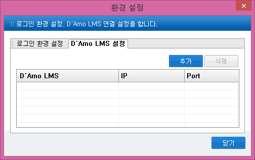
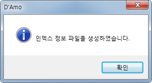
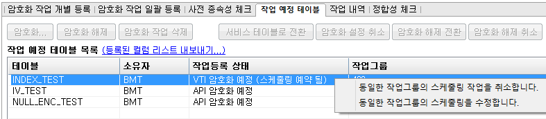
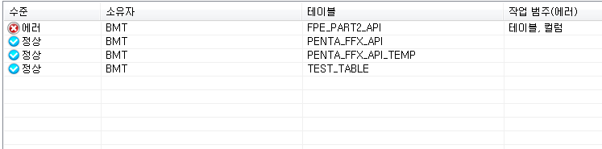
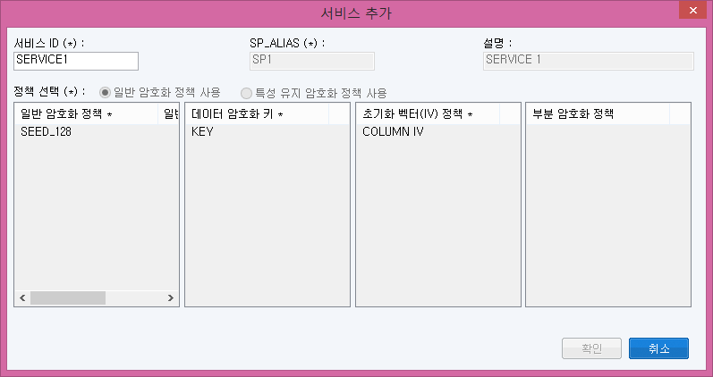
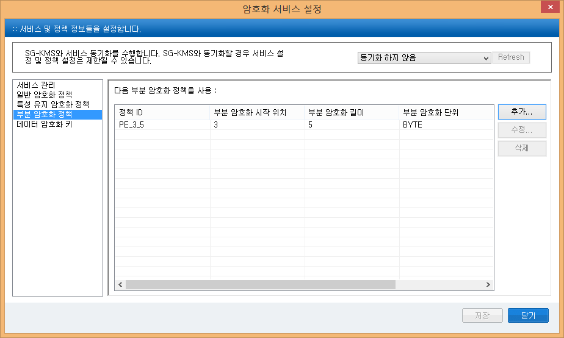

|image0|

\ |image1|\ |image2|\ y

Copyright 1997-2016 Penta Security Systems, Inc. All rights reserved

프로그램 및 상표, 본 매뉴얼의 저작권은 펜타시큐리티시스템㈜에 있습니다.
본사의 허락 없이 의 무단 복제, 상표의 무단 사용, 그리고 본 매뉴얼의 일부
또는 전체를 무단 복사, 전재 하실 수 없습니다.

본사

서울특별시 영등포구 여의도 25-11 한진 해운빌딩 20층

TEL: 02.780.7728 FAX: 02.786.5281

www.pentasecurity.com

펜타시큐리티시스템㈜

일본지사

도쿄도 미나토구 아카사카 3-2-8 아센도 아카사카 빌딩3 층

TEL: 81-3-5573-8191 FAX: 81-3-5573-8193

www.pentasecurity.co.jp

160726

\| 만든 사람들 \|

작성 및 편집:

표지 및 편집 디자인: VS 팀

검수: 제품혁신부

이 매뉴얼에 관하여

***의 목적***

본 문서는 Oracle Database 보호 솔루션 D’Amo의 사용자 매뉴얼로서 DB 보안
관리자가 보안정책의 수립, 적용 및 운영을 하기 위한 가이드를 제공한다.

***의 범위***

본 문서는 D’Amo의 관리도구와 Security Agent를 사용하는 방법에 대해
설명한다. D’Amo 설치에 대한 내용은 사용자 매뉴얼과 함께 배포되는
설치매뉴얼을 참고한다.

***사전지식***

Windows에서 프로그램 사용에 능숙해야 하고, Oracle에 대한 사전지식이
필요하다.

***활용방법***

본 문서는 제품의 설치 이후 D’Amo의 관리도구 사용법과 DB를 암복호화
하는방법, 암복호화 권한 및 접근제어 관리방법을 설명하고 있다.

***구성 장별 간단한 요약***

제 I장 개요에서는 DB의 암호화가 갖는 보안 서비스에 대해서 설명하고,
D’Amo의 구성과 D’Amo에서 사용하는 공개키의 키 체계 개념을 설명한다.
D’Amo의운영 시 키 체계 개념을 이해하는 것이 매우 중요하므로, 꼭 숙독한
후 다음 장을 참고한다.

제 II장 관리도구 사용하기에서는 관리도구에 로그인하는 방법 및 비밀번호
변경에 대한 내용과 관롣구 화면 구성에 대해서 기술한다.

제 III장 DB 서버 관리에서는 D’Amo 시스템 전반에 영향을 미치는 설정들에
대해 주로 설명한다.

제 IV장 암호화 적용/해제에서는 컬럼의 암복호화 방법과 D’Amo가 사용자의
편의를 위하여 추가적으로 제공하는 기능에 대하여 설명한다.

제 V장 에서는 암호화한 테이블 및 컬럼에 대한 전반적인 관리를 할 수 있는
기능에 대해 설명한다.

제 VI장 접근제어에서는 컬럼의 암복호화 권한 설정과 접근제어 설정 및
로그인 접근제어 설정에 대해 설명한다.

제 VII장 로그 정보에서는 D’Amo에서 발생한 로그를 검색하고 저장하는
방법에 대해 설명한다.

제 VIII장 통계 정보에서는 이벤트 로그를 이용한 통계를 보는 방법을
설명한다.

제 IX장 환경 설정에서는 암호화에 필요한 운영 설정, 암호화 설정, 로그
설정 등에 대해 설명한다.

제 X장 운영 시 주의사항에서는 운용 중 발생할 수 있는 문제점에 대한 대응
방법을 설명한다.

제 XI장 부록에서는 본문에서 참고하는 정보들을 서술한다.

***표기법***

다음과 같은 표기법을 사용하여 본 문서를 작성한다.

+----------+------------------------------------------------------+------------------------------------------------+
| 표기법   | 설명                                                 | 예                                             |
+----------+------------------------------------------------------+------------------------------------------------+
| 예)      | 예제표기                                             |                                                |
+----------+------------------------------------------------------+------------------------------------------------+
| <>       | 사용자환경에 따라 입력하는 값이 다를 때              | <설치 디렉토리>\\ABC.EXE 파일을 입력해주세요   |
+----------+------------------------------------------------------+------------------------------------------------+
| []       | 사용자가 선택적으로 입력하는 옵션 정보               | 커맨드프롬프트에서 DIR[\\W]를 입력하세요.      |
+----------+------------------------------------------------------+------------------------------------------------+
|          | 메뉴/기능버튼 이름                                   |                                                |
+----------+------------------------------------------------------+------------------------------------------------+
| 굵게     | 사용자 입력 메시지                                   |                                                |
+----------+------------------------------------------------------+------------------------------------------------+
| 틀       | 예제 코드 및 소스 코드 및 환경 설정 정보 파일 인용   |                                                |
+----------+------------------------------------------------------+------------------------------------------------+

목 차

*이 매뉴얼에 관하여* 4

`*목 차* 6 <#_Toc430767333>`__

`*I. 개요* 12 <#_Toc430767334>`__

`*1. D’Amo for Oracle 이란?* 13 <#_Toc430767335>`__

`*1.1 주요 기능* 13 <#_Toc430767336>`__

`*1.2 특징* 13 <#_Toc430767337>`__

`*2. 구성 요소* 14 <#_Toc430767338>`__

`*3. 관련 기술* 16 <#_Toc430767339>`__

`*3.1 보안 서비스* 16 <#_Toc430767340>`__

`*3.2 키 체계 이해* 16 <#_Toc430767341>`__

`*II. 관리도구 사용하기* 20 <#_Toc430767342>`__

`*1. 로그인하기* 20 <#로그인하기>`__

`*2. 환경 설정* 22 <#환경-설정>`__

`*2.1 로그인 환경 설정* 22 <#_Toc430767345>`__

`*2.2 D’Amo LMS 설정* 24 <#damo-lms-설정>`__

`*3. 관리도구 화면 구성* 26 <#관리도구-화면-구성>`__

`*III. DB 서버 관리* 28 <#_Toc430767348>`__

`*1. DB 서버 추가* 28 <#_Toc430767349>`__

`*2. DB 서버 삭제* 32 <#_Toc430767350>`__

`*3. 라이선스 관리* 33 <#라이선스-관리>`__

`*3.1 라이선스 발급* 33 <#_Toc430767352>`__

`*3.2 라이선스 가져오기* 34 <#_Toc430767353>`__

`*3.3 라이선스 내보내기* 35 <#_Toc430767354>`__

`*3.4 라이선스 삭제* 36 <#라이선스-삭제>`__

`*3.5 라이선스 적용* 37 <#_Toc430767356>`__

`*4. 보안정책 동기화* 37 <#_Toc430767357>`__

`*5. Security Agent 삭제* 39 <#_Toc430767358>`__

`*6. DB 키 불러오기* 40 <#_Toc430767359>`__

`*6.1 관리도구에서 로드 하는 방법* 41 <#관리도구에서-로드-하는-방법>`__

`*6.2 수동으로 언로드 하는 방법* 42 <#수동으로-언로드-하는-방법>`__

`*6.3 DB 키 로드 상태 확인하기* 42 <#db-키-로드-상태-확인하기>`__

`*IV. 암호화 적용/해제* 46 <#_Toc430767363>`__

`*1. 암호화 작업 개별 등록* 46 <#_Toc430767364>`__

`*1.1 암호화 작업 등록하기* 46 <#암호화-작업-등록하기>`__

`*1.2 암호화 해제 작업 등록* 49 <#_Toc430767366>`__

`*1.3 작업 등록 시 제약사항* 50 <#작업-등록-시-제약사항>`__

`*2. 암호화 작업 등록의 기능 활용* 51 <#암호화-작업-등록의-기능-활용>`__

`*2.1 인덱스 관리* 51 <#_Toc430767369>`__

`*2.2 Storage 관리* 54 <#storage-관리>`__

`*2.3 테이블 파티션 관리* 54 <#테이블-파티션-관리>`__

`*3. 암호화 작업 일괄 등록* 56 <#암호화-작업-일괄-등록>`__

`*3.1 암호화 컬럼 정보 파일 편집(ver 1.1)* 56 <#_Toc430767373>`__

`*3.2 인덱스 정보 파일 생성* 58 <#_Toc430767374>`__

`*3.3 인덱스 정보 파일 수정* 59 <#인덱스-정보-파일-수정>`__

`*3.4 암호화 작업 일괄 등록하기* 60 <#암호화-작업-일괄-등록하기>`__

`*4. 사전 종속성 체크* 61 <#_Toc430767377>`__

`*4.1 종속성 체크 정보* 61 <#_Toc430767378>`__

`*5. 작업 예정 테이블* 64 <#작업-예정-테이블>`__

`*5.1 암호화 및 암호화 해제 진행* 64 <#암호화-및-암호화-해제-진행>`__

`*5.2 서비스 테이블 전환 및 해제 전환 및 취소*
66 <#서비스-테이블-전환-및-해제-전환-및-취소>`__

`*5.3 스케줄링 작업 예약* 67 <#스케줄링-작업-예약>`__

`*5.4 스케줄링 예약의 수정 및 삭제 예약*
69 <#스케줄링-예약의-수정-및-삭제-예약>`__

`*5.5 암호화 중 에러가 발생한 테이블에 대한 복구*
70 <#암호화-중-에러가-발생한-테이블에-대한-복구>`__

`*5.6 등록된 컬럼 리스트 내보내기* 70 <#등록된-컬럼-리스트-내보내기>`__

`*6. 작업 내역* 70 <#_Toc430767386>`__

`*6.1 암복호화 작업 진행 상태 조회*
73 <#암복호화-작업-진행-상태-조회>`__

`*6.2 작업 복구* 73 <#_Toc430767388>`__

`*7. 정합성 체크* 74 <#_Toc430767389>`__

`*7.1 정합성 체크 수행* 75 <#_Toc430767390>`__

`*V. 암호화 데이터 관리* 80 <#_Toc430767391>`__

`*1. 객체 재생성* 80 <#_Toc430767392>`__

`*1.1 테이블을 선택한 후 객체 재생성*
81 <#테이블을-선택한-후-객체-재생성>`__

`*1.2 컬럼을 선택한 후 객체 재생성*
82 <#컬럼을-선택한-후-객체-재생성>`__

`*2. 인덱스 생성* 83 <#인덱스-생성>`__

`*3. 컬럼 길이 변경* 85 <#_Toc430767396>`__

`*4. 암호화 값 확인* 87 <#암호화-값-확인>`__

`*5. 작업 잔여 테이블 삭제* 88 <#작업-잔여-테이블-삭제>`__

`*VI. 접근제어* 90 <#_Toc430767399>`__

`*1. 암복호화 권한 설정(VTI)* 90 <#암복호화-권한-설정vti>`__

`*1.1 사용자를 선택 후 컬럼별 암복호화 설정*
90 <#사용자를-선택-후-컬럼별-암복호화-설정>`__

`*1.2 암호화 컬럼을 선택후 사용자별 암복호화 설정*
92 <#암호화-컬럼을-선택후-사용자별-암복호화-설정>`__

`*2. 암복호화 권한 설정(API)* 94 <#_Toc430767403>`__

`*2.1 사용자를 선택 후 정책별 암복호화 설정*
94 <#사용자를-선택-후-정책별-암복호화-설정>`__

`*2.2 암호화 정책을 선택 후 사용자별 암복호화 설정*
96 <#암호화-정책을-선택-후-사용자별-암복호화-설정>`__

`*3. 컬럼의 접근제어(VTI)* 97 <#_Toc430767406>`__

`*4. 정책의 접근제어(API)* 102 <#정책의-접근제어api>`__

`*5. 로그인 권한 설정* 107 <#로그인-권한-설정>`__

`*VII. 로그 정보* 114 <#_Toc430767409>`__

`*1. 접근 로그* 114 <#접근-로그>`__

`*2. 정책 로그* 117 <#정책-로그>`__

`*VIII. 통계 정보* 122 <#_Toc430767412>`__

`*1. 통계 정보 조회하기* 123 <#통계-정보-조회하기>`__

`*IX. 환경 설정* 126 <#_Toc430767414>`__

`*1. 암호화 설정* 126 <#_Toc430767415>`__

`*1.1 암호화 서비스 설정* 126 <#_Toc430767416>`__

`*1.2 암호화 식별 설정* 150 <#암호화-식별-설정>`__

`*1.3 보안 정책 설정* 151 <#보안-정책-설정>`__

`*1.4 암호화 컬럼 정보 복사* 154 <#암호화-컬럼-정보-복사>`__

`*2. 운영 설정* 156 <#_Toc430767420>`__

`*2.1 암호화 컬럼 표시 설정* 156 <#_Toc430767421>`__

`*2.2 접근제어 정책 설정* 157 <#_Toc430767422>`__

`*2.3 접근제어 기본값 설정* 158 <#_Toc430767423>`__

`*2.4 보안정책 백업* 161 <#보안정책-백업>`__

`*2.5 DB 키 비밀번호 변경* 163 <#_Toc430767425>`__

`*2.6 사용자 비밀번호 변경 적용* 163 <#사용자-비밀번호-변경-적용>`__

`*3. 로그 설정* 164 <#로그-설정>`__

`*3.1 로그정책 설정* 164 <#_Toc430767428>`__

`*3.2 자동로그 백업 설정* 165 <#자동로그-백업-설정>`__

`*3.3 로그 필터링* 167 <#로그-필터링>`__

`*3.4 현재 상태 보고서 생성* 170 <#현재-상태-보고서-생성>`__

`*X. 운영 시 주의사항* 175 <#_Toc430767432>`__

`*1. 키 관련* 175 <#_Toc430767433>`__

`*1.1 키 비밀번호 분실 시* 175 <#키-비밀번호-분실-시>`__

`*1.2 키 관리 및 사용* 175 <#키-관리-및-사용>`__

`*1.3 DB 키 갱신 기능* 176 <#db-키-갱신-기능>`__

`*1.4 설치 DB키가 기존과 다를 경우*
178 <#설치-db키가-기존과-다를-경우>`__

`*2. 암호화 적용 테이블 관련* 179 <#암호화-적용-테이블-관련>`__

`*2.1 암호화된 테이블의 변경(ALTER) 작업*
179 <#암호화된-테이블의-변경alter-작업>`__

`*2.2 암호화된 테이블의 Trigger 작업* 180 <#_Toc430767440>`__

`*2.3 PK/FK 암호화 설정 및 해제* 181 <#pkfk-암호화-설정-및-해제>`__

`*2.4 단일 인덱스 컬럼 암호화 설정 및 해제*
183 <#단일-인덱스-컬럼-암호화-설정-및-해제>`__

`*2.5 결합 인덱스 컬럼 암호화 설정 및 해제*
183 <#결합-인덱스-컬럼-암호화-설정-및-해제>`__

`*2.6 파티션 테이블 암호화 설정 및 해제* 184 <#_Toc430767444>`__

`*2.7 MView 암호화 설정 및 해제* 184 <#mview-암호화-설정-및-해제>`__

`*2.8 암호화 테이블 rename* 186 <#_Toc430767446>`__

`*2.9 복호화 권한이 없는 경우 반환 값* 186 <#_Toc430767447>`__

`*2.10 테이블 권한 이양 대상* 186 <#테이블-권한-이양-대상>`__

`*3. DB 서버 관리* 187 <#_Toc430767449>`__

`*3.1 D’Amo 백업* 187 <#damo-백업>`__

`*3.2 암호화 테이블 있는 계정의 export/import*
187 <#암호화-테이블-있는-계정의-exportimport>`__

`*3.3 D’Amo 계정 복구* 187 <#damo-계정-복구>`__

`*3.4 DBMS 이전 또는 DBMS 버전 Upgrade의 경우*
190 <#dbms-이전-또는-dbms-버전-upgrade의-경우>`__

`*3.5 Debugging Mode 사용 제한* 191 <#debugging-mode-사용-제한>`__

`*3.6 damo Object에 대한 Compile* 191 <#damo-object에-대한-compile>`__

`*4. 사용자 권한 관련* 191 <#사용자-권한-관련>`__

`*4.1 사용자의 암호 변경 작업* 191 <#사용자의-암호-변경-작업>`__

`*XI. 부록* 194 <#_Toc430767458>`__

`*1. 암호화 후 데이터 크기* 194 <#_Toc430767459>`__

`*2. 암호화 설정 고려사항* 198 <#_Toc430767460>`__

`*3. 암복호화 및 해쉬 함수 이름* 199 <#암복호화-및-해쉬-함수-이름>`__

`*4. DB 서버 이전 또는 Upgrade시 상세* 218 <#_Toc430767462>`__

`*4.1 Full Export를 이용하여 신규 서버로 이전하는 경우*
218 <#full-export를-이용하여-신규-서버로-이전하는-경우>`__

`*4.2 dbf(database file) file을 신규 서버에서 재사용하는 경우*
224 <#dbfdatabase-file-file을-신규-서버에서-재사용하는-경우>`__

`*5. 에러코드* 230 <#에러코드>`__

`*6. 용어정의* 238 <#용어정의>`__

개요
====

정보화 사회로 들어서면서 개인정보에 대한 보안의 필요성이 강조되고 있다.
기업 및 공공기관에서는 다양한 개인정보를 수집하게 되었으나, 악의적인
해킹이나, 기업의 부주의로 인해 개인정보 침해 또는 유출 사고도 증가하고
있는 현실이다. E-나라 지표에 따르면 2000년 2,035건의 개인정보 침해신고가
2012년 166,801건으로 약 80배 증가한 것을 알수 있다.

다양한 개인정보유출 및 이로 인한 2차 피해를 막고자, 국가에서는 2011년
9월 개인정보보호법을 일반법으로 제정하여 개인정보에 대한 보안을
강제화하였다. 일반법인 개인정보보호법과 개별법인 정보통신망법,
신용정보보호법 등에서는 주민번호, 외국인등록번호, 여권번호, 운전면허번호
및 금용정보인 카드번호 등의 정보를 암호화하여 보안을 강화하도록 요구하고
있다.

개인정보보호법에 따라, 개인정보들이 저장된 곳, 즉 데이터베이스에 대한
암호화는 선택이 아닌 필수가 되었다. 특히, 데이터베이스에 대한 공격은
손쉬우며, 실제 정보 누출 사고들에 대한 통계도 이를 뒷받침한다. 대부분의
보안 시스템은 내부 네트워크를 보호하기 위한 방화벽이 존재하지만, 뚫리면
데이터베이스는 쉽게 공격을 받게 되며, 수 분도 안되어 수천만 건의
데이터가 유출될 수 있다. 이를 근본적으로 막기 위해서는 데이터베이스
내부의 정보에 대한 암호화를 통해 보안성을 확보해야 한다.

D’Amo for Oracle 이란?
----------------------

본 장은 D’Amo for Oracle를 소개하는 장으로 제품의 주요 기능과 특징 및
구성요소에 대해 기술한다.

D’Amo for Oralce는 DBMS Package Encryption 방식의 암호화를 통해,
Oracle이 설치된 DB서버에 패키지 형태로 설치되어 암호화 및 복호화 기능을
제공한다. 이를 통해 단순 암호화가 아닌, 접근제어, 감사 로그, 키관리 등의
기능을 제공하여 보안성을 확보한 암호화를 제공한다.

주요 기능
~~~~~~~~~

D’Amo for Oralce 의 주요 기능은 아래와 같다.

-  암호화 Agent를 통한 암호화 및 복호화

-  암호화 데이터 접근제어

-  암호화 데이터 감사 기록

-  보안 관리자 권한 분리

   1. .. rubric:: 특징
         :name: 특징

D’Amo for Oracle의 특징은 아래와 같다.

-  국정원 검증필 암호모듈 사용 (CIS-CC)

-  NIST 검증필 FIPS 인증 암호 알고리즘 사용 (AES, TDES)

-  국내외 표준 알고리즘 지원 (ARIA, SEED, AES, TDES 등)

-  쿼리 수정을 최소화한 암호화 지원

-  Package Install 형태의 간편한 설치

-  D’Amo KMS(키관리) 및 LMS(로그관리) 연동 지원

   1. .. rubric:: 구성 요소
         :name: 구성-요소
         :class: -22

|image3|

[그림 1] D’Amo 시스템 구성도

각각의 구성 요소 및 특징은 다음과 같다.

-  관리도구

D'Amo의 관리도구(D’Amo Console)는 보안 관리자로 하여금 D’Amo 구성요소의
간편한 관리 업무를 가능케 한다. 보안 관리자는 추가된 DB 서버 내의 컬럼에
대하여 암호화 설정 및 제거 그리고 해당 DB 계정에 복호화 권한 할당 등의
업무를 수행할 수 있다. 특히, 암호화 설정 및 제거 중 발생할 수 있는 DB
서버 상의 모든 에러에 대하여 관리도구에서 쉽게 파악 및 복구할 수 있는
기능을 제공한다.

또한 관리도구에서 발생한 로그에 대한 조회가 가능하며 정책정보가
변경되었을 경우, Secure DB의 내용을 백업하는 기능을 제공한다.

-  Security Agent

Security Agent는 실제 운영되는 DB 서버에 탑재되어, DB 서버에서 일어나게
되는 암호화 설정 작업 및 암복호화 연산 그리고 암복호화 권한에 따른
접근제어 등의 기능을 수행한다.

-  Secure DB

Secure DB는 Security Agent가 참고하거나, 관리도구에서 설정한 정보가
관리되는 DB 서버 영역이다. Secure DB는 별도로 생성된 DB 서버 하위에
생성되며, 중요한 정보는 Security Agent만이 접근할 수 있도록 암호화되어
관리된다.

-  Keymanager

Keymanager는 키를 관리하는 데몬으로, 서버에서 운영한다. Security Agent가
암호화 설정 작업 및 암복호화 연산 그리고 암복호화 권한에 따른 접근제어
등의 기능을 수행할 때, Keymanager에게 키를 요청하면, 암호화 통신을
이용하여 Security Agent에게 키를 주는 기능을 수행한다.

1. .. rubric:: 
      관련 기술
      :name: 관련-기술

   1. .. rubric:: 보안 서비스
         :name: 보안-서비스

DB 서버에 대한 악의적인 접근으로부터 데이터를 보호하기 위해서 다음과
같은 보안 서비스가 필요하다.

-  데이터 기밀성 (Confidentiality)

의도되지 않은 제3자에게 정보가 노출되지 않음을 보장할 수 있어야 한다.
이를 위해서 데이터를 암호화하여 저장한다.

-  데이터 무결성 (Integrity)

의도되지 않은 제3자에 의해 정보가 변경되지 않았음을 보장할 수 있어야
한다. 이를 위해 데이터를 암호화하여 저장한다.

-  사용자 인증 (Authentication)

DB 서버에 접근하려는 혹은 통신하고 있는 상대 객체가 누구인지 확인하는
것이다. 이를 위해 DB 서버에 대한 접근 시 인증 과정을 수행한다.

-  접근제어 (Access Control)

데이터에 대한 접근 권한에 따라 제어가 필요하다. 이를 위해서 데이터에
대한 권한이 부여된 사용자에게만 복호화 할 수 있는 키를 부여한다.

키 체계 이해
~~~~~~~~~~~~

D’Amo는 안전한 사용자 인증과 데이터 보호를 위해 PKI기반의 키들을생성하여
관리한다. D’Amo를 사용하기 위해서는 다음의 공개키 쌍이반드시 필요하다.

|image4|

[그림 2] D’Amo 키 체계도

-  사이트 키 : 각 고객사 별로 생성하는 키

사이트 키는 공개키(인증서)와 비공개키로 구성되며 비공개키는 암호화 되어
관리된다. 고객별로 최초 1회만 생성하며, 관리도구 키와 DB 키를 생성하는
역할을 한다. DB 키의 비밀번호를 분실했을 경우, 비밀번호를 다시 설정하는
데도 사용하며, 관리도구에 서버 등록 진행 시도 사용 한다. 고객사의 DB
보안 관리자가 생성하고 보안상 매우 중요한 키이므로 반드시 보안 관리자에
의해 안전하게 관리되어야 한다.

-  관리도구 키 : 관리도구가 사용하기 위한 키

관리도구 키는 공개키(인증서)와 비공개키로 구성되며 비공개키는 암호화
되어 관리된다. 사이트에서 최초 1회만 생성하며, 관리도구 인증 시
사용된다. 관리도구 공개키는 인증서라고도 한다.

-  DB 키 : 각 DB SID별로 생성하는 키

DB 키는 공개키(인증서)와 비공개키로 구성되며 비공개키는 암호화 되어
관리된다. DB 키는 DB 서버에 D’Amo Security Agent를 설치할 때 필요하다.
설치 이후 컬럼 키를 생성하고 컬럼 키를 암(복)호화하는데 사용되며, Secure
Agent가 사용하는 중요 정보를 암호화하는 데 사용된다.

DB 키는 Security Agent 수만큼 생성될 수 있다. DB 키는 최초 Security
Agent를 설치한 이후나, DB 서버를 재시작할 때 Security Agent가 사용할 수
있도록 반드시 공유 메모리에 로드해야 한다.

DB 키를 로드 하는 방식에는 두 가지가 있는데, 자동 모드로 변경하면 별도의
DB키 로드 작업을 수행 할 필요가 없다. DB 키를 로드 하는 방법은 [III.6 DB
키 불러오기]를 참고한다.

-  | 자동 DB 키 로딩:
   | 자동을 선택하면 DB 키를 직접 관리자가 로드 하지 않아도 내부적으로
     로드 된다. 따라서 관리자가 DB 서버의 재시작과 같은 상황에서 특별히
     주의할 필요가 없어운영 시에 편리하다.

-  | 수동 DB 키 로딩:
   | 운영체제 재시작 시에 반드시 DB 키 비밀번호를 관리자가 직접 입력하여
     DB 키를 로딩해야 원활하게 암복호화작업이 이루어 지게 된다. 관리자가
     다소 불편하지만, DB의 보안도를 좀 더 향상시킬 수 있다. 수동을
     선택한 경우 DB 키 비밀번호를 입력한다

-  컬럼 키: 각 암호화 컬럼별로 생성하는 암복호화 키

각 암호화 컬럼별로 생성하는 암복호화 키로 암호화 컬럼에서 데이터를
암호화하는데 사용하는 키이다. Security Agent 내부적으로만 관리되므로,
관리자가 직접 관리할 필요는 없다.

관리도구 사용하기
=================

다음의 내용은 관리도구를 설치한 이후에 필요한 내용이다. 만일 관리도구를
설치하지 않았다면, [D’Amo 설치매뉴얼]을 참고하여, 먼저 설치한다.

관리도구를 처음으로 사용하는 것이라면, 다음의 파일들이 필요하다.관리도구
사용자와 보안 관리자가 다를경우, 보안 관리자에게 ‘DBA’ 관리도구 인증서
파일을 요청한다.

-  사이트 인증서 파일(.cer)

-  DBA 관리도구 인증서와 비공개키 파일(.cer/.key)

키에 대한 세부 정보가 필요한 경우 [**오류! 참조 원본을 찾을 수
없습니다.**. **오류! 참조 원본을 찾을 수 없습니다.**]를 참고한다.

-  보안관리자는 ‘SA(보안관리자)’ 관리도구 인증서 파일을 사용하여
   관리도구에 접근 한다.

   1. .. rubric:: 로그인하기
         :name: 로그인하기
         :class: -22

D’Amo에 로그인하는 절차는 다음과 같다.

#. 관리도구가 설치된 경우 바탕화면의 |image5|\ 아이콘을 실행하거나,
   [시작\\프로그램\\D’Amo\\D’Amo 관리도구<버전>]를 실행한다.

#. 관리도구를 실행하면 나타나는 첫 화면은 다음과 같다.

|image6|

[그림 3] 로그인 화면

#. 만일 “비밀번호” 입력 창이 비활성화 되어있다면, 보안 관리자
   인증서(관리도구 인증서)가 등록되지 않은 것이므로 [II.2.101 인증서
   불러오기] 절의 인증서 등록하기를 수행한 후, 다음 단계를 진행한다.

#. 관리도구 로그인 화면에서 보안 관리자(관리도구 비공개키)의 비밀번호를
   입력한다. 비밀번호가 일치하면 로그인이 성공한다.

#. 로그인 시 관리하는 각 Security Agent와 인증 절차를 거치기 때문에 다소
   시간이 걸릴 수 있다. 실제 소요 시간은 Security Agent의 수, DB 서버의
   성능, 네트워크 속도, 시스템 성능 등의 환경에 따라 다를 수 있다.

#. 로그인에 성공하게 되면 다음 같은 메인 화면이 나타난다.

|image7|

[그림 4] 보안관리자 초기 화면

환경 설정
---------

로그인 환경 설정은 관리도구를 처음 설치해서 사용하거나, 새로운 관리도구
인증서로 변경할 때 또는 관리도구 비공개키의 비밀번호를변경할 때 사용하는
기능이다. 관리도구 인증서 등록 후 등록된 관리도구 키를 [내보내기]하여,
다른 관리자 PC에서 등록하거나, 백업할 때 사용한다.

또한, 연동 가능 한 D’Amo LMS를 등록할 수있다.

1. .. rubric:: 로그인 환경 설정
      :name: 로그인-환경-설정
      :class: -31

   #. .. rubric:: 인증서 불러오기
         :name: 인증서-불러오기

#. 관리도구 인증서(관리도구 키)를 등록하기 위해 [[그림 3] 로그인
   화면]에서 [환경 설정…] 버튼을 누른다.

#. [[그림 5] 로그인 환경 설정] 화면에서 [불러오기...] 버튼을 클릭한다.

|image8|

[그림 5] 로그인 환경 설정

#. [인증서/비공개키 설치] 화면에서 관리도구 키의 인증서 파일(.cer 파일),
   비공개키(.key 파일) 파일의 경로와 비공개키 비밀번호를 입력한 후,
   [확인] 버튼을 클릭한다.

|image9|

[그림 6] 관리자(관리도구 키) 등록 화면

#. 로그인 환경 설정이 완료되었으면 [확인] 버튼을 클릭하여 지금까지
   설정한 내용을 저장한다.

#. 등록이 성공하면 로그인 환경 설정 화면으로 돌아간다. [닫기] 버튼을
   클릭하여 로그인 환경 설정 창을 종료한다.

   #. .. rubric:: 인증서 내보내기
         :name: 인증서-내보내기

등록된 관리도구 인증서를 파일로 저장하는 기능이다.

#. 관리도구 인증서를 내보내기 위해서는 [[그림 5] 로그인 환경
   설정]화면에서 [내보내기…] 버튼을 클릭한다.

#. 관리도구 인증서의 저장 경로와 비공개키 비밀번호를 입력한 후, [확인]
   버튼을 클릭한다.

|image10|

[그림 7] 관리도구 인증서 내보내기 화면

비밀번호 변경
^^^^^^^^^^^^^

[[그림 5] 로그인 환경 설정] 화면에서 [비밀번호 변경...] 버튼을 클릭하여
등록한 관리도구 비공개키의 비밀번호를 변경할 수 있다. [비밀번호 변경]
버튼은 관리도구 인증서가 등록되어 있는 경우에만 활성화된다.

|image11|

[그림 8] 관리도구 비공개키 비밀번호 변경

-  변경된 비밀번호는 비밀번호를 변경한 관리자의 PC 환경에만 적용된다.

   1. .. rubric:: D’Amo LMS 설정
         :name: damo-lms-설정

      #. .. rubric:: D’Amo LMS 등록
            :name: damo-lms-등록

#. D'Amo LMS를 등록하기 위해 [[그림 3] 로그인 화면]에서 [환경 설정…]
   버튼을 누른다.

#. [[그림 9] D’Amo LMS 설정] 화면에서 [추가] 버튼을 클릭한다.

|image12|

[그림 9] D’Amo LMS 설정

#. [[그림 9] D’Amo LMS 추가] 화면에서 연동 가능한 D'Amo LMS의 IP를 입력
   후 접속 체크 버튼을 눌러 접속에 성공하면 [확인] 버튼이 활성화된다.

|image13|

[그림 10] D’Amo LMS 연결 추가

#. [확인] 버튼을 클릭하여 D'Amo LMS 추가 작업을 완료한다.

   #. .. rubric:: D’Amo LMS 등록 삭제
         :name: damo-lms-등록-삭제

[[그림 9] D’Amo LMS 설정] 화면에서 삭제를 원하는 D'Amo LMS의 이름을 클릭
후 [삭제] 버튼을 클릭 한다.

-  D’Amo LMS가 이중화 구성이 되어 있는 경우 이중화 된 D’Amo LMS 서버
   모두를 추가 등록 해야 한다.

   1. .. rubric:: 관리도구 화면 구성
         :name: 관리도구-화면-구성
         :class: -22

관리도구의 화면은 상단의 메뉴 창과 하단의 작업 창으로 구성되어 있다.

관리도구 메뉴 창의 상단에는 D’Amo의 버전과 현재 로그인한 사용자, 그리고
D'Amo LMS 연동 버튼이 표시된다. 메뉴의 하단에는 선택한 탭의 기능에 대한
설명과 DB 갱신시간이 표시된다.

관리도구 메뉴 창에는 아래와 같은 메뉴가 있다.

    [표 1] 메뉴 창

+-------------+----------------------------------------------------------------------------------------------------+
|             | DB 서버의 목록과 선택 된 DB 서버의 정보를 보여준다.                                                |
+-------------+----------------------------------------------------------------------------------------------------+
| |image14|   | 컬럼을 암호화/암호화 해제를 진행할 수 있으며 사전 종속성, 정합성 체크등의 기능을 이용할 수 있다.   |
+-------------+----------------------------------------------------------------------------------------------------+
| |image15|   | 암호화 현황을 확인할 수 있으며, 인덱스 생성 및 컬럼 길이 변경등의 기능을 이용할 수 있다.           |
+-------------+----------------------------------------------------------------------------------------------------+
| |image16|   | 암/복호화 권한 설정 및 컬럼/정책 접근제어를 설정한다.                                              |
+-------------+----------------------------------------------------------------------------------------------------+
| |image17|   | 접근 로그 및 정책 로그를 검색한다.                                                                 |
+-------------+----------------------------------------------------------------------------------------------------+
| |image18|   | 통계 정보를 확인한다.                                                                              |
+-------------+----------------------------------------------------------------------------------------------------+
| |image19|   | 기타설정을 한다.                                                                                   |
+-------------+----------------------------------------------------------------------------------------------------+
| |image20|   | [새로고침]DB정보를 갱신한다.                                                                       |
+-------------+----------------------------------------------------------------------------------------------------+
| |image21|   | 지정 시간 동안 관리도구를 사용하지 않으면 자동 종료되는 시간을 설정한다.                           |
+-------------+----------------------------------------------------------------------------------------------------+

DB 서버 관리
============

관리도구에서 DB 서버를 관리하려면, DB 서버에 Security Agent가 설치되어
있어야 한다. Security Agent가 설치 된 DB 서버가 없다면, D’Amo
설치매뉴얼을 참고하여 설치한 후, 본 내용을 참고한다.

DB 서버 관리 작업 창의 왼쪽에는 DB 서버 목록, 오른쪽에는 선택한 DB
서버의 정보를 표시한다.

DB 서버 추가
------------

관리도구에서 본격적으로 작업을 시작하기 위해서는 관리할 DB 서버를
등록해야 한다.

서버 등록을 위해서는 다음의 준비사항이 필요하다.

-  해당 DB 서버에 Security Agent가 설치되어 있어야 함

-  Security Agent가 설치된 Oracle 서버의 인스턴스 이름 또는Oracle SID,
   별칭

-  Security Agent를 설치할 때 지정한 D’Amo 계정 비밀번호

-  사이트 키 중 인증서 파일(.cer)

-  DB 키를 수동으로 발급받은 경우 DB 키 비밀번호

관리할 DB 서버에 Security Agent가 설치되었다면 다음 절차에 따라 DB
서버를 등록한다.

#. 관리도구가 설치된 PC에 오라클 클라이언트를 설치하고, TNS 파일에
   Security Agent가 설치된 DB 서버의 접속정보를 등록을 한다.

-  관리도구는 전용프로세스(Dedicated) 접속 방식으로만 동작하므로
   tnsnames.ora 파일의 서버 접속정보가 Shared로 되어있는지 반드시
   확인한다.

#. DB 서버 목록 상단의 [서버 추가…]버튼을 클릭한다.

|image22|

[그림 11] DB 서버 등록 메뉴 화면

#. [서버 타입 선택] 화면에서 DP-ORA는 DB 서버에 설치 하여 사용하는
   제품이므로 [DB 서버]를 선택 한다.

|image23|

[그림 12] 서버 타입 선택 화면

#. | [DB 서버에 설치 된 D’Amo 컴포넌트 선택] 화면에서
   | DP-ORA는 DBMS Package Encryption 제품이므로[DBMS Package
     Encryption]을 선택한다.

|image24|

[그림 13] DB 서버에 설치 된 D’Amo 컴포넌트 선택 화면

#. Oracle 서버 선택 후 [상세 정보 입력]에서 Security Agent가 설치된
   서버의 Oracle SID또는 별칭을 선택한다. 만일 원하는 DB 서버 이름이
   목록에 보이지 않을 경우, Oracle™[Net8 Configuration Assistant]를
   참조하거나, 추가한다.

|image25|

[그림 14] DB 서버 상세 정보 입력 화면

#. 보안 관리자 비밀번호는 Security Agent 설치 시 생성 한 damo 계정의
   비밀번호를 입력한다.

#. […] 버튼을 클릭하여 Security Agent 설치 시에 생성한 사이트
   인증서(.cer)를 선택한다. 사이트 인증서 생성 및 관리는 [D’Amo
   설치매뉴얼]을 참고한다.

#. 모든 정보 입력 후, [마침]버튼을 클릭하면 등록과정이 진행된다. 이때
   등록한 서버에 DB 키 로드가 되어 있지 않다면 [DB 키 불러오기] 화면이
   표시된다.

|image26|

[그림 15] DB 서버 등록 시 DB 키 불러오기 화면

#. 적절한 DB 키의 비밀번호를 입력하면 정상적으로 서버등록이 완료된다.
   만일 DB 키가 자동 모드로 설정되어 있거나, 이미 DB 키가 로드된
   상태라면 창이 표시되지 않는다.DB 키 로드에 대한 자세한 내용은 항목
   [III.6 DB 키 불러오기]를 참고한다.

#. 입력한 정보가 정상적인 경우, 좌측 [서버 목록]에 DB 서버가 추가되며,
   우측에 새로 추가한 DB 서버의 정보가 표시된다.

|image27|

[그림 16] 보안관리자 관리도구에서 DB 서버가 추가된 화면

DB 서버 삭제
------------

Security Agent가 설치된 DB 서버를 관리도구를 통하여 더 이상 관리하지
않을 경우 해당 DB 서버를 [서버 목록]에서 삭제한다. 이는 해당 서버의 DB나
Security Agent를 삭제하는 것이 아니라 관리도구에서 관리 할 [서버
목록]에서만 삭제 된다.

[서버 목록]에서 삭제할 서버를 선택한 후 오른쪽 마우스 버튼을 클릭하여
[서버 삭제]를 선택한다. 또는 [서버 목록] 상단의 [서버 삭제]버튼을
클릭하여 실행할 수 있다.

|image28|

[그림 17] DB 서버 삭제 화면

라이선스 관리
-------------

인터넷을 통해서 라이선스를 새로 발급받거나 발급받은 라이선스를 DB 서버에
적용하는 기능이다. DB 서버 관리 작업 창에서 우측 상단의 [라이선스
관리…]버튼을 클릭하여 실행한다.

-  관리도구가 인터넷과 연결되어 있지 않은 경우 인터넷이 연결된 곳에
   관리도구를 설치후에 아래 과정을 수행하여 라이선스를 가져온 후
   적용해야한다.

   :: 라이선스 발급 ->라이선스 내보내기 -> 라이선스 가져오기

   1. .. rubric:: 라이선스 발급
         :name: 라이선스-발급
         :class: -31

다음은 라이선스를 새로 발급받아 DB 서버에 적용하는 절차에 대해서
설명한다. 라이선스를 새로 발급받기 위해서는 사전에 메일로 인증코드를
받아야만 한다.

#. 관리도구 PC가 인터넷에 연결되었는지 확인한다.

#. [라이선스 발급…] 버튼을 클릭한다.

#. DB 서버 타입을 선택하고 사전에 발급받은 사용자 ID와 인증코드를 입력한
   후 [확인] 버튼을 클릭한다

|image29|

[그림 18] 사용자 인증 다이얼로그 인증

#. [라이선스 정보] 리스트에 라이선스가 추가 된다면 발급을성공한 것이다.

|image30|

[그림 19] 라이선스 관리 다이얼로그

#. 발급받은 라이선스를 DB 서버에 적용하는 방법은 [III.3.5 라이선스
   적용]을 참고한다.

   1. .. rubric:: 라이선스 가져오기
         :name: 라이선스-가져오기
         :class: -31

내보낸 라이선스를 가져와 [라이선스 정보]에 추가하는 기능이다.

#. [라이선스 가져오기…] 버튼을 클릭한다.

#. 파일 다이얼로그가 나오면 사용자가 내보낸 라이선스 파일을 선택하여
   [열기]버튼을 클릭한다.

|image31|

[그림 20] 라이선스 파일 찾기

#. [라이선스 내보내기…]시 입력한 비밀번호를 입력한다. 라이선스 정보
   리스트에 가져온 라이선스 파일정보가 추가된다면 성공적으로 가져온
   것이다.

|image32|

[그림 21] 라이선스 파일 찾기

#. 가져온 라이선스를 DB 서버에 적용하는 방법은 [III.3.5 라이선스 적용]
   을 참고한다.

   1. .. rubric:: 라이선스 내보내기
         :name: 라이선스-내보내기
         :class: -31

라이선스를 파일로 내보내는 기능이다.

#. 리스트에서 내보낼 라이선스를 선택한 후 [라이선스 내보내기…] 버튼을
   클릭한다.

|image33|

[그림 22] 내보낼 라이선스 선택

#. 파일 저장 경로를 입력한 후 비밀번호를 입력한다. 라이선스 파일의
   유효기간은 1일부터 최대 15일까지 가능하다.

|image34|

[그림 23] 라이선스 파일 정보 입력

#. 저장할 디렉터리를 선택한 후에 파일 이름을 입력한다. 라이선스 파일은
   자동으로 파일 이름 뒤에 LIC로 확장자가 붙는다.

|image35|

[그림 24] 저장할 라이선스 파일 이름 입력

라이선스 삭제
~~~~~~~~~~~~~

[라이선스 정보] 리스트에서 선택한 라이선스 정보를 삭제한다.

#. 리스트에서 삭제할 라이선스를 선택한다.

#. [라이선스 삭제] 버튼을 클릭하면 선택한 라이선스 정보가 삭제된다.

   1. .. rubric:: 라이선스 적용
         :name: 라이선스-적용
         :class: -31

발급받은 라이선스를 DB 서버에 적용하는 기능이다.

#. [서버 목록]에서 적용 반영 할 DB 서버를 선택한다.

#. 우측 상단의 [라이선스 관리…] 버튼을 클릭한 후 라이선스 정보
   리스트에서 해당 DB 서버에 적용할 라이선스를 선택 한다.

|image36|

[그림 25] 적용할 라이선스 선택

#. 활성화 된 [적용] 버튼을 클릭한다. 라이선스 정보가 정확하다면 라이선스
   적용후 적용된 라이선스는 리스트에서 삭제되고 라이선스 관리
   다이얼로그가 자동으로 닫힌다.

   1. .. rubric:: 보안정책 동기화
         :name: 보안정책-동기화
         :class: -22

보안 정책 동기화 기능은 RAC를 구성하는 Node가 2개 이상인 경우,관리도구를
통한 보안 정책 변경 사항이 RAC를 구성하는 서버들에게 반영되도록 하는
기능이다.

보안 정책 변경에 해당되는 사항은 다음과 같다.

-  접근제어 설정 변경

-  암호화 적용/해제

-  환경 설정

사용 방법은 다음과 같다.

#. [서버 목록]에서 DB 서버를 선택 한다.

#. [서버정보] 상단에 [보안정책 동기화…] 버튼을 클릭하여 실행 한다.

|image37|

[그림 26] 보안정책 동기화 메뉴

#. 보안정책 동기화 창에서 추가 버튼을 클릭하여 RAC를 구성하는 모든
   서버를 추가한다. 이미 [서버 추가…]를 통하여 관리도구에 추가한 서버
   또한 보안정책 동기화 관리 서버로 추가해야 한다.

|image38|

[그림 27] 보안 정책 동기화 관리 화면

#. 접속 테스트가 성공적으로 되는 경우에만 추가 된다.

|image39|

[그림 28] 보안 정책 등기화 대상서버 추가

#. [적용] 버튼을 클릭하여 추가한 서버를 적용한다.

-  접속가능이 “O” 상태인 서버만 보안정책동기화 시도를 한다.

-  TNS Alias가 다르더라도 서로 다른 관리자 PC에는 등록된 서버 접속이
   가능한 tnsnames.ora 파일 설정이 필요하다.

-  $DAMO\_INST\_HOME 경로가 공유 Disk에 위치하고 있다면 보안 정책 동기화
   관리 기능은 필요없다.

   1. .. rubric:: Security Agent 삭제
         :name: security-agent-삭제
         :class: -22

설치된 Security Agent를 삭제한다. 암호화 컬럼이 존재 할 경우에는
Security Agent를 삭제할 수 없다. 반드시 먼저 암호화 컬럼을 해제한이후에
Security Agent를 삭제해야 한다.

Security Agent 삭제 절차는 다음과 같다.

#. damo 계정을 삭제할 수 있는 SYSDBA 계정과 비밀번호를입력 후 권한설정에
   따라 NORMAL, SYSDBA, SYSOPER를 선택한다.

#. 입력된 정보가 정확한지 확인하기 위해 [접속확인] 버튼을클릭하여 접속을
   확인 해 본다.

#. 접속 확인이 끝나면, [확인]을 클릭하여 Security Agent를 삭제한다.

|image40|

[그림 29] Security Agent 삭제

DB 키 불러오기
--------------

Security Agent를 설치한 후, 정상적으로 암복호화를 수행하기 위해서는 먼저
DB 키를 로드 해야 한다. (단 DB 키가 자동 로딩 모드인 경우 항상 로드되어
있는 것으로 처리되므로 필요 없다.)

DB 키가 로드 되지 않은 상태로, 관리도구에서 서버를 추가하면, 자동으로
[DB 키 불러오기…]가 실행된다. 이미 해당 서버가 추가된 상태에서 DB 키를
로드 할 때에는, 해당 DB 서버의 팝업메뉴 또는 오른쪽 위의 [DB 키
불러오기…] 버튼을 클릭하여 로드 할 수 있다.

DB 키가 정상적으로 로드되지 않았을 때는 암호화 적용/해제 작업, 암호화
데이터 관리, 접근제어 설정 등의 보안작업이 정상적으로 작동하지 않기
때문에 관리도구에서 [DB 서버 삭제], [Security Agent 삭제], [라이선스
관리], [DB 키 불러오기…]만 동작한다.

-  DB 키를 로드 해야 하는 경우

-  DB 서버에 Security Agent를 최초 설치한 경우

-  DB가 설치된 운영체제를 재시작한 경우

-  수동으로 DB 키를 언로드한 경우

   1. .. rubric:: 관리도구에서 로드 하는 방법
         :name: 관리도구에서-로드-하는-방법
         :class: -31

DB 키가 로드 되어 있지 않은 경우 관리도구에서 사용자가 DB 키를로드 할 수
있는 방법이다.

#. [서버 목록]에서 DB 키 로드 할 서버를 선택 한 후 마우스 오른쪽 버튼
   클릭 시 나오는 메뉴에서 [DB 키 불러오기…]를 선택하거나 [서버 관리]
   창의 오른쪽 위에 있는 [DB 키 불러오기…] 버튼을 클릭한다.

\ |image41|

[그림 30] DB 키 불러오기 메뉴 선택 화면

#. DB 키의 비밀번호를 입력한다.

|image42|

[그림 31] DB 키 불러오기 화면

-  Unix는 키 로드에 필요한 공유 메모리의 주소를 이미 사용하고 있다면
   에러가 난다. 이 경우 아래 예문을 실행하여 SECURE\_CFG 테이블 내용을
   변경하고 관리도구를 종료한 후 다시 접속하도록 한다.

> sqlplus damo/damo\_pwd@tnsname

SQL>UPDATE SECURE\_CFG SET VALUE= '<변경할 메모리 주소>' WHERE
SECTION='CERT' AND PARAMETER='ADR\_MEM';

수동으로 언로드 하는 방법
~~~~~~~~~~~~~~~~~~~~~~~~~

DB 키를 수동으로 언로드 하는 것이 필요 할 경우 사용 한다. 예를 들어 DB
키를 다른 키로 교체하려고 할 때에는 기존의 DB 키를 언로드 해야 한다.

다음을 실행하면 DB 키를 수동으로 언로드 할 수 있다.

> sqlplus damo/damo\_pwd@tnsname

SQL> select secure\_access.secure\_delete\_dbkey() from dual;

-  DB 키를 임의로 변경하면, 기존의 암호화 되어 있는 모든 정보를 손실할
   수 있다. 따라서 DB 키를 변경하는 경우, 반드시 모든 컬럼을 암호화
   해제한 후에 DB 키를 변경해야 한다.

-  DB키가 자동 로딩 모드인 경우에는 언로드 되지 않는다. 언로드하기
   위해서는 먼저 항목 [IX.2.5 DB 키 비밀번호 변경]을 참고하여 자동 로딩
   모드를 해제한다.

   1. .. rubric:: DB 키 로드 상태 확인하기
         :name: db-키-로드-상태-확인하기
         :class: -31

DB 키 로드가 되어 있는 경우 [서버 관리] 오른쪽 상단의 [DB 키 불러 오기…]
버튼이 비 활성화 되어 있다.

#. DB 서버 목록에서 DB 서버를 선택한다.

|image43|

[그림 32] DB 서버 정보보기 메뉴 화면

암호화 적용/해제
================

암호화 적용/해제할 컬럼의 선택과 암호화 적용/해제 방법, 암호화 적용/해제
중 발생하는 문제는 어떻게 처리해야 하는지 설명한다.

암호화 작업 개별 등록
---------------------

컬럼 단위로 암호화 적용/해제 등록을 할 수 있다. 해당 작업은 환경 설정의
[암호화 서비스 설정..]을 통해 서비스 정책이 미리 등록되어 있어야 진행할
수 있다.. 만약 서비스 정책을 미리 생성하지 않았다면 해당 창의 [암호화
서비스 설정..]을 클릭하거나 환경 설정의 [암호화 서비스 설정] 버튼을
클릭하여 서비스 정책을 등록한 뒤 진행 한다. 서비스 정책을 등록하는
방법은 [IX.1.1 암호화 ] 을 참고한다.

|image44|

[그림 33] 보안관리자 관리도구의 암호화 적용/해제 암호화 작업 등록 화면

암호화 작업 등록하기
~~~~~~~~~~~~~~~~~~~~

암호화 작업 등록에 앞서 어떤 식으로 암호화를 진행할 지 [암호화 유형]을
결정해야 한다. [암호화 유형]에는 VTI / API 모드 2가지가 있다. 만약
유형을 결정하였으면 [암호화 개별 작업 등록] 창 오른편 하단에 [암호화
유형]을 선택한다. 기본은 VTI 모드이다.

|image45|

[그림 34] 암호화 유형 선택 화면

-  VTI 모드

| View와 Trigger가 생성되어 쿼리 수정 없이 암호화 테이블에 데이터를 조회
  및 삽입, 삭제할 수 있다.
| 암호화 이후 테이블 이름 마지막에 “\_DAMO”가 붙으며 암호화 대상 칼럼
  앞에는 “SEC\_”가 붙는다.

-  API 모드

View와 Trigger가 생성되지 않는 모드이다. 암호화 후 반드시 쿼리를
수정해야 한다. 테이블 이름, 칼럼 이름의 변화가 없다.

컬럼의 암호화 작업 등록은 다음과 같다.

#. DB의 소유자 이름, 테이블 이름을 기준으로 암호화할 컬럼을 선택한다.

#. 암호화하려는 컬럼에 대해서 각각 우클릭하여 [암호화 서비스 사용]을
   클릭한 뒤 미리 등록 진행한 서비스 정책의 ID를 선택해 준다.

|image46|

[그림 35] 암호화 작업 등록 진행 화면

-  암호화하려는 칼럼이 하나의 테이블에 다중 존재하며 같은 서비스 정책을
   사용할 경우 여러 개의 칼럼을 Ctrl키를 눌러 다중 선택한 이후
   우클릭하여 한 번에 정책 설정이 가능하다.

-  암호화 작업 개별 등록하기 전 설정한 서비스 정책을 취소하고 싶은 경우
   설정한 컬럼을 선택한 뒤 우클릭하여 [취소]버튼을 눌러 취소한다. 

|image47|

[그림 36] 암호화 작업 등록이 불가능한 제약 사항 표시 화면

#. 암호화하려는 컬럼에 대한 설정을 완료한 후 오른쪽 아래에 [등록] 버튼을
   클릭하면 암호화 작업 등록이 되고 정상적으로 완료되면 해당 컬럼이 모두
   연분홍색으로 설정된다.

|image48|

[그림 37] 암호화 작업 등록이 완료된 상태

#. 작업이 등록된 테이블에 대해서는 암호화 작업 등록을 중복으로
   설정하거나 암호화 유형 외 인덱스 관리, Storage 관리, 테이블 파티션
   관리 기능을 설정할 수 없다. 수정 시에는 [초기화] 버튼을 클릭하고
   재등록해야 한다.

-  이전에 암호화가 완료된 컬럼에 대해서 우클릭 시 [암호화 서비스 해제]만
   클릭이 가능하다. 자세한 사항은 [IV.1.2 암호화 해제 작업 등록]을
   참조한다.

-  암호화할 서비스 정책을 지정하는 것 외에도 해당 테이블의 인덱스 관리,
   Storage 관리, 테이블 파티션 관리를 설정하는 기능이 있는데 이는 각 [2.
   암호화 작업 등록의 기능 활용]에서 설명한다.

-  Trigger가 설정된 테이블에 대한 암호화 적용 시에는, 테이블에 설정되어
   있던 Trigger는 disable로 자동 변환되며, Trigger가 정상적으로
   동작하도록 테이블 이름과 컬럼 이름을 적절하게 변경해주어야 한다.

   1. .. rubric:: 암호화 해제 작업 등록
         :name: 암호화-해제-작업-등록
         :class: -31

암호화 해제 작업 등록은 기존에 암호화 되었던 컬럼을 암호화 해제작업
등록하는 기능이다.

#. 기존에 암호화한 컬럼에 대해서 암호화 해제를 하고 싶다면 암호화 설정
   때와 같이 해제할 칼럼을 선택 후 우클릭한다.

#. [암호화 서비스 해제]를 클릭하여 해제 칼럼 작업 등록을 진행 한다.

|image49|

[그림 38] 암호화 해제 등록을 진행 중인 상태

#. [등록] 버튼을 클릭하면 암호화 해제 작업 등록이 완료 되며 해당 칼럼이
   하늘색으로 설정 된다.

|image50|

[그림 39] 암호화 해제 등록을 진행 중인 상태

작업 등록 시 제약사항 
~~~~~~~~~~~~~~~~~~~~~~

암호화 및 암호화 해제 작업 등록 시 컬럼의 데이터 타입, Constraint등 에
따라 암호화 적용 해제 설정이 제한된다.

제약사항은 아래와 같다.

#. 동일 테이블에 [암호화 유형]을 혼용해서 작업 등록 불가.

#. 컬럼 길이 950Byte 이하의 CHAR, VARCHAR2 타입만 부분암호화 지원.

#. LONG 유형의 컬럼은 LOB 유형으로 암호화 작업 전에 변환해야 암호화 작업
   등록 이후 정상적으로 암호화 작업이 수행된다.

#. 일방향 암호화를 사용하는 서비스 정책 사용 시 CHAR, VARCHAR2 타입만
   지원 가능.

#. API 모드는 VARCHAR2, CHAR, RAW 타입은 컬럼 길이 950Byte 이하만 암호화
   가능.

#. API 모드는 암호화 후 Default값 기능을 지원하지 않는다.

#. 특성 유지 암호화 정책을 사용하는 서비스 정책 사용 시 VARCHAR2, CHAR
   타입만 지원 가능.

   1. .. rubric:: 암호화 작업 등록의 기능 활용
         :name: 암호화-작업-등록의-기능-활용
         :class: -22

암호화 작업 등록 화면 오른편에 있는 인덱스 관리, Storage 관리, 테이블
파티션 관리 기능을 설명한다.

사용자의 편의를 위하여 추가로 제공되는 기능이며 암호화 및 암호화 해제
작업 등록을 할 때 사용가능하다.

인덱스 관리 
~~~~~~~~~~~~

테이블이 가지고 있는 Constraint와 인덱스에 대하여 추가/수정이 가능한
기능이다.

[암호화 작업 개별 등록] 화면에서 암호화할 컬럼을 선택 한 뒤 [인덱스
관리] 버튼을 클릭하면 [인덱스 관리] 창이 뜬다.

|image51|

[그림 40] Constraint와 인덱스가 존재하는 테이블의 상태

-  Constraint

인덱스 관리 화면에서 상위 2개의 리스트에 해당하며 첫 번째 [기존 컬럼의
Constraint 정보]는 테이블의 Constraint 정보를 보여준다. 두 번째 [생성될
컬럼의 Constraint 정보]는 암호화 적용/해제 이후 생성될 테이블의
Constraint 정보이며, 해당 리스트에서 사용자가 수정이 가능하다.

[생성될 컬럼의 Constraint 정보]의 유형의 Constraint 타입은 PK: Primary
키, FK: Foreign 키, UK: Unique 키, CK: Check 키를 의미하며 PK, FK유형을
제외한 CK, UK 유형일 때만 관련 컬럼의 이름을 수정할 수 있다.

또한, UK, CK일 경우 생성여부 항목의 체크를 통해 기존에 있던 Constraint를
삭제할 수 있고 FK일 경우는 삭제할 수 없다.

-  인덱스

인덱스는 세 번째와 네 번째 리스트이다. 세 번째 [기존 인덱스 정보]는 현재
테이블의 인덱스 정보를 보여준다. 네 번째 [생성될 인덱스 정보]는 세 번째
기존 인덱스 정보를 기반으로 암호화 적용/해제 이후 생성될 테이블에 새로
생성될 인덱스의 정보를 보여준다.

기존 인덱스 정보는 인덱스가 두 개 이상의 복수 컬럼으로 구성된
인덱스일지라도 다른 열로 보여 준다. 리스트의 ‘우선순위’가 인덱스 구성
컬럼의 순서를 말해준다.

암호화 여부는 암호화 작업 등록 화면에서 인덱스 구성 컬럼을
암호화하겠다고 설정을 했을 때 ‘YES’라고 표시된다.

인덱스 또한 파티션을 나누어서 관리할 수 있는데 이에 대한 Storage와
파티션 정보는 [수정 및 조회] 버튼을 클릭하여 수정할 수 있다.

-  VTI 모드에서 암호화 대상 칼럼에 인덱스 추가 시 관련 컬럼에는 암호화
   칼럼이름을 입력 해야 한다.

|image52|

    [그림 41] 인덱스 파티션 정보를 관리하는 화면

암호화 적용/해제 이후에 해당 인덱스를 생성하고 싶지 않은 경우 [생성여부]
체크를 해제하거나 오른쪽 아래에 [삭제] 버튼을 클릭하면 된다.
[생성여부]를 체크하지 않은 인덱스는 적용 버튼을 클릭한 후 다시 인덱스
관리 창을 열었을 때 [생성여부]가 체크되지 않은 채 리스트에 존재한다.
[삭제] 버튼을 클릭하여 삭제한 인덱스는 적용 후 다시 인덱스 관리 창을
열었을 때 해당 인덱스의 리스트가 존재하지 않는다.

[추가] 버튼은 사용자 편의를 위해 제공된 버튼으로 [추가] 버튼을 클릭하면
인덱스가 추가되며 [관련컬럼]에 인덱스 구성 컬럼 명을 입력해야 한다.

Constraint 또는 인덱스 정보를 수정하다가 수정된 내용을 무효로 하고 기존
정보와 같게 하거나 재수정을 하고 싶다면 초기화 버튼을 클릭하여
초기화한다.

-  인덱스 및 Constraint의 Tablespace 및 Parallel 일괄 설정

인덱스와 Constraint는 Tablespace 및 Parallel 값을 개별적으로 Storage
컬럼의 [수정 및 조회] 버튼을 클릭하여 설정할 수 있다. 하지만 인덱스
정보가 많을 때 개별적으로 설정해주는 데 불편함이 있어 일괄적으로
설정해주는 기능이다. 일괄 설정 값을 설정하고 [적용] 버튼을 클릭한 후,
인덱스 정보 리스트에서 Stroage 컬럼의 [수정 및 조회] 버튼을 클릭하여
Parallel 값을 확인해 보면 설정이 이미 되어있는 것을 확인할 수 있다.

Storage 관리 
~~~~~~~~~~~~~

테이블의 Storage를 관리하는 기능으로 암호화 적용 및 해제 진행 시유효한
기능이다.

[테이블스페이스 관리 모드]에는 “LOCAL”과 “SYSTEM”이 있는데 전자는 DB
서버가 테이블의 Storage에 대해서 어느 정도 자동으로 관리해주는 모드이고,
후자는 사용자(DBA)가 세부적으로 관리하는 모드이다. 그래서 LOCAL은
‘MINEXTENTS’,’MAXEXTENTX’, ‘Next’, ‘PCT Increase’, ‘PCT Used’를 DB에서
관리하므로 사용자가 값을 설정할 수 없다.

|image53|

[그림 42] 인덱스 파티션 정보를 관리하는 화면

-  Init 범위의 경우 block 2개 크기보다 작게 설정을 하면 최소값이 block
   2개 값으로 설정 된다.

   1. .. rubric:: 테이블 파티션 관리
         :name: 테이블-파티션-관리
         :class: -31

암호화 설정 또는 해제 작업을 등록함과 동시에 테이블의 파티션 정보를 수정
할 수 있는 기능이다. 테이블이 파티션 테이블일 때만 버튼이 유효화되며
테이블이 파티션 테이블이 아닌 일반 테이블일 경우는 무효화되어 설정할 수
없다.

테이블 파티션의 설정은 다음과 같다.

#. 파티션 테이블인 경우 테이블 파티션 관리를 클릭하면 해당 파티션 키
   컬럼을 기준으로 파티션 리스트가 나온다.

#. 파티션 이름과 테이블스페이스를 수정한다.

#. 하나의 테이블스페이스를 모든 파티션에 일괄적으로 지정하고 싶으면
   리스트에서 원하는 테이블스페이스를 선택한뒤 왼쪽 아래에 [선택된
   테이블스페이스로 일괄설정] 버튼을 누른다.

#. 수정했지만 기존의 파티션을 그대로 유지하고 싶다면 왼쪽 아래에 초기화
   버튼을 누른다.

#. 적용 버튼을 클릭하여 수정한 파티션 정보를 적용한다.

|image54|

[그림 43] 테이블 파티션 관리 초기 화면

-  파티션 키 컬럼 일 경우 암호화 할 수 없다.

-  복합 파티션 키 테이블이고 키 Value에 TO\_DATE와 같이 ‘,’ 문자를
   포함한 표현식의 함수가 있는 테이블은 암호화 할 수 없다.

-  Global partition index 키 칼럼은 암호화 할 수 없다.

   1. .. rubric:: 암호화 작업 일괄 등록
         :name: 암호화-작업-일괄-등록
         :class: -22

암호화 작업 일괄 등록은 다수 테이블을 암호화 작업 등록할 때 암호화 컬럼
정보 파일을 바탕으로 사용자가 테이블을 일괄적으로 작업 등록할 수 있도록
한다. 암호화 작업 일괄 등록의 화면구성은 다음과 같다.

|image55|

[그림 44] 암호화 작업 일괄 등록 화면구성

-  암호화 작업 일괄 등록은 파티션 테이블 암호화는 지원하지 않는다.

-  암호화 작업 일괄 등록은 PK, FK 암호화를 지원하지 않는다.

   1. .. rubric:: 암호화 컬럼 정보 파일 편집(ver 1.1)
         :name: 암호화-컬럼-정보-파일-편집ver-1.1
         :class: -31

암호화 작업 일괄 등록을 위해서는 암호화 컬럼 정보 파일을 편집해야 한다.
암호화 컬럼 정보 파일 양식은 관리도구가 설치된 디렉터리에 위치한다.
암호화 컬럼 정보 파일을 작성할 때 지켜야 할 사항은 다음과 같다.

|image56|

[그림 45] 암호화 컬럼 정보 파일 편집

#. 암호화할 컬럼의 OWNER, TABLE, COLUMN을 순서대로 기재한다.

#. SERVICE\_ID는 관리도구를 통해 미리 등록된 서비스 ID를 입력해야 한다.
   서비스를 설정하는 방법은 [IX.1.1 암호화 서비스 설정]을 참조한다.

#. VTI 모드로 암호화하기 위해서는 ENC\_FLAG 값을 VTI로 설정한다.

#. API 모드로 암호화하기 위해서는 ENC\_FLAG 값을 API로 설정한다.

#. TABLESPACE와 PARALLEL을 입력하면 해당 테이블 암호화 시 설정한
   TABLESPACE와 PARALLEL을 사용한다.

#. TABLESPACE와 PARALLEL 정보를 입력하지 않으면 기존 TABLESPACE 정보로
   설정된다. PARALLEL 값은 1로 설정된다.

#. 암호화 해제 작업을 수행할 경우 ENC\_FLAG 값을 DEC로 설정한다.

-  편집을 완료 후 엑셀의 [수식->이름 관리자]를 통하여
   ENC\_COLUMN\_INFO의 범위를 확인 후 재조정한다.

   1. .. rubric:: 인덱스 정보 파일 생성
         :name: 인덱스-정보-파일-생성
         :class: -31

인덱스 정보 파일 생성은 암호화 컬럼 정보 파일에 있는 테이블 정보를
바탕으로 관리도구가 DB 서버에 접속하여 인덱스 정보와 CONSTRAINT 정보를
가져온 후 엑셀 파일로 저장하는 기능이다. 사용자는 이 기능을 사용하여
테이블의 인덱스 정보를 생성할 수 있다.

#. [찾아보기…] 버튼을 클릭하여 암호화 컬럼 정보 파일을 불러온다.

|image57|

[그림 46] 암호화 컬럼 정보 파일 불러오기

#. 암호화 컬럼 정보 파일을 불러오면 [인덱스 파일 생성…] 버튼이 활성화
   된다. [인덱스 파일 생성…] 버튼을 클릭하여 파일 이름을 입력한 후
   [저장] 버튼을 클릭한다.

|image58|

[그림 47] 인덱스 파일 이름 입력

#. 인덱스 정보 파일 생성이 성공하면 다음과 같은 메시지가 출력된다.

|image59|

[그림 48] 인덱스 정보 파일 생성 성공 메시지

인덱스 정보 파일 수정
~~~~~~~~~~~~~~~~~~~~~

[IV.3.2 인덱스 정보 파일 생성]에서 생성한 인덱스 정보 파일을 수정할 때
유의할 사항은 다음과 같다.

#. OBJECT\_TYPE은 크게 INDEX와 CONSTRAINT로 나뉜다.

#. 사용자가 수정할 수 있는 부분은 OBJECT\_TYPE이 INDEX일 경우
   APPLY\_OBJECT\_NAME, APPLY\_COLUMN, TABLESPACE, PARALLEL,
   CREATE\_FLAG 컬럼이다.

#. APPLY\_OBJECT\_NAME을 수정하면 암호화한 후 생성되는 인덱스나
   CONSTRAINT 이름을 수정할 수 있다.

#. APPLY\_COLUMN을 수정하면 암호화한 후 생성되는 해당 인덱스나
   CONSTRAINT의 구성 컬럼을 수정할 수 있다.

#. TABLESPACE와 PARALLEL 정보를 수정하면 사용자가 수정한 TABLESPACE와
   PARALLEL 정보를 바탕으로 생성한다.

#. CREATE\_FLAG를 ‘Y’가 아닌 값으로 조절하면 해당 인덱스나 CONSTRAINT
   정보는 생성하지 않는다.

-  인덱스 정보를 추가했을 때 반드시 엑셀의 [수식->이름 관리자]를 통하여
   INDEX\_INFO의 범위를 확인 후 재조정한다.

-  추가할 인덱스의 구성 컬럼이 암호화 컬럼이면 INDEX\_TYPE 값을
   ‘ADVANCED’로 설정한다.

   1. .. rubric:: 암호화 작업 일괄 등록하기
         :name: 암호화-작업-일괄-등록하기
         :class: -31

암호화 컬럼 정보 파일을 바탕으로 암호화 작업 일괄 등록을 위한 사전
준비와 작업등록을 수행한다. 암호화 작업 일괄 등록을 위한 과정은 다음과
같다.

#. [찾아보기…] 버튼을 클릭하여 암호화 컬럼 정보 파일을 불러온다.

|image60|

[그림 49] 암호화 컬럼 정보 파일 불러오기1

#. 암호화 컬럼 정보 파일을 토대로 암호화 컬럼 정보를 검사하여 검사
   결과가 정상이라면 상태 창에 ‘암호화 설정 정보’와 ‘암호화 설정 해제
   정보’가 출력된다.

|image61|

[그림 50] 암호화 컬럼 정보 파일 불러오기2

#. 기존 인덱스를 사용한다면 ‘기존 인덱스 사용’ 라디오 버튼을 선택한다.
   변경할 인덱스가 존재한다면 인덱스 정보 파일을 이용하여 변경할 인덱스
   정보를 입력 한 뒤인덱스 파일 입력 라디오 버튼을 선택한다. 인덱스를
   사용하지 않는다면 ‘인덱스를 사용하지 않음’ 라디오 버튼을 선택한다.

#. [작업 등록 시작] 버튼을 클릭하여 일괄 작업 등록을 시작한다.

|image62|

[그림 51] 일괄 작업 등록 시작

#. 작업이 완료 후 수행 된 작업에 진행 내역이 표시 되며, 해당 작업의
   로그는 log 디렉터리에 자동으로 저장된다.

-  두 개 이상의 인덱스 구성 컬럼이 동일한 경우 Export\_IndexInfo.xls
   파일에 인덱스 값 설정시 하나의 인덱스만 CREATE\_FLAG 값을 ‘Y’로
   설정한다.

   1. .. rubric:: 사전 종속성 체크
         :name: 사전-종속성-체크
         :class: -22

사전 종속성 체크는 암호화 적용 및 해제 작업 등록이 완료 된 테이블에
종속된 객체를 보여준다. 사전 종속성 체크의 초기 화면은 다음과 같다.

|image63|

[그림 52] 사전 종속성 체크 초기 화면

-  작업예정등록이 완료 된 테이블에 추가 된 object에 대해서는 종속성
   체크를 수행 할 수 없다.

   1. .. rubric:: 종속성 체크 정보
         :name: 종속성-체크-정보
         :class: -31

-  PK

작업 등록된 테이블에 존재하는 Primary Key 제약조건의 제약조건 이름, 구성
컬럼, 활성화 여부, 유효성 여부를 보여준다.

|image64|

[그림 53] 사전 종속성 체크의 PK 제약조건 체크 화면

-  FK

작업 등록된 테이블에 존재하는 Foreign Key 제약조건의 제약조건 이름, 구성
컬럼, 참조 테이블의 Owner, 참조 테이블, 유효성 여부를 보여준다.

|image65|

[그림 54] 사전 종속성 체크의 FK 제약조건 체크 화면

-  Trigger

작업 등록된 테이블에 존재하는 Trigger의 이름, Trigger 타입, 활성화 여부,
유효성 여부, Trigger 구동 이벤트, Trigger의 Owner를 보여준다.

|image66|

[그림 55] 사전 종속성 체크의 Trigger 체크 화면

-  Trigger는 암호화 이후 암호화 테이블에 자동 이관 되지 않으므로 항목이
   출력 되는 경우 스크립트 백업이 필요 하다.

-  Procedures

작업 등록된 테이블을 참조하는 Procedure의 Owner, Proceduer 이름, 유효성
여부를 보여준다.

|image67|

[그림 56] 사전 종속성 체크의 Procedure 체크 화면

-  Functions

작업 등록된 테이블을 참조하는 Function의 Owner, Function 이름, 유효성
여부를 보여준다.

|image68|

[그림 57] 사전 종속성 체크의 Function 체크 화면

-  View

작업 등록된 테이블을 참조하는 View의 Owner, View 이름, 유효성 여부를
보여준다.

|image69|

[그림 58] 사전 종속성 체크의 View 체크 화면

-  Package

작업 등록된 테이블을 참조하는 Package의 Owner, Package 이름, 유효성
여부를 보여준다.

|image70|

[그림 59] 사전 종속성 체크의 View 체크 화면

작업 예정 테이블
----------------

작업 예정 테이블은 암호화 작업 등록을 통하여 암호화 또는 암호화 해제
작업을 등록한 테이블을 한 곳에 모아서 관리한다. 작업 예정 테이블의 초기
화면은 다음과 같다.

|image71|

[그림 60] 암호화 적용 및 해제 작업 등록 후 작업 예정 테이블 초기 화면

암호화 및 암호화 해제 진행 
~~~~~~~~~~~~~~~~~~~~~~~~~~~

암호화 작업 등록과 암호화 해제 작업 등록은 각각 ‘{VTI \| API} 암호화
예정’, ‘암호화 해제 예정’으로 작업 등록 상태에 표시 된다.

암호화 및 암호화 해제 진행은 다음과 같다.

#. [작업 예정 테이블 목록] 중 작업 테이블을 선택하여 상단에 활성화 된
   버튼을 클릭하거나 작업 테이블에 마우스 오른쪽 버튼을 클릭하면 나오는
   “해당 테이블의 컬럼들을암호화/암호화 해제 합니다”를 선택 한다. 해당
   작업은 단일 테이블에 대해서만 유효 하다.

|image72|

[그림 61] 암호화 적용 및 해제 작업을 우클릭하여 즉시 실행하는 화면

#. INVALID OBJECT COMPILE, 작업 잔여 테이블 삭제 여부, 서비스 전환 통합
   진행를 선택한 뒤 [다음] 버튼을 클릭 한다.

   |image73|

[그림 62] 암호화 및 암호화 해제 진행 설정 진행 창

-  Invalid Object Compile 여부

-  마이그레이션 중 Invalid로 상태가 변경된 Dependency 오브젝트를
   자동으로 Compile한다.

-  작업 잔여 테이블 삭제 여부

-  암호화 및 암호화 해제 작업 후에 작업 잔여 테이블 삭제를 자동화 한다.

-  서비스 전환 통합

-  암호화 시 서비스 테이블 전환, 암호화 해제 진행 시 해제 테이블 전환을
   함께 진행한다.

#. [마침]을 클릭하면 암호화 및 암호화 해제가 진행 된다.

   1. .. rubric:: 서비스 테이블 전환 및 해제 전환 및 취소
         :name: 서비스-테이블-전환-및-해제-전환-및-취소
         :class: -31

[서비스 전환 통합]을 체크하지 않고 암호화 및 암호화 해제 1단계만진행했을
경우 해당 테이블을 서비스 테이블로 전환해야 한다.

-  암호화 서비스 테이블 전환

#. 작업 등록 상태가 “서비스 전환이 필요합니다.”인 테이블에서 마우스
   오른쪽 버튼을 클릭한 후 [서비스 전환하기]를 클릭한다.

#. [예]를 클릭하면 암호화 서비스 전환이 진행된다.

-  암호화 해제 전환

#. 작업 등록 상태가 “암호화 해제 전환이 필요합니다.”인 테이블에서 마우스
   오른쪽 버튼을 클릭한 후 [암호화 해제 전환하기]를 클릭한다.

#. [예]를 누르면 암호화 해제 전환이 진행된다.

-  암호화 및 암호화 해제 취소하기

#. 서비스 전환 및 해제 전환이 필요한 테이블에 각각 암호화 설정 취소하기,
   암호화 해제 취소하기를 선택하면 암호화/암호화 해제 1단계가 취소되고
   해당 테이블의 작업 등록도 취소(삭제)된다.

   1. .. rubric:: 스케줄링 작업 예약
         :name: 스케줄링-작업-예약
         :class: -31

암호화/암호화 해제는 단일 테이블에 대해서만 가능하고 서비스 전환명령을
내리는 순간 즉시 암호화가 진행된다. 하지만 작업 예정 테이블의 스케줄링
기능을 이용하면 복수의 테이블을 순차적으로 암호화/암호화 해제가
가능하며, 특정 시간에 암호화 예약이 가능하다.

스케줄링은 [작업 등록 상태]가 동일 한 테이블에 대해서만 가능하다.

스케쥴링 작업 예약은 다음과 같다.

#. 작업 상태가 동일한 테이블을 복수 선택하고 상단의 [작업 예정 테이블]창
   우측 상단의 [스케쥴링..] 버튼을 클릭하거나 마우스 오른쪽 버튼을
   클릭하여 “해당 테이블 컬럼들에 스케줄링작업을 예약합니다.”를
   선택한다.

|image74|

[그림 63] 테이블 스케줄링 메뉴의 선택

#. 스케줄링 창 상단에는 “그룹별 수행 순서”로 테이블을 그룹별로 나눠
   진행할 수 있고, 그룹 내의 작업순서를 정하여 어느 테이블을 먼저 할
   것인지에 대해 설정할 수 있다.

|image75|

[그림 64] 작업 예정 테이블에서 스케줄링 설정 창

#. 그룹을 나눌 때 새로운 그룹의 추가는 [그룹 수행순서]의 ‘그룹’ 컬럼을
   더블클릭하여 지정할 수 있는데 새로운 그룹이 추가될 때마다 하위의
   “그룹별 작업 설정”의 그룹이추가된다.

#. “그룹별 작업 설정”은 상위 “그룹별 수행순서”의 그룹의 개수만큼 열이
   존재하며 이 그룹은 공통으로 적용된다.

#. | [그룹 별 작업 설정]에서 그룹 별로 ‘작업계획’, ‘시간’,
   | ’작업유형’, ’INVALID COMPILE’, ’서비스 전환’을 달리하여 설정할 수
     있다.

#. [그룹별 작업설정]의 “작업계획”은 즉시 실행과 작업시간 등록으로
   나뉜다. 즉시 실행은 의미대로 적용되는 즉시 차례대로 실행 됨을
   의미하고 작업시간 등록은 DB 서버 시간을 기준으로 특정 날짜 특정
   시간에 작업을 진행 할 수 있다.

#. 스케줄링 설정을 완료 후 [적용] 버튼을 클릭 하면 작업 예정 테이블에는
   스케줄링을 설정한 테이블에 대해 작업그룹 ID가 부여된다. 이 작업그룹
   ID가 같다는 것은 해당테이블들이 같은 그룹으로 설정되었다는 것을 의미
   한다.

-  DB 서버 시간 갱신

#. [갱신] 버튼을 클릭하면 현재 DB 서버의 시간을 알 수 있다. 이는
   관리도구의 작업 시간이 DB 서버 시간과 다를 수 있기 때문이다.

#. DB 서버 시간보다 이전의 시간으로 작업 등록 시간을 등록하면 스케줄링이
   올바로 작동하지 않기 때문에 경고 창을 띄우고 스케줄링 등록이 되지
   않는다.

   1. .. rubric:: 스케줄링 예약의 수정 및 삭제 예약
         :name: 스케줄링-예약의-수정-및-삭제-예약
         :class: -31

스케줄링을 완료한 테이블들에 대해서 수정 또는 삭제할 수 있다. 스케줄링이
예약된 테이블에 대해서 오른쪽 버튼을 누르면 스케줄링 수정과 스케줄링
취소가 있다. 수정 또는 삭제 시에 작업그룹 ID가 같은 테이블에 대해서 동시
적용된다.

#. 작업 등록 상태가 “스케줄링 예약됨” 상태인 것을 선택하여 마우스 오른쪽
   버튼을 클릭한다.

|image76|

[그림 65] 작업 예정 테이블에서 스케줄링 수정 및 삭제 창

#. [동일한 작업그룹의 스케쥴링 작업을 취소/수정 합니다.] 중 원하는
   작업에 맞는 메뉴를 선택 한다.

#. [동일한 작업그룹의 스케줄링 작업을 수정합니다.]를 선택한 경우 수정 할
   내용에 맞게 변경 한 후 [적용] 버튼 클릭하여 스케쥴링 작업 정보를 수정
   한다.

   1. .. rubric:: 암호화 중 에러가 발생한 테이블에 대한 복구
         :name: 암호화-중-에러가-발생한-테이블에-대한-복구
         :class: -31

암호화 진행, 암호화 해제 진행, 스케줄링 진행 중 에러가 나면 작업예정
테이블의 테이블 상태에는 에러가 발생했다는 메시지가 나오고 아무런 메뉴를
선택할 수 없다. [작업 내역] 탭에 가서 복구를 해주어야한다. 작업 예정
테이블의 작업 테이블 상태는 에러인데 [작업 내역]에 없는 경우에는 [새로
고침]을 클릭한다.

|image77|

[그림 66] 암호화 암호화 해제 작업 중 오류 발생 창

등록된 컬럼 리스트 내보내기
~~~~~~~~~~~~~~~~~~~~~~~~~~~

사용자의 로컬 PC에 엑셀 형태로 저장하여 작업 예정 등록 된 칼럼 별 세부
정보를 확인 할 수 있다.

등록 된 컬럼 리스트 내보내기 작업은 다음과 같다.

#. [등록된 컬럼 리스트 내보내기…] 버튼을 클릭 한다.

#. 엑셀 파일의 이름과 저장 경로를 지정하여 [저장] 버튼을 클릭 한다.

#. 엑셀에서 작업등록 결과를 컬럼별로 확인한다.

   1. .. rubric:: 작업 내역
         :name: 작업-내역
         :class: -22

컬럼에 대한 암호화 작업, 암호화 해제 작업은 관리도구에서 SecurityAgent를
호출함으로써 이루어진다. 이러한 작업은 여러 단계가 존재하는데(작업
종류에 따라 다름), 단계별 작업에 대한 진행 상황을 파악하고 에러 발생 시
적절한 조치를 할 수 있는 기능을 관리도구에서 제공하고 있다.

Security Agent에서 수행된 작업의 상태는 다음과 같이 구분되어 관리된다.

-  완료

암호화 암호화 해제 작업이 성공적으로 완료된 상태이다.

|image78|

[그림 67] 암호화 작업이 완료된 화면

-  복구 완료

진행 중(오류 발생)인 작업을 복구한 상태이다.

\ |image79|

[그림 68] 복구화 작업이 완료된 화면

-  작업 중

암복호화 작업이 현재 진행 중인 상태이다.

-  실패

진행 도중 에러가 발생하여 멈춰진 상태에서 주황색으로 표시되며 에러가
발생한 단계의 작업 부분 역시 주황색으로 표시된다. 에러가 발생한 작업에
마우스를 클릭하면 실패한 작업에 대한 오류 코드 및 오류 메시지를 풍선
도움말로 보여준다. 실패의 복구 방법은 [IV.6.2 작업 복구]를 참고한다.

|image80|

[그림 69] 암호화 해제 진행 중 오류 발생 작업 화면

-  비정상 종료

암호화 설정/암호화 해제 작업 중 매우 예외적인 상황(DB 서버에서의
deadlock 등..)에서 해당 작업을 강제 종료하게 되면, 실제 작업상태가
다음과 같이 진행 중인 상태에 멈추게 되어 자동으로 작업 복구를 할 수
없다. 이 경우에는 수동 복구를 통해서만 작업 복구를 진행할 수 있다.

비정상 종료 시 수동 복구를 하기 위해서는 D’Amo 공급사에 기술 지원을
요청한다.

암복호화 작업 진행 상태 조회
~~~~~~~~~~~~~~~~~~~~~~~~~~~~

암복호화 작업완료/진행/에러 상태에 대한 조회 방법은 다음과 같다.

#. [암호화 적용/해제] 작업 창에서 [작업 내역]탭을 선택한다.

#. 각 작업을 더블클릭하면 진행됐던 단계별 작업 내용 리스트가 나타나며,
   단계별 작업을 클릭하면 작업시간/작업 상태/성공, 에러 메시지를 볼 수
   있다. 작업 시간은 해당 DB서버 시간이다.

|image81|

[그림 70] 작업 관리 화면

작업 복구 
~~~~~~~~~~

암호화 중 작업 취소를 하거나, 오류가 발생하여 진행이 멈춰있는 작업은
작업 시작 이전 상태로 복구할 수 있다.

작업 시작 이전 상태로 복구하는 방법은 다음과 같다.

#. 에러가 발생한 단계의 작업을 클릭하게 되면 호출하기 전의 상태로 복구할
   것인지를 묻는 창이 나타난다.

#. [복구] 버튼을 클릭하면 이전 작업 상태로 복구가 진행되며, 복구 작업이
   완료되면 “복구 완료”로 변경된다.

|image82|

[그림 71] 작업 복구 화면

-  에러가 발생한 단계의 작업을 클릭할 수 없는 경우 D’Amo 공급사에 기술
   지원을 요청한다.

-  진행메뉴 선택 시 오류 발생 원인에 대한 검토 및 조치는 D’Amo 공급사와
   같이 진행하거나, 기술 지원을 요청한다.

   1. .. rubric:: 정합성 체크
         :name: 정합성-체크
         :class: -22

정합성 체크 기능은 암호화 또는 암호화 해제 이전에 존재하는 테이블,
인덱스, 테이블의 제약조건, SYNONYM, GRANT 정보를 암호화 또는 암호화 해제
이후에 생성되었는지 확인하는 기능이다.

초기 화면은 다음과 같다.

|image83|

[그림 72] 정합성 체크 초기 화면

정합성 체크 수행
~~~~~~~~~~~~~~~~

정합성 체크 기능은 암호화 또는 암호화 해제 마이그레이션이 완료된
테이블만 가능하며 정합성 체크 기능을 수행하기 위한 과정은 다음과 같다.

#. [정합성 체크 수행…] 버튼을 클릭한다.

#. 정합성 체크를 수행할 테이블을 선택한 후 [확인] 버튼을 클릭한다. 모든
   테이블을 선택 또는 선택 해제할 때는 [전체선택/해제] 버튼을 클릭 한다.

|image84|

[그림 73] 정합성 체크 테이블 선택 화면

#. 정합성 체크 결과를 화면에서 확인한다. 객체들이 암호화 또는 암호화
   해제 이전과 동일하게 생성된 경우 객체 이름 앞에 아이콘이 파랑색이며
   그렇지 않은 경우 빨간색으로 표시된다.

|image85|

[그림 74] 정합성 체크 결과 화면

#. 에러가 발생한 테이블을 선택할 경우 상세한 에러 내용을 확인할 수 있다.

|image86|

[그림 75] 정합성 체크 상세 결과 화면

#. 정합성 체크를 수행하는 항목은 다음과 같다.

-  생성 체크

객체의 생성 여부이며 테이블, 컬럼, 인덱스, 제약조건, SYNONYM, GRANT
객체가 모두 정상적으로 생성되었는지 체크한다.

-  포지션 체크

테이블, 제약조건을 구성하는 컬럼이 암호화 또는 암호화 해제 이전과 동일한
순서로 생성 되었는지 보여주는 값이다. 테이블, 제약조건에 표시되며 구성
컬럼이 암호화 또는 암호화 해제 이전과 동일한 순서로 생성되었는지
체크한다.

-  테이블스페이스 체크

테이블, 인덱스가 암호화 또는 암호화 해제 이전과 동일한 테이블스페이스에
생성되었는지 보여주는 값이다. 테이블과 인덱스에 표시되며 암호화 또는
암호화 해제 이전과 동일한 테이블스페이스에 생성되었는지 체크한다.

-  코멘트 체크

테이블, 컬럼의 코멘트가 암호화 또는 암호화 해제 이전과 동일하게
생성되었는지 보여주는 결과 값이다. 테이블과 컬럼에 표시되며 암호화 또는
암호화 해제 이전과 동일하게 코멘트가 생성되었는지 체크한다.

암호화 데이터 관리
==================

서버의 암호화 현황을 파악 할 수 있다.

작업 창 왼쪽에는 암호화 된 컬럼이 존재 하는 스키마 리스트가 보이며
스키마를 더블 클릭 하면 오른편에 암호화 된 테이블의 ‘암호화 칼럼’, ‘작업
내역’을 확인 할 수 있다.

[테이블 선택] 트리는 암호화 한 테이블의 현 상태를 아이콘 형태로 표시
한다.

    [표 3] 테이블 선택 트리 아이콘

+-------------+--------------------------------------------------------------------------------------+
| |image87|   | 테이블 그룹                                                                          |
+-------------+--------------------------------------------------------------------------------------+
| |image88|   | 테이블 루트                                                                          |
+-------------+--------------------------------------------------------------------------------------+
| |image89|   | [테이블] 일반 테이블 아이콘                                                          |
+-------------+--------------------------------------------------------------------------------------+
| |image90|   | [컬럼] 암호화된 컬럼                                                                 |
+-------------+--------------------------------------------------------------------------------------+
| |image91|   | [테이블] 작업 잔여 테이블                                                            |
+-------------+--------------------------------------------------------------------------------------+
| |image92|   | [테이블] 서비스 전환 완료 중 Trigger가 생성되지 않아 수동으로 생성이 필요한 테이블   |
+-------------+--------------------------------------------------------------------------------------+

객체 재생성
-----------

암호화 된 컬럼이 존재하는 테이블의 정보를 사용자가 변경하였을 경우, 즉
ALTER 테이블 작업을 수행 하거나 Security Agent가 생성 한 View나
Trigger를 삭제하는 경우 해당 테이블에 대한 정상적인 서비스가 이루어 질
수 없다. 이때 보안 관리자는 [객체 재생성…] 메뉴를 통하여 테이블 정보
갱신 및 View와 Trigger를 재생성하는 작업을 한다.

-  API 모드로 암호화한 테이블은 객체 재생성 기능을 지원하지 않는다.

   1. .. rubric:: 테이블을 선택한 후 객체 재생성
         :name: 테이블을-선택한-후-객체-재생성
         :class: -31

테이블을 선택해서 객체 재생성하는 방법은 다음과 같다.

#. 왼쪽 테이블 선택 트리에서 <암호화된 테이블>을 우클릭 하여 [객체
   재생성…]을 선택한다. 또는 우측 상단의 2개의 [객체 재생성…] 버튼 중
   상단의 버튼을 클릭한다.

|image93|

[그림 76] 객체 재생성 선택

#. 객체 재생성은 다음의 3가지 옵션을 선택할 수 있다.

-  성능최적화 설정 : [성능최적화 설정]은 일부 기능을 제한하는 대신
   암복호화 성능을 향상시키는 정책이다. 안정적으로DB 서버가 운영되어,
   암호화 컬럼이 추가로 적용되거나 해제될 가능성이 적은 경우에
   효과적이다. 그러나 접근제어와로그를 저장하지 않는 단점이 있다. 암호화
   시 기본값은 적용 안 함이며, 설정값은 암호화 컬럼을 추가하거나,
   삭제해도 계속 유지된다.

-  컬럼 보호 설정 : 암호화 테이블에 대한 truncate와 drop을 차단 하는
   정책 이다. 기본적으로 암호화 완료 된 시점에서해당 기능이 활성화 되어
   있으며, 사용자가 해당 테이블에 대해 이를 원치 않는 경우 체크
   박스를해제 한뒤 객체 재생성을 진행 하면 된다. 그러나 암호화 컬럼을
   추가하거나 해제하면, 다시 [컬럼 보호 설정]이 적용된므로 다시 체크
   박스를 해제 하여 객체 재생성을 진행 해야 한다.

-  View Hint 설정 : Security Agent가 생성 한 View 스크립트에 Optimizer
   Mode Hint를 추가 하는 정책이다. 이는 사용자 DB 서버 환경에 맞게 해당
   View의 Optimizer 특성을 설정할 필요가 있는 경우 유효 하다.

-  FIRST\_ROWS : FIRST\_ROWS Hint를 추가하여 해당 View가 FIRST\_ROWS
   Optimizer Mode로 동작하게 한다.

-  ALL\_ROWS : ALL\_ROWS Hint를 추가하여 해당 View가 ALL\_ROWS Optimizer
   Mode로 동작하게 한다.

-  | RULE : RULE Hint를 추가하여 해당 View가 RULE
   | Optimizer Mode로 동작하게 한다.

-  | CHOOSE : CHOOSE Hint를 추가하여 해당 View가
   | CHOOSE Optimizer Mode로 동작하게 한다.

\ |image94|

[그림 77] 객체 재생성 화면

컬럼을 선택한 후 객체 재생성
~~~~~~~~~~~~~~~~~~~~~~~~~~~~

컬럼을 선택해서 객체 재생성하는 방법은 다음과 같다.

#. 왼쪽 트리 메뉴에서 스키마를 클릭 하면 오른쪽 프레임에 <암호화 컬럼>
   탭이 나타난다.

#. 객체 재생성 할 컬럼을 선택한 후 오른쪽 마우스 버튼을 클릭하여 객체
   재생성을 실행한다. 또는 오른쪽 위의 두 개의 [객체 재생성…] 버튼 중
   아래쪽을 클릭한다. 변경 컬럼을 복수 개로 선택하고 [객체 재생성…]
   메뉴를 선택하면 한번에 반영된다.

\ |image95|

[그림 78] 객체 일괄 재생성

인덱스 생성
-----------

D’Amo는 암호화 컬럼에 대한 인덱스를 생성하기 위해 별도의 인덱스 생성
방법을 제공한다.

|image96|

[그림 79] 인덱스 생성 선택

-  Core Extended Index

-  Oracle의 Function-Based Index가 이용되는 환경에서 사용 가능

-  VARCHAR2, CHAR, NUMBER계열 타입의 암호화 컬럼에 대해서만 적용할 수
   있다. CHAR 타입의 경우, 컬럼 전체 자릿수에 모두 데이터가 채워진
   경우가 아니면 VARCHAR TYPE으로 암호화 된 값과 비교 시 잘 못 된 결과
   값을 리턴 할 수 있다.

-  결합 인덱스를 지원하지 않는다.

-  내부적으로 인덱싱에 이용되는 메타데이터를 함수기반 인덱스로 참조한다.

관리도구에서는 암호화 컬럼에 대한 인덱스 생성과 함께 PK도 함께 생성할 수
있다.

인덱스 생성 절차는 다음과 같다.

#. 생성할 인덱스의 이름을 지정한다. 동일한 이름의 인덱스가 존재하면,
   기존의 인덱스를 제거하고, 새로 생성한다.

#. 인덱스가 생성될 테이블스페이스를 지정한다.

#. 필요에 따라 PK를 선택한다. 인덱스 생성시 PK를 선택하면, 선택된
   컬럼들에 대해 인덱스가 생성된 후 PK가 자동으로 생성된다. 이 때
   생성되는 PK는 인덱스 이름과 동일한 이름으로 생성되는 것이 아니라, 실
   암호화 테이블에 시스템에서 지정하는 이름으로 생성된다.

#. Storage Option을 지정한다. 생성될 인덱스의 extent에 대하여, 초기값과
   다음 값을 지정한다.

#. Parallel을 지정한다. 인덱스를 생성하는 과정에 Parallel 기능을
   사용할지 여부 지정 (1은 미지정, 1초과 시 Parallel 기능 사용)

#. | 인덱스 Option을 지정한다. 오라클의 인덱스 유형 선택.
   | Normal : 일반 B-tree 인덱스
   | Unique : Unique 특성을 갖는 일반 B-tree 인덱스
   | Bitmap : Bitmap 특성을 갖는 인덱스

|image97|

[그림 80] 암호화 컬럼 인덱스 생성

-  API 모드로 암호화한 테이블은 인덱스 생성 기능을 제공하지 않는다.

   1. .. rubric:: 컬럼 길이 변경
         :name: 컬럼-길이-변경
         :class: -22

암호화 된 컬럼의 길이를 변경하는 기능이다.

암호화 컬럼 길이 변경 방법은 다음과 같다.

#. 길이 변경할 컬럼을 선택한 후 마우스 오른쪽 버튼을 클릭하고 메뉴에서
   [컬럼길이 변경…]을 선택한다. 또는 오른쪽 위에 활성화된 [컬럼길이
   변경…]버튼을 클릭한다.

|image98|

[그림 81] 암호화 컬럼 길이 변경 메뉴

#. 변경할 컬럼 길이를 입력한다. 변경할 컬럼 길이는 현재 컬럼 길이보다
   커야 한다. 또한 다음과 같은 제약 사항을가진다.

-  CHAR, VARCHAR2, RAW 타입만 가능하다

-  부분 암호화 컬럼일 경우 최대 변경길이가 499이다.

-  CHAR, RAW 타입일 경우 최대 2000까지 입력가능하다.

-  암호화 컬럼의 길이가 1~950일 경우 950까지 가능하며, 951~3000일 경우,
   3000까지 가능하며, 3001~4000일 경우4000까지 가능하다.

-  암호화 인덱스가 걸려 있는 경우에는 암호화 인덱스를 제거하고 객체
   재생성 진행 후 수행해야 한다.

|image99|

[그림 82] 암호화 컬럼 길이 변경 화면

#. [확인] 버튼을 클릭하여 암호화 컬럼 길이를 변경한다.

   1. .. rubric:: 암호화 값 확인
         :name: 암호화-값-확인
         :class: -22

관리도구에서는 암호화 정책이 제대로 반영되어 암복호화가 이루어지는지
확인할 수 있는 기능이 제공된다. 실제 암호화되어 저장된 데이터의 조회 시
복호화되어 나타나는 결과 데이터를 한 화면에서 조회할 수 있다.

#. 테이블 선택 트리에서 [테이블] [소유자] [암호화된 테이블] 순으로
   선택하면 오른쪽 프레임에 [암호화 값 확인] 탭이 나타난다.

#. [암호화 값 확인] 탭을 클릭하면 해당 테이블에 존재하는 모든 암호화된
   컬럼에 대하여 암호화하여 저장된 데이터와 이를 복호화 한 데이터를
   조회하여 출력한다.

|image100|

[그림 83] 암호화 값 확인

-  Security Agent를 설치할 때 사용된 DB 키가 잘못 설치되었을 경우
   암호화된 컬럼의 내용을 복호화하여 볼 수 없다.

-  관리도구는 복호화된 결과에 대해 각 컬럼당 20개의 Row만을 보여준다.

   1. .. rubric:: 작업 잔여 테이블 삭제
         :name: 작업-잔여-테이블-삭제
         :class: -22

관리도구에서 아래와 같은 테이블 아이콘으로 쉽게 식별되며, 해당 테이블이
더 이상 필요 없는 경우, 오른쪽 마우스 버튼을 클릭하여 [작업 잔여 테이블
삭제] 메뉴를 통해 삭제할 수 있다. 또는 오른쪽 위에 [작업 잔여 테이블
삭제] 버튼을 사용한다.

|image101|

[그림 84] 작업 잔여 테이블 삭제 메뉴 화면

-  PK-FK로 묶여진 테이블의 암호화 해제 작업 시, PK-FK를 구성하는 모든
   테이블의 작업이 완료되어야 해당 메뉴를 사용할 수 있다.

-  암호화 이전에 트리거가 걸려 있던 테이블은 “작업 잔여 테이블 삭제”가
   불가능 하다.

접근제어
========

암호화 적용 완료 후 최초 해당 칼럼에는 어떤 사용자도 암복호화 권한이
없다. 따라서, 암호화 컬럼 지정 이후 반드시 암복호화 권한을 지정해 주어야
한다.

암호화 컬럼에 암복호화 권한 외에 추가로 컬럼 접근제어를 설정 할수 있다.
컬럼 접근제어는 암호화 컬럼에 접근 시 적용되는 조건으로접속 방식, 특정
IP나 MAC, 특정 서비스, 접근 날자 및 시간 설정으로 암호화 컬럼에 대한
접근을 허용하거나 차단하는 기능이다.

로그인 접근제어는 IP, MAC, 로그인 시간 등을 이용하여 DB 서버 계정에
로그인을 허용하거나 차단하는 기능이다.

암복호화 권한 설정(VTI)
-----------------------

암호화된 컬럼 내용을 조회하려면, 해당 컬럼에 대한 복호화 권한이 있어야
한다. 반대로 암호화된 컬럼에 데이터를 추가하거나 변경하려면 암호화
권한이 있어야 한다. 그러므로 암호화 적용 이후에는 해당컬럼에 대한
암복호화 권한을 각 DB 계정별로 설정해 주어야 한다.

권한 설정은 관리도구를 통해서만 이루어지며 설정 된 권한 정보는
암호화되어 안전하게 관리 된다. 권한 정보를 변경 하는 경우 해당 DB 서버의
Security Agent에 의해 실시간으로 반영된다. (기존 세션에대한 반영은 변경
완료 후 5분 이내로 반영 되며, 암복호화 권한 관리 작업은 사용자의 편의를
위하여 다음의 두 가지 관점으로 기능을제공한다.

사용자를 선택 후 컬럼별 암복호화 설정
~~~~~~~~~~~~~~~~~~~~~~~~~~~~~~~~~~~~~

사용자 계정을 기준으로 암복호화 권한 설정 방법은 다음과 같다.

#. [접근제어] 창에서 암복호화 권한 설정 중 [사용자 우선 선택]을 선택
   하면 왼쪽 아래에 [사용자 선택] 리스트가 나타난다.

|image102|

[그림 85] VTI 모드의 사용자 선택 화면

#. 권한 설정할 사용자를 클릭하면, 오른쪽에 사용자에 대한암복호화 권한
   정보를 확인/수정할 수 있는 [암호화 컬럼 선택] 리스트가 나타난다.

#. 선택한 사용자에게 암호화된 컬럼들에 대한 암복호화 권한을 부여하기
   위하여 해당 체크박스를 선택한다.

\ |image103|

[그림 86] 사용자 기준의 암호화 컬럼 권한 관리 화면

#. 목록 중 [컬럼 접근제어(규칙 수)] 항목은 해당 항목에 대한 접근제어
   적용 여부를 결정한다.

#. 컬럼 접근제어 체크박스 우측의 규칙수는 해당 컬럼에 설정 된 접근제어
   항목의 규칙수가 표시 된다. 규칙수가 없다면 접근제어를 설정 할 칼럼을
   선택 한 뒤 하단의 [컬럼 접근제어 변경…] 버튼을 클릭하여 컬럼 접근제어
   규칙을 추가한다. 컬럼 접근제어 규칙에 대한 자세한 사항은 [VI.3컬럼의
   접근제어]를 참고한다.

#. 컬럼 접근제어는 [기본값으로 일괄변경] 버튼을 통해 일괄적용할 수도
   있다. 컬럼 접근제어 정보의 기본값 생성은 [IX.2.3 접근제어 기본값 ]을
   참고한다. 추가된 기본값이 없으면 [기본값으로 일괄 변경] 버튼은
   활성화되지 않는다.

#. 모든 설정 완료 후 [확인] 버튼을 클릭하면 설정 사항이 적용된다.

-  컬럼 접근제어는 최초에 어떤 값도 설정되어 있지 않지만, 접근제어 우선
   정책에 따라 모두 허용되거나, 모두 차단될 수 있다. 따라서 정책을
   고려하여 접근제어 설정을 해야 한다. 자세한 사항은 [IX.2.2접근제어
   정책 설정]을 참조한다.

-  암복호화 권한을 제어 하는 것과 컬럼 접근제어를 설정 하는 것은 같은
   수준의 접근제어가 아니다.

-  이벤트 로그를 표시 할 때 암복호화 권한이 없는 경우에는
   ‘ENCRYPT\_ACCESS\_FAIL / DECRYPT\_ACCESS\_FAIl’로 로그가 기록되고,
   컬럼 접근제어로 차단된 경우 ‘SERVICE\_ACCESS\_FAIL’로 기록된다.

   1. .. rubric:: 암호화 컬럼을 선택후 사용자별 암복호화 설정
         :name: 암호화-컬럼을-선택후-사용자별-암복호화-설정
         :class: -31

암호화된 컬럼을 기준으로 권한 설정하는 방법은 다음과 같다.

#. 접근제어 작업 창에서 [암호화 컬럼 우선 선택]을 선택하면 왼쪽 하단에
   암호화 컬럼 선택 리스트가 나타난다.

|image104|

[그림 87] VTI 모드의 암호화 컬럼 선택 화면

#. 오른쪽에 [사용자 선택]리스트가 나타나면, 암복호화 권한을 부여하고자
   하는 사용자 계정을 선택하고, 암호화 권한/복호화 권한 항목에 체크
   표시한다. 사용자의 목록을 복수 개 선택하여 암복호화 권한을 일괄
   변경할 수 있다.

|image105|

[그림 88] 컬럼 기준의 암복호화 권한 설정 화면

#. 목록 중 [컬럼 접근제어(규칙 수)] 항목은 해당 항목에 대한 접근제어
   적용 여부를 결정한다.

#. 컬럼 접근제어 체크박스 우측의 규칙수는 해당 컬럼에 설정 된 접근제어
   항목의 규칙수가 표시 된다. 규칙수가 없다면 접근제어를 설정 할 칼럼을
   선택 한 뒤 하단의 [컬럼 접근제어 변경…] 버튼을 클릭하여 컬럼 접근제어
   규칙을 추가한다. 컬럼 접근제어 규칙에 대한 자세한 사항은 [VI.3컬럼의
   접근제어]를 참고한다.

#. 컬럼 접근제어는 [기본값으로 일괄변경] 버튼을 통해 일괄적용할 수도
   있다. 컬럼 접근제어 정보의 기본값 생성은 [IX.2.3 접근제어 기본값 ]을
   참고한다. 추가된 기본값이 없으면 [기본값으로 일괄 변경] 버튼은
   활성화되지 않는다.

#. 모든 설정 완료 후 [확인] 버튼을 클릭하면 설정 사항이 적용된다.

-  암복호화 권한을 설정해도, 설정값이 표시되지 않으면 DB 키가 로드 되어
   있는지 확인한다. DB 키가 로드 되어 있지 않으면 모든 암복호화 권한
   정보가 표시되지 않는다.

   1. .. rubric:: 암복호화 권한 설정(API)
         :name: 암복호화-권한-설정api
         :class: -22

API 모드로 암호화된 컬럼을 조회하려면, 등록된 ‘암호화 정책’에 대한복호화
권한이 있어야 하며 암호화된 컬럼에 데이터를 추가하거나변경하려면 등록된
‘암호화 정책’에 대한 암호화 권한이 있어야 한다.

권한 설정은 관리도구를 통해서만 이루어지며 설정 된 권한 정보는
암호화되어 안전하게 관리 된다. 권한 정보를 변경 하는 경우 해당 DB 서버의
Security Agent에 의해 실시간으로 반영된다. (기존 세션에대한 반영은 변경
완료 후 5분 이내로 반영 되며, 암복호화 권한 관리 작업은 사용자의 편의를
위하여 다음의 두 가지 관점으로 기능을제공한다.

사용자를 선택 후 정책별 암복호화 설정
~~~~~~~~~~~~~~~~~~~~~~~~~~~~~~~~~~~~~

사용자 계정을 기준으로 암복호화 권한 설정 방법은 다음과 같다.

#. 접근제어 작업 창에서 [사용자 우선 선택]을 선택하면 왼쪽 하단에 사용자
   선택 리스트가 나타난다.

|image106|

[그림 89] API 모드의 사용자 선택 화면

#. 권한 설정할 사용자를 클릭하면, 오른쪽에 사용자에 대한 암복호화 권한
   정보를 확인/수정할 수 있는 암호화 정책 선택 리스트가 나타난다.

#. 선택한 사용자에게 암호화 정책들에 대한 암복호화 권한을 부여하기
   위하여 해당 체크박스를 선택한다.

|image107|

[그림 90] 사용자 기준의 암호화 컬럼 정책 관리 화면

#. 목록 중 [컬럼 접근제어(규칙 수)] 항목은 해당 항목에 대한 접근제어
   적용 여부를 결정한다.

#. 컬럼 접근제어 체크박스 우측의 규칙수는 해당 컬럼에 설정 된 접근제어
   항목의 규칙수가 표시 된다. 규칙수가 없다면 접근제어를 설정 할 칼럼을
   선택 한 뒤 하단의 [컬럼 접근제어 변경…] 버튼을 클릭하여 컬럼 접근제어
   규칙을 추가한다. 컬럼 접근제어 규칙에 대한 자세한 사항은 [VI.3컬럼의
   접근제어]를 참고한다.

#. 컬럼 접근제어는 [기본값으로 일괄변경] 버튼을 통해 일괄적용할 수도
   있다. 컬럼 접근제어 정보의 기본값 생성은 [IX.2.3 접근제어 기본값 ]을
   참고한다. 추가된 기본값이 없으면 [기본값으로 일괄 변경] 버튼은
   활성화되지 않는다.

#. 모든 설정 완료 후 [확인] 버튼을 클릭하면 설정 사항이 적용된다.

-  컬럼 접근제어는 최초에 어떤 값도 설정되어 있지 않지만, 접근제어 우선
   정책에 따라 모두 허용되거나, 모두 차단될 수 있다. 따라서 정책을
   고려하여 접근제어 설정을 해야 한다. 자세한 사항은 [IX.2.2접근제어
   정책 설정]을 참조한다.

-  암복호화 권한을 제어 하는 것과 컬럼 접근제어를 설정 하는 것은 같은
   수준의 접근제어가 아니다.

-  이벤트 로그를 표시 할 때 암복호화 권한이 없는 경우에는
   ‘ENCRYPT\_ACCESS\_FAIL / DECRYPT\_ACCESS\_FAIl’로 로그가 기록되고,
   컬럼 접근제어로 차단된 경우 ‘SERVICE\_ACCESS\_FAIL’로 기록된다

   1. .. rubric:: 암호화 정책을 선택 후 사용자별 암복호화 설정
         :name: 암호화-정책을-선택-후-사용자별-암복호화-설정
         :class: -31

등록된 암호화 정책을 기준으로 권한 설정하는 방법은 다음과 같다.

#. 접근제어 작업 창에서 [암호화 정책 우선 선택]을 선택하면 왼쪽 하단에
   암호화 정책 선택 리스트가 나타난다.

|image108|

[그림 91] API 모드의 암호화 정책 선택 화면

#. 오른쪽에 [사용자 선택] 리스트가 나타나면, 암복호화 권한을 부여하고자
   하는 사용자 계정을 선택하고, 암호화 권한/복호화 권한 항목에 체크
   표시한다. 사용자의 목록을복수 개 선택하여 암복호화 권한을 일괄 변경할
   수 있다.

|image109|

[그림 92] 암호화 정책 기준의 암복호화 권한 설정 화면

#. 목록 중 [컬럼 접근제어(규칙 수)] 항목은 해당 항목에 대한 접근제어
   적용 여부를 결정한다.

#. 컬럼 접근제어 체크박스 우측의 규칙수는 해당 컬럼에 설정 된 접근제어
   항목의 규칙수가 표시 된다. 규칙수가 없다면 접근제어를 설정 할 칼럼을
   선택 한 뒤 하단의 [컬럼 접근제어 변경…] 버튼을 클릭하여 컬럼 접근제어
   규칙을 추가한다. 컬럼 접근제어 규칙에 대한 자세한 사항은 [VI.3컬럼의
   접근제어]를 참고한다.

#. 컬럼 접근제어는 [기본값으로 일괄변경] 버튼을 통해 일괄적용할 수도
   있다. 컬럼 접근제어 정보의 기본값 생성은 [IX.2.3 접근제어 기본값 ]을
   참고한다. 추가된 기본값이 없으면 [기본값으로 일괄 변경] 버튼은
   활성화되지 않는다.

#. 모든 설정 완료 후 [확인] 버튼을 클릭하면 설정 사항이 적용된다.

-  암복호화 권한을 설정해도, 설정값이 표시되지 않으면 DB 키가 로드 되어
   있는지 확인한다. DB 키가 로드 되어 있지 않으면 모든 암복호화 권한
   정보가 표시되지 않는다.

   1. .. rubric:: 컬럼의 접근제어(VTI)
         :name: 컬럼의-접근제어vti
         :class: -22

컬럼 접근제어 설정은 5가지 조건을 각기 복수 개 설정하여 하나의 접근제어
룰을 만든다. 각 룰간의 설정은 or로 적용되고, 룰 내의 각조건들, 즉
접속방식/IP/MAC/서비스 이름/접근 날짜 및 시간 설정 등의 조건들은 and로
적용된다.

접근 제어 조건 항목은 다음과 같다.

-  접속방식

   -  SQL\*NET 접속: SQL\*NET을 이용한 DB 서버 외부의 원격 접속을
      의미한다.

-  Terminal 접속: Windows의 Terminal 서비스와 같이 DB서버에 Terminal을
   이용하여 접속한 후 로그인하는 접속 방법을 의미한다. 사용자가 DB
   서버에 Terminal 방식으로 로그인 한 경우 사용자 정보(IP/MAC)는 DB
   서버의 정보로 인식하는 것이 아니라, Terminal 서비스에 접속한 시스템
   정보로 인식한다. 즉 사용자가 개인 PC에서 DB 서버에 Terminal 서비스로
   접속 후 DB 서버에서 SQL 서버로 접속할 경우 Security Agent는 해당
   세션의 사용자 정보를 개인 PC정보로 변환해서 조건을 제어한다. 이는
   접속 방법과 무관하게 사용자에 대한 접근제어를 설정할 수 있는 중요한
   기능이다. 원격 접근 계정 이름은 Terminal 접속 시 설정한다.

-  대소문자 구분

서비스 이름 및 원격 접근 계정 이름의 대소문자 구분 여부를 설정 한다.
체크 시 대소문자를 구분하며, 체크 해제 시 대소문자를 구분하지 않는다.

-  접근자 IP

접근 가능한 시스템의 IP를 제한한다. 입력 값으로는 특정 IP값이나 ‘?’,
‘\*’ 메타문자를 이용한 범위 값을 지정 할 수 있다.

접근자 IP 입력 규칙은 다음과 같다.

-  ‘\*’는 Class 단위로만 가능하다. 즉 192.168.0.1\* 는 허용되지 않는다.

-  192.168.0.90 ~ 192.168.0.100까지 허용하고 싶은 경우 2개의 IP 범위로
   분리해야 한다. 즉, 192.168.0.9? , 192.168.0.100을 허용 가능한 IP로
   지정한다.

-  값을 입력하지 않으면 모든 IP 허용으로 처리 된다.

-  IP 값에 ‘,’를 구분자로 하여 복수개의 IP를 입력 할 수 있다.

192.168.0.1 : (O)

192.168.0.\* : (O) : 192.168.0.1 ~ 192.168.0.255

192.168.0.1?: (O) : 192.168.0.10 ~ 192.168.0.19

192.168.0.1\*: (X)

192.168.0.1??, 192.168.0.?1?: (X)

-  접근자 MAC(Media Access Control)

입력 창 우측의 […]버튼을 클릭하면 IP 입력 창이 표시되며, IP를 입력하면
해당 DB 서버에 인식 가능한 MAC address값으로 변환된다. MAC address값으로
변환이 안 되는 경우에는 수동으로 입력 할 수 있다. ‘,’로 구분하여
복수개의 MAC address 값을 넣을 수 있다.

-  제어하고자 하는 시스템이 정지되어 있다면, MAC address를 얻지 못할 수
   있다.

-  접근제어 하고자 하는 시스템에서 DB 서버에 접속할 때 네트워크 장비를
   경유하게 된다면, 해당 시스템의 MAC Address가 얻어지지 않을 수 있다.
   이 경우에는 네트워크 구조상 MAC으로 접근제어를 할 수 없다.

-  SECURE\_CFG 테이블의 SYSTEM / MAC 의 값이 FALSE 일 경우 MAC Address
   를 얻지 않도록 설정되어 있는 것이기 때문에 MAC 으로 접근제어를 할 수
   없다. SECURE\_CFG 테이블의 SYSTEM / MAC 의 값을 TRUE 로 변경시 MAC
   으로 접근제어를 할 수 있다.

-  서비스 이름

입력 창 우측의 […] 버튼을 클릭하면 현재 접속되어 있는 프로그램 및 모듈의
리스트를 보고 선택이 가능 하며, 선택 한 프로그램 이름 또는 모듈이름으로
암호화 컬럼에 접근 하는 것을 제한한다.

-  프로그램 이름은 사용자가 흔히 볼 수 있는 실행 파일의 이름이다.

-  모듈 이름은 실행 파일의 내부적인 고유 이름이다.

웹 환경에서프로그램 이름은 달리 설정될 수 있다. 모든 경우에 해당하지는
않지만, 이벤트 로그를 보고 판단하는 것이 정확하다.

    [표 1] 웹 환경에서의 서비스 이름 예시

+---------------+--------------------------------------------------------------------------------------------------------------------------------------------------------------------------------------------------------------+
| 환경          | 설명                                                                                                                                                                                                         |
+---------------+--------------------------------------------------------------------------------------------------------------------------------------------------------------------------------------------------------------+
| JDBC 환경:    | Java 기반의 WAS(Web Application 서버)에서 주로 사용하는 JDBC방식으로 DB 서버에 접근하는 경우에는 서비스 이름이 "JDBC THIN CLIENT"로 인식된다.                                                                |
+---------------+--------------------------------------------------------------------------------------------------------------------------------------------------------------------------------------------------------------+
| IIS 환경:     | IIS 환경에서 DB 서버에 접속하는 경우에는 접속방식이나, IIS 동작 방식에 대한 설정에 따라 여러 가지로 표현될 수 있다. 통상 "INETINFO.EXE", "DLLHOST.EXE", "W3WP.EXE", "ASPNET\_W.EXE" 등으로 인식될 수 있다.   |
+---------------+--------------------------------------------------------------------------------------------------------------------------------------------------------------------------------------------------------------+
| CGI기반환경   | 통상 cgi 파일 이름으로 인식된다.                                                                                                                                                                             |
+---------------+--------------------------------------------------------------------------------------------------------------------------------------------------------------------------------------------------------------+

-  서비스이름을 이용하여 암호화 컬럼에 접근을 제한 할 때 접속 프로그램의
   이름에 지정한 문자열이 포함되어 있는지 확인한다.

-  통상 동일한 프로그램일지라도, Unix에서의 프로그램과, Windows에서의
   프로그램의 확장자가 서로 다르므로 확장자는 문자열에 포함하지 않는
   것이 바람직하다.

-  웹 환경에서 프로그램 이름이 달라 질 수 있으므로 ‘이벤트 로그’를 보고
   판단하는 것이 정확 하다.

-  사용자 설명

사용자가 왜 허용/차단 목록을 설정 했는지 부가 설명을 추가 할 수 있다.

-  원격 접근 계정 이름

Terminal 접속인 경우에만 적용 가능한 조건이며, telnet/ssh 등으로 접속 시
사용하는 로그인 ID로 접근을 제어한다. Windows의 terminal service를
사용하는 경우에도 동일하게 로그인 ID로 접근을 제어한다.

-  Unix환경에서 ‘su 사용자 ID’를 한 경우 바뀐 사용자로 인식된다.

-  접근 날짜 및 시간 설정

선택한 컬럼에 접근을 허용/차단 할 시간 또는 날짜 및 요일을 설정 한다.

암호화 컬럼에 접근제어 설정하는 방법은 다음과 같다.

#. [접근제어] 창 하단의 [컬럼 접근제어 변경…] 버튼을 클릭하면 접근제어
   설정 화면이 표시된다.

|image110|

[그림 93] 컬럼 접근제어 화면

#. 접근제어를 설정 하는 대상 목록을 복수 개 선택하고 [컬럼 접근제어
   변경…]을 클릭하면 접근제어 설정 창에 기존의 값이 표시되지 않고,
   변경한 내용이 선택된 모든 대상에 일괄적으로 반영된다.

#. [컬럼 접근제어 설정] 화면에서 허용목록을 작성 할지 차단 목록일 작성
   할지 [허용/차단 목록 설정] 항목 중 선택한다. [허용/차단 설정]은 상호
   관계가 있으며, [접근제어 정책 설정]의 암호화 컬럼 접근제어 우선
   정책에 영향을 받는다.

#. 접근제어 조건을 설정하고 [추가] 버튼을 클릭 한다.

#. 만약 추가된 목록을 삭제하려면 삭제할 목록을 선택한 후[삭제] 버튼을
   클릭한다.

#. 설정이 완료되면 [확인] 버튼을 클릭하여 적용한다.

   1. .. rubric:: 정책의 접근제어(API)
         :name: 정책의-접근제어api
         :class: -22

암호화 정책 접근제어 설정은 5가지 조건을 각기 복수 개 설정하여 하나의
접근제어 룰을 만든다. 각 룰간의 설정은 or로 적용되고, 룰 내의 각조건들,
즉 접속방식/IP/MAC/서비스 이름/접근 날짜 및 시간 설정 등의 조건들은
and로 적용된다.

접근 제어 조건 항목은 다음과 같다.

-  접속방식

   -  SQL\*NET 접속: SQL\*NET을 이용한 DB 서버 외부의 원격 접속을
      의미한다.

-  Terminal 접속: Windows의 Terminal 서비스와 같이 DB서버에 Terminal을
   이용하여 접속한 후 로그인하는 접속 방법을 의미한다. 사용자가 DB
   서버에 Terminal 방식으로 로그인 한 경우 사용자 정보(IP/MAC)는 DB
   서버의 정보로 인식하는 것이 아니라, Terminal 서비스에 접속한 시스템
   정보로 인식한다. 즉 사용자가 개인 PC에서 DB 서버에 Terminal 서비스로
   접속 후 DB 서버에서 SQL 서버로 접속할 경우 Security Agent는 해당
   세션의 사용자 정보를 개인 PC정보로 변환해서 조건을 제어한다. 이는
   접속 방법과 무관하게 사용자에 대한 접근제어를 설정할 수 있는 중요한
   기능이다. 원격 접근 계정 이름은 Terminal 접속 시 설정한다.

-  대소문자 구분

서비스 이름 및 원격 접근 계정 이름의 대소문자 구분 여부를 설정 한다.
체크 시 대소문자를 구분하며, 체크 해제 시 대소문자를 구분하지 않는다.

-  접근자 IP

접근 가능한 시스템의 IP를 제한한다. 입력 값으로는 특정 IP값이나 ‘?’,
‘\*’ 메타문자를 이용한 범위 값을 지정 할 수 있다.

접근자 IP 입력 규칙은 다음과 같다.

-  ‘\*’는 Class 단위로만 가능하다. 즉 192.168.0.1\* 는 허용되지 않는다.

-  192.168.0.90 ~ 192.168.0.100까지 허용하고 싶은 경우 2개의 IP 범위로
   분리해야 한다. 즉, 192.168.0.9? , 192.168.0.100을 허용 가능한 IP로
   지정한다.

-  값을 입력하지 않으면 모든 IP 허용으로 처리 된다.

-  IP 값에 ‘,’를 구분자로 하여 복수개의 IP를 입력 할 수 있다.

192.168.0.1 : (O)

192.168.0.\* : (O) : 192.168.0.1 ~ 192.168.0.255

192.168.0.1?: (O) : 192.168.0.10 ~ 192.168.0.19

192.168.0.1\*: (X)

192.168.0.1??, 192.168.0.?1?: (X)

-  접근자 MAC(Media Access Control)

입력 창 우측의 […]버튼을 클릭하면 IP 입력 창이 표시되며, IP를 입력하면
해당 DB 서버에 인식 가능한 MAC address값으로 변환된다. MAC address값으로
변환이 안 되는 경우에는 수동으로 입력 할 수 있다. ‘,’로 구분하여
복수개의 MAC address 값을 넣을 수 있다.

-  제어하고자 하는 시스템이 정지되어 있다면, MAC address를 얻지 못할 수
   있다.

-  접근제어 하고자 하는 시스템에서 DB 서버에 접속할 때 네트워크 장비를
   경유하게 된다면, 해당 시스템의 MAC Address가 얻어지지 않을 수 있다.
   이 경우에는 네트워크 구조상 MAC으로 접근제어를 할 수 없다.

-  SECURE\_CFG 테이블의 SYSTEM / MAC 의 값이 FALSE 일 경우 MAC Address
   를 얻지 않도록 설정되어 있는 것이기 때문에 MAC 으로 접근제어를 할 수
   없다. SECURE\_CFG 테이블의 SYSTEM / MAC 의 값을 TRUE 로 변경시 MAC
   으로 접근제어를 할 수 있다.

-  서비스 이름

입력 창 우측의 […] 버튼을 클릭하면 현재 접속되어 있는 프로그램 및 모듈의
리스트를 보고 선택이 가능 하며, 선택 한 프로그램 이름 또는 모듈이름으로
암호화 컬럼에 접근 하는 것을 제한한다.

-  프로그램 이름은 사용자가 흔히 볼 수 있는 실행 파일의 이름이다.

-  모듈 이름은 실행 파일의 내부적인 고유 이름이다.

웹 환경에서프로그램 이름은 달리 설정될 수 있다. 모든 경우에 해당하지는
않지만, 이벤트 로그를 보고 판단하는 것이 정확하다.

    [표 2] 웹 환경에서의 서비스 이름 예시

+---------------+--------------------------------------------------------------------------------------------------------------------------------------------------------------------------------------------------------------+
| 환경          | 설명                                                                                                                                                                                                         |
+---------------+--------------------------------------------------------------------------------------------------------------------------------------------------------------------------------------------------------------+
| JDBC 환경:    | Java 기반의 WAS(Web Application 서버)에서 주로 사용하는 JDBC방식으로 DB 서버에 접근하는 경우에는 서비스 이름이 "JDBC THIN CLIENT"로 인식된다.                                                                |
+---------------+--------------------------------------------------------------------------------------------------------------------------------------------------------------------------------------------------------------+
| IIS 환경:     | IIS 환경에서 DB 서버에 접속하는 경우에는 접속방식이나, IIS 동작 방식에 대한 설정에 따라 여러 가지로 표현될 수 있다. 통상 "INETINFO.EXE", "DLLHOST.EXE", "W3WP.EXE", "ASPNET\_W.EXE" 등으로 인식될 수 있다.   |
+---------------+--------------------------------------------------------------------------------------------------------------------------------------------------------------------------------------------------------------+
| CGI기반환경   | 통상 cgi 파일 이름으로 인식된다.                                                                                                                                                                             |
+---------------+--------------------------------------------------------------------------------------------------------------------------------------------------------------------------------------------------------------+

-  서비스이름을 이용하여 암호화 컬럼에 접근을 제한 할 때 접속 프로그램의
   이름에 지정한 문자열이 포함되어 있는지 확인한다.

-  통상 동일한 프로그램일지라도, Unix에서의 프로그램과, Windows에서의
   프로그램의 확장자가 서로 다르므로 확장자는 문자열에 포함하지 않는
   것이 바람직하다.

-  웹 환경에서 프로그램 이름이 달라 질 수 있으므로 ‘이벤트 로그’를 보고
   판단하는 것이 정확 하다.

-  사용자 설명

사용자가 왜 허용/차단 목록을 설정 했는지 부가 설명을 추가 할 수 있다.

-  원격 접근 계정 이름

Terminal 접속인 경우에만 적용 가능한 조건이며, telnet/ssh 등으로 접속 시
사용하는 로그인 ID로 접근을 제어한다. Windows의 terminal service를
사용하는 경우에도 동일하게 로그인 ID로 접근을 제어한다.

-  Unix환경에서 ‘su 사용자 ID’를 한 경우 바뀐 사용자로 인식된다.

-  접근 날짜 및 시간 설정

선택한 컬럼에 접근을 허용/차단 할 시간 또는 날짜 및 요일을 설정 한다.

암호화 컬럼에 접근제어 설정하는 방법은 다음과 같다.

#. [접근제어] 창 하단의 [컬럼 접근제어 변경…] 버튼을 클릭하면 접근제어
   설정 화면이 표시된다.

|image111|

[그림 94] 컬럼 접근제어 화면

#. 접근제어를 설정 하는 대상 목록을 복수 개 선택하고 [컬럼 접근제어
   변경…]을 클릭하면 접근제어 설정 창에 기존의 값이 표시되지 않고,
   변경한 내용이 선택된 모든 대상에 일괄적으로 반영된다.

#. [컬럼 접근제어 설정] 화면에서 허용목록을 작성 할지 차단 목록일 작성
   할지 [허용/차단 목록 설정] 항목 중 선택한다. [허용/차단 설정]은 상호
   관계가 있으며, [접근제어 정책 설정]의 암호화 컬럼 접근제어 우선
   정책에 영향을 받는다.

#. 접근제어 조건을 설정하고 [추가] 버튼을 클릭 한다.

#. 만약 추가된 목록을 삭제하려면 삭제할 목록을 선택한 후[삭제] 버튼을
   클릭한다.

#. 설정이 완료되면 [확인] 버튼을 클릭하여 적용한다.

   1. .. rubric:: 로그인 권한 설정
         :name: 로그인-권한-설정
         :class: -22

로그인 접근제어는 사용자 별로 DB 서버 접속을
IP/MAC/서비스이름/접근시간/원격접근계정 등으로 제어하는 기능이다.

암호화 컬럼의 권한 관리와는 달리 특정 컬럼에 대한 권한 관리가 아니라
특정 사용자의 로그인에 대한 접근제어를 하는 것이다. 따라서 암호화 컬럼
설정 여부와 무관하게 적용된다.

로그인이 가능한 조건을 IP/서비스이름/접근시간/MAC/원격접근계정 등으로
지정하며, 각 조건은 and조건으로 적용된다. 접근제어 설정 목록에 포함되는
각 항목은 복수 개로 설정할 수 있고, 각각 or조건으로 적용된다.

접근 제어 조건 항목은 다음과 같다.

-  대소문자 구분

서비스 이름 및 원격 접근 계정 이름의 대소문자 구분 여부를 설정 한다.
체크 시 대소문자를 구분하며, 체크 해제 시 대소문자를 구분하지 않는다.

-  접근자 IP

접근 가능한 시스템의 IP를 제한한다. 입력 값으로는 특정 IP값이나 ‘?’,
‘\*’ 메타문자를 이용한 범위 값을 지정 할 수 있다.

접근자 IP 입력 규칙은 다음과 같다.

-  ‘\*’는 Class 단위로만 가능하다. 즉 192.168.0.1\* 는 허용되지 않는다.

-  192.168.0.90 ~ 192.168.0.100까지 허용하고 싶은 경우 2개의 IP 범위로
   분리해야 한다. 즉, 192.168.0.9? , 192.168.0.100을 허용 가능한 IP로
   지정한다.

-  값을 입력하지 않으면 모든 IP 허용으로 처리 된다.

-  IP 값에 ‘,’를 구분자로 하여 복수개의 IP를 입력 할 수 있다.

192.168.0.1 : (O)

192.168.0.\* : (O) : 192.168.0.1 ~ 192.168.0.255

192.168.0.1?: (O) : 192.168.0.10 ~ 192.168.0.19

192.168.0.1\*: (X)

192.168.0.1??, 192.168.0.?1?: (X)

-  접근자 MAC(Media Access Control)

입력 창 우측의 […]버튼을 클릭하면 IP 입력 창이 표시되며, IP를 입력하면
해당 DB 서버에 인식 가능한 MAC address값으로 변환된다. MAC address값으로
변환이 안 되는 경우에는 수동으로 입력 할 수 있다. ‘,’로 구분하여
복수개의 MAC address 값을 넣을 수 있다.

-  제어하고자 하는 시스템이 정지되어 있다면, MAC address를 얻지 못할 수
   있다.

-  접근제어 하고자 하는 시스템에서 DB 서버에 접속할 때 네트워크 장비를
   경유하게 된다면, 해당 시스템의 MAC Address가 얻어지지 않을 수 있다.
   이 경우에는 네트워크 구조상 MAC으로 접근제어를 할 수 없다.

-  SECURE\_CFG 테이블의 SYSTEM / MAC 의 값이 FALSE 일 경우 MAC Address
   를 얻지 않도록 설정되어 있는 것이기 때문에 MAC 으로 접근제어를 할 수
   없다. SECURE\_CFG 테이블의 SYSTEM / MAC 의 값을 TRUE 로 변경시 MAC
   으로 접근제어를 할 수 있다.

-  서비스 이름

입력 창 우측의 […] 버튼을 클릭하면 현재 접속되어 있는 프로그램 및 모듈의
리스트를 보고 선택이 가능 하며, 선택 한 프로그램 이름 또는 모듈이름으로
암호화 컬럼에 접근 하는 것을 제한한다.

-  프로그램 이름은 사용자가 흔히 볼 수 있는 실행 파일의 이름이다.

-  모듈 이름은 실행 파일의 내부적인 고유 이름이다.

웹 환경에서프로그램 이름은 달리 설정될 수 있다. 모든 경우에 해당하지는
않지만, 이벤트 로그를 보고 판단하는 것이 정확하다.

    [표 3] 웹 환경에서의 서비스 이름 예시

+---------------+--------------------------------------------------------------------------------------------------------------------------------------------------------------------------------------------------------------+
| 환경          | 설명                                                                                                                                                                                                         |
+---------------+--------------------------------------------------------------------------------------------------------------------------------------------------------------------------------------------------------------+
| JDBC 환경:    | Java 기반의 WAS(Web Application 서버)에서 주로 사용하는 JDBC방식으로 DB 서버에 접근하는 경우에는 서비스 이름이 "JDBC THIN CLIENT"로 인식된다.                                                                |
+---------------+--------------------------------------------------------------------------------------------------------------------------------------------------------------------------------------------------------------+
| IIS 환경:     | IIS 환경에서 DB 서버에 접속하는 경우에는 접속방식이나, IIS 동작 방식에 대한 설정에 따라 여러 가지로 표현될 수 있다. 통상 "INETINFO.EXE", "DLLHOST.EXE", "W3WP.EXE", "ASPNET\_W.EXE" 등으로 인식될 수 있다.   |
+---------------+--------------------------------------------------------------------------------------------------------------------------------------------------------------------------------------------------------------+
| CGI기반환경   | 통상 cgi 파일 이름으로 인식된다.                                                                                                                                                                             |
+---------------+--------------------------------------------------------------------------------------------------------------------------------------------------------------------------------------------------------------+

-  서비스이름을 이용하여 암호화 컬럼에 접근을 제한 할 때 접속 프로그램의
   이름에 지정한 문자열이 포함되어 있는지 확인한다.

-  통상 동일한 프로그램일지라도, Unix에서의 프로그램과, Windows에서의
   프로그램의 확장자가 서로 다르므로 확장자는 문자열에 포함하지 않는
   것이 바람직하다.

-  웹 환경에서 프로그램 이름이 달라 질 수 있으므로 ‘이벤트 로그’를 보고
   판단하는 것이 정확 하다.

-  원격 접근 계정 이름

Terminal 접속인 경우에만 적용 가능한 조건이며, telnet/ssh 등으로 접속 시
사용하는 로그인 ID로 접근을 제어한다. Windows의 terminal service를
사용하는 경우에도 동일하게 로그인 ID로 접근을 제어한다.

-  Unix환경에서 ‘su 사용자 ID’를 한 경우 바뀐 사용자로 인식된다.

-  접근 시간

로그인 접근을 허용/차단 할 시간을 설정 한다.

사용자 계정 로그인 접근제어하는 방법은 다음과 같다.

#. 작업 창의 왼쪽 [사용자 선택] 리스트에서 권한 설정할 사용자를
   선택한다.

|image112|

[그림 95] 사용자 로그인 권한 관리 화면

#. [로그인 권한 설정] 화면에서 허용목록을 작성 할지 차단 목록일 작성
   할지 [허용/차단 목록 설정] 항목 중 선택한다. [허용/차단 설정]은 상호
   관계가 있으며, [접근제어 정책 설정]의 암호화 컬럼 접근제어 우선
   정책에 영향을 받는다.

#. 접근제어 조건을 설정한 후에 [추가] 버튼을 클릭한다.

#. 만약 추가된 목록을 삭제하려면 삭제할 목록을 선택한 후[삭제] 버튼을
   클릭한다.

#. 설정이 완료되면 [확인] 버튼을 클릭하여 적용한다.

#. 변경된 권한 정보는 암호화되어 안전하게 관리되며 해당 Security Agent에
   의해 실시간으로 반영된다. 기존 세션에 대한 반영은 변경 완료 후 5분
   이내로 반영된다.

-  로그인 접근제어를 사용하기 위해서는 [보안정책]>[접근제어 정책
   설정]>[로그인 제어]를 활성화로 설정해야 한다.

-  로그인 접근제어는 ‘DAMO/SYS/SYSTEM’ 의 계정과 ‘ADMINISTER DATABASE
   TRIGGER 권한을 가진 계정에는 적용되지 않는다.

로그 정보
=========

관리도구에서는 Security Agent와 관리도구에서 방생 하는 로그를 검색 하여
조회 할 수 있는 기능을 제공 한다.

접근 로그
---------

Security Agent는 접근 로그로 다음의 사항에 대해 로그를 남긴다.

-  [보안 정책 설정]에 설정된 정책에 대한 로그

-  암복호화 권한에 따른 로그(작업 실패)

-  접근제어에 따른 로그(접근 제어 조건 충족 실패)

-  사용자 로그인 권한 관리에 따른 로그(로그인 실패)

접근 로그는 다음의 조건들로 검색할 수 있으며, 복수개의 조건을 선택 시
모든 조건을 만족하는 로그만 검색 된다. 만약 아무것도 선택하지 않는 다면
모든 접근 로그가 검색 된다.

각 조건은 해당 항목에 대한 패턴 검색을 실시한다.

|image113|

[그림 96] 접근 로그 구분 별 선택 화면

검색 조건에는 다음과 같은 항목이 있다.

    [표 4] 접근 로그 검색 조건

+----------------+-----------------------------------------------------------------------+
| 항목           | 설명                                                                  |
+----------------+-----------------------------------------------------------------------+
| 기간           | 로그가 저장된 시간으로 검색하며, ‘년월일시분초’ 지정할 수 있음.       |
+----------------+-----------------------------------------------------------------------+
| 접근자         | DB 서버에 접속한 계정                                                 |
+----------------+-----------------------------------------------------------------------+
| 접근자 IP      | DB 서버에 접속한 시스템의 IP 주소                                     |
+----------------+-----------------------------------------------------------------------+
| 접근자 MAC     | DB 서버에 접속한 시스템의 Mac 주소                                    |
+----------------+-----------------------------------------------------------------------+
| 호스트 이름    | DB 서버에 접속한 client의 DB 서버의 이름                              |
+----------------+-----------------------------------------------------------------------+
| 접근 방법      | DB 서버에 접근한 방법                                                 |
|                |                                                                       |
|                | ‘SQLNET/TERMINAL/LOCAL’값들이 올 수 있음.                             |
+----------------+-----------------------------------------------------------------------+
| 소유자         | 작업 대상 테이블의 소유자 이름                                        |
+----------------+-----------------------------------------------------------------------+
| 테이블         | 작업 대상 테이블 이름                                                 |
+----------------+-----------------------------------------------------------------------+
| 컬럼           | 작업 대상 컬럼 이름                                                   |
+----------------+-----------------------------------------------------------------------+
| 성공 유무      | 작업의 성공 유무를 알려주는 구분자.                                   |
|                |                                                                       |
|                | ‘DECRYPT/ENCRYPT/SERVICE/AUDIT’ + ‘SUCCESS/FAIL’ 값들이 올 수 있음.   |
+----------------+-----------------------------------------------------------------------+
| 서비스 이름    | DB 서버에 접속 시 사용한 서비스 이름                                  |
+----------------+-----------------------------------------------------------------------+
| 원격 접근      | DB 서버에 접속한 시스템의 계정                                        |
| 계정           |                                                                       |
+----------------+-----------------------------------------------------------------------+
| 접속 터미널    | DB 서버에 접속한 시스템의 터미널/호스트 이름                          |
+----------------+-----------------------------------------------------------------------+
| 상세작업내역   | 작업에 대한 상세 설명                                                 |
+----------------+-----------------------------------------------------------------------+

-  로그 구분 중 ‘LOGON’은 로그인 접근제어 활성화 시 남는다

이벤트 로그 조회 및 조회된 로그의 저장방법은 다음과 같다.

#. [로그 정보] 작업 창에서 [접근 로그] 탭을 선택한다.

|image114|

[그림 97] 보안관리자 관리도구의 이벤트 로그

#. 기간 조건 외에 최대 3개 조건을 추가로 적용한 후 [검색]버튼을
   클릭한다.

#. 접근 로그를 조회한 후, [로그저장] 버튼을 클릭하면 다음과 같이 저장할
   파일 이름과 경로를 지정하는 팝업 창이 나타난다.

|image115|

[그림 98] 로그 저장 화면

#. 파일의 이름과 경로를 지정하고 TXT, XLS(Excel file) 중 저장할 파일의
   형식을 선택한다.

#. [저장] 버튼을 클릭하면 선택된 파일의 형식으로 로그를 저장 한다.

   1. .. rubric:: 정책 로그
         :name: 정책-로그
         :class: -22

관리도구는 보안 관리자에 의해 수립된 암호화 정책 및 복호화 권한정책
정보를 안전하게 보관, 관리하는 역할을 담당한다.

보안 관리자에 의해 추가/수정/삭제되는 정책 정보에 대해 로그를 남긴다.

시간 조건과 로그구분 조건, 소유자, 테이블, 컬럼 조건의 검색이 가능하다.

검색 조건에는 다음과 같은 항목이 있다.

    [표 5] 정책 로그 검색 조건

+-------------+-------------------------------------------------------------------+
| 항목        | 설명                                                              |
+-------------+-------------------------------------------------------------------+
| 기간        | 로그가 저장된 시간으로 검색하며, ‘년월일시분초’ 지정할 수 있음.   |
+-------------+-------------------------------------------------------------------+
| 로그 구분   | 로그의 성격을 알려주는 구분자.                                    |
+-------------+-------------------------------------------------------------------+
| 소유자      | 작업 대상 테이블의 소유자 이름                                    |
+-------------+-------------------------------------------------------------------+
| 테이블      | 작업 대상 테이블 이름                                             |
+-------------+-------------------------------------------------------------------+
| 컬럼        | 작업 대상 컬럼 이름                                               |
+-------------+-------------------------------------------------------------------+

정책 로그 조회 및 조회된 로그의 저장 방법은 다음과 같다.

#. 로그 정보 작업 창에서 [정책 로그] 탭을 선택한다.

\ |image116|

[그림 99] 보안관리자 관리도구의 정책 로그 화면

#. 검색할 기간, 로그구분, 소유자, 테이블, 컬럼에 검색할 조건을 입력 후
   [검색] 버튼을 클릭한다.

-  정책 로그는 DB 서버에 암호화 되어 관리되기 때문에 반드시 대소문자를
   구분하여 검색 조건을 입력하여야만 한다.

#. 정책 로그를 조회한 후, [로그저장] 버튼을 클릭하면 다음과 같이 저장할
   파일 이름과 경로를 지정하는 다이얼로그가 나타난다.

|image117|

[그림 100] 로그 저장 화면

#. 파일의 이름과 경로를 지정하고 TXT, XLS(Excel file) 중 저장할 파일의
   형식을 선택한다.

#. [저장] 버튼을 클릭하면 선택된 파일의 형식으로 로그를 저장한다.

통계 정보
=========

통계 정보 기능을 이용하면 `접근 로그 <#_이벤트_로그>`__\ 를 검색하여,
시간별/일별/월별/테이블별/컬럼별/로그인별 통계자료를 작성할 수 있다.

이 통계 자료는 단순히 그래프로 볼 수도 있고, 보고서 형태로 만들어
출력하거나, HTML형태로 저장할 수 있다.

통계 정보를 작성하려면, 먼저 대상 데이터를 검색할 조건을 지정하고,
생성할 통계 정보를 지정한 이후에 [결과 보기] 버튼을 클릭하면통계 정보가
생성된다. 이후에 인쇄하거나 저장할 수 있다.

출력은 [인쇄] 버튼을 클릭하여 직접 인쇄를 하거나, [저장] 버튼을 클릭하여
파일로 저장할 수 있다. 파일로 저장할 경우 그래프 형태는BMP 형식으로,
보고서 형태는 HTML 형식으로 저장된다.

[조건 설정]의 조건들에 대한 각 정보는 다음과 같다.

-  시간 조건

특정한 시간 범위의 데이터를 검색하기 위한 조건으로, ‘년/월/일/시/분/초’
형태로 입력한다.

-  [시간조건]을 선택하지 않은 경우 기본 금일에 대한 데이터만 가져 온다.
   이는 시간 조건을 지정하지 않았을 때, 통계를 작성하는 데 매우 많은
   시간이 소요될 수 있기 때문이다.

-  스키마 조건

특정한 소유자/테이블/컬럼에 대한 데이터만을 검색한다. 소유자만
입력하거나, 소유자/테이블만 입력할 수 있다. 소유자를 선택하면, 해당
소유자의 테이블만 리스트에 표시되고, 테이블을 선택하면, 해당 테이블의
컬럼만 리스트에 표시된다.

-  기타 조건

접근자 IP/서비스 이름/접근자 이름에 대한 조건을 추가로 지정할 수 있다.
기타 조건의 경우 LIKE 검색을 지원하므로 조회하려는 조건의 글자 중 일부만
입력하여도 검색이 가능하다.

통계 정보 조회하기
------------------

통계 정보를 시간 조건과 스키마 조건을 설정하여 보고서 형태로 보거나,
그래프 형태로 볼 수 있다.

\ |image118|

[그림 101] 보안관리자 관리도구의 통계 정보 작성 화면

#. 통계 정보 작업 창에서 [보고 방법 선택]을 한다. 보고서 보고 방법에는
   그래프, 보고서로 구성된다.

#. [그래프 설정]에서 X축에 대해서는
   [접속시간(시간별,일별,월별)/테이블/컬럼/로그인] 중에서 선택할 수
   있다.

#. [조건 설정]항목에서 다음 검색 조건을 설정한다.

#. 조건 설정이 완료되면 [결과보기]를 클릭한다.

#. 통계 정보를 출력한다.

환경 설정
=========

D’Amo 운영에 있어 주의할 점 및 기타 주요 작업에 대해 설명한다.

암호화 설정
-----------

암호화 설정은 각 DB 서버 별로 암호화 시에 적용되는 정책, 암호화 식별
옵션, 기본값 등을 결정하는 설정이다.

암호화 설정의 각각의 기능에 대해서는 다음 설명을 참고한다.

암호화 서비스 설정
~~~~~~~~~~~~~~~~~~

[암호화 서비스 설정]에서는 서비스 및 정책을 추가, 삭제, 수정 관리 하는
기능을 제공하며, SG-KMS 버전 별로 연동/해제, 서비스 및 정책 갱신 기능을
제공한다.

|image119|

[그림 102] 서비스 관리 창

SG-KMS 연동/연동 해제 및 정책 동기화
^^^^^^^^^^^^^^^^^^^^^^^^^^^^^^^^^^^^

SG-KMS와의 연동/해제를 관리 도구에서 설정하기 위해서 설치 매뉴얼의 [3-7
SG-KMS 연동하기]를 참고하여 Security Agent에 SG-KMS설정이 먼저 진행
되어야 한다.

SG-KMS 연동
'''''''''''

SG-KMS 2.3 버전과 3.0 버전 모두 연동이 가능하다. SG-KMS 연동 선택 시 DB
서버와 실제 연동하는 SG-KMS 버전을 선택해야 한다. 만약 실제 SG-KMS
버전과 맞지 않는 버전을 선택하여 연동을 진행하는 경우 오류가 발생하고
연동이 되지 않는다.

|image120|

[그림 103] SG-KMS 연동/연동 해제 및 정책 갱신

SG-KMS와의 연동 과정은 다음과 같다.

#. 우선 작업으로 설치 매뉴얼의 [3-7 SG-KMS 연동하기]를 참고하여 Security
   Agent에 SG-KMS 설정을 진행한다.

#. [암호화 서비스 설정] 화면 우측 상단의 아래 화살표 버튼을 클릭 하여
   발생 한 목록 중 해당 DB 서버에 연동 진행 될 SG-KMS 실제 버전을
   선택하여 클릭한다.

만약, DP-ORA와 SG-KMS에 각각 존재 하는 동일 한 정책 및 서비스가 연동
시점에 정책 ID 및 서비스 ID가 동일 하고 설정 내용이 다른 경우 아래와
같은 경고창이 발생한다. 동일한 ID의 정책 및 서비스는 SG-KMS 내부에서
동시에 관리 될 수 없으므로 각 정책 ID 및 서비스 ID를 DP-ORA에서 변경 해
주어야 한다.

|image121|

[그림 104] SG-KMS 연동 시 중복 리스트 도출 창

DP-ORA에서 ID를 변경 하고자 하는 경우 [ERROR] 창 리스트에 해당 하는 정책
및 서비스의 ID를 선택 한 뒤 [수정] 버튼을 클릭 한다. ID 수정을 진행 한
뒤 [저장] 버튼을 눌러 ID 변경을 설정 한다.

-  DP-ORA와 SG-KMS에서 서로 다른 정책 리스트의 정책ID가 같은 경우 중복
   리스트로 출력되지 않는다.

-  같은 정책의 ID를 사용 한다 해도 ‘설명’을 제외한 정책 내용이
   동일하다면 중복 리스트로 출력되지 않는다.

   1. .. rubric:: SG-KMS 연동 해제
         :name: sg-kms-연동-해제

SG-KMS와의 연동을 더 이상 원하지 않는 경우 사용한다.

SG-KMS와의 연동 과정은 다음과 같다.

#. [서비스 관리] 화면 우측 상단의 [SG-KMS 3.0/2.3]을 클릭 하여 발생한
   목록 중 ‘동기화 하지 않음’을 선택하여 클릭한다.

   1. .. rubric:: SG-KMS 정책 및 서비스 동기화
         :name: sg-kms-정책-및-서비스-동기화

SG-KMS v3.0과 연동을 진행 하면 더 이상 DP-ORA 관리도구에서는 서비스 및
정책을 추가, 삭제, 수정 할 수 없기 때문에 연동 이후에는 서비스 및 정책을
SG-KMS 관리 도구에서 관리 해야 한다. SG-KMS에서 정책 및 서비스를 등록
하는 자세한 방법은 [SG-KMS 운영 매뉴얼]을 참조한다.

연동 이후 SG-KMS v3.0 에서 등록 및 삭제 된 정책 및 서비스 정보를
DP-ORA에 적용 하는 방법은 다음과 같다.

#. SG-KMS v3.0 관리도구에서 서비스 및 정책을 등록한다.

#. DP-ORA 관리도구에 접속하여 [서비스 관리]를 클릭한다.

#. 우측 상단의 [Refresh] 버튼을 클릭하여 정책을 갱신한다.

|image122|

[그림 105] SG-KMS 3.0 연동 이후 Refresh 버튼 활성화

-  SG-KMS v2.3과 연동 시에는 서비스 및 정책을 DP-ORA 관리 도구에서 추가,
   삭제가 가능 하며 SG-KMS에서 등록한 정책 및 서비스는 사용 할 수 없다.

   1. .. rubric:: SG-KMS v3.0 정책 및 서비스 동기화시 제약 사항
         :name: sg-kms-v3.0-정책-및-서비스-동기화시-제약-사항

각 정책 및 서비스 동기화 시 SG-KMS v3.0에서는 등록이 가능 하지만
DP-ORA에서는 사용이 불가능 한 설정이 존재 한다. 해당 설정으로 등록 된
정책 및 서비스는 DP-ORA에 동기화 되지 않으므로 SG-KMS v3.0정책 등록 시
유의 해야 한다.

SG-KMS v3.0에 등록 후 DP-ORA에서 사용 불가능한 설정은 다음과 같다.

-  일반 암호화 정책

-  알고리즘을 AESNI로 설정하려고 하는 경우

-  알고리즘을 ARIA 192bit로 설정하려고 하는 경우

-  알고리즘을 SHALTED SHA로 설정하려고 하는 경우

-  CFB를 제외한 운영 모드 선택 시 패딩을 ‘NON-PADDING’으로 설정 하는
   경우

-  운영 모드를 ‘OFB’, ‘CFB\_BYTE’로 설정 하는 경우

-  출력 타입은 DP-ORA에 영향 받지 않음

-  이중 암호화 방지 값은 DP-ORA에 영향 받지 않음

-  특성 유지 암호화 정책

   -  방식을 ‘순서유지 암호화 방식(OPE)’, ‘형태 유지 일방향 암호화
      방식(FPOE)’로 하는 경우

-  데이터 저장 암호화 방식으로 설정하려고 하는 경우운영 모드 중
   NIST\_BPS, NIST\_VAS3를 설정하려고 하는 경우초기화 벡터 정책

-  ‘COLUMN IV’, ‘RECORD IV’를 제외한 IV TYPE으로 설정한 경우

-  데이터 암호화 키

-  유형을 ‘수동 입력’, ‘솔트’로 설정 하는 경우

   #. .. rubric:: 서비스 관리
         :name: 서비스-관리
         :class: -40

서비스를 추가/수정/삭제 할 수 있다. 서비스는 암호화 작업에 사용 한다.

서비스는 ‘내보내기’와 ‘가져오기’가 가능 한데 해당 기능을 이용하여
SG-KMS의 다른 D'Amo Agent에 서비스와 관련 정책을 Export/Import 할 수
있다.

서비스 추가
'''''''''''

‘일반 암호화 정책’, ‘데이터 암호화 키’, ‘초기 벡터(IV) 정책’, ‘부분
암호화 정책’, ‘특성 유지 암호화 정책’을 조합하여 생성한다. 서비스를
생성하기 위한 필수 조건의 정책이 존재하지 않는다면 서비스를 생성할 수
없으므로 필수 정책을 우선 등록 하고 서비스를 생성해야 한다. (필수
정책에는 (\*) 표시가 존재한다.)서비스 설정 시 ‘일반 암호화 정책’과
‘특성유지 암호화 정책’은 함께 사용이 불가능하므로 어떤 암호화 정책을
사용 할지 서비스 등록 전에 먼저 선택해야 한다. 각 정책에 대한 자세한
설명은 [IX.1.103 일반 암호화 정책]과 [IX.1.104 특성 유지 암호화 정책]을
참조 한다.

서비스 1개에 하나의 SP\_ALIAS가 생성되며, 해당 SP\_ALIAS는 API 모드에서
관리 되는 정책에 해당 된다. API 모드로 암호화 작업 시 사용된 서비스와
매칭 되는 SP\_ALIAS로 권한 관리 및 접근 제어를 제공한다. 서비스 ID와
SP\_ALIAS 이름은 달라도 된다.

서비스를 추가 하는 방법은 다음과 같다.

#. [암호화 서비스 관리] 창의 [서비스 관리]를 클릭 한다.

|image123|

[그림 106] 서비스 관리 화면

#. 설정 창 오른쪽 [추가] 버튼을 클릭 한다.

|image124|

[그림 107] 서비스 추가 화면

#. ‘서비스 ID’, ‘SP\_ALIAS’, ‘일반/특성유지 암호화 정책’, ‘데이터 암호화
   키’, ‘초기화 백터(IV) 정책’은 필수 입력 항목이므로 반드시 설정
   되야하며, ‘부분 암호화 정책’은 선택 사항이므로 필요 한 경우만
   클릭한다.

#. 등록을 원하는 서비스 입력을 모두 끝낸 뒤 [저장] 버튼을 클릭하여 최종
   적용 한다. 만약 [저장] 버튼을 클릭하지 않고 [닫기] 버튼을 클릭하는
   경우 경고 창이 발생하며 이 떄 [예]를 클릭하면 설정이 저장되고
   [아니오]를 누르면 추가 설정이 적용되지 않고 사라진다.

-  ‘서비스 ID’와 SP\_ALIAS는 허용된 특수문자(- \_ )와 (영)대문자,
   숫자로만 입력 가능 하다. (한글 및 (영)소문자는 입력할 수 없다.)

-  ‘일반/특성유지 암호화 정책’에서 선택한 알고리즘에 맞는 키 길이를 가진
   ‘데이터 암호화 키’ 만 선택이 가능하다. 예를 들어 알고리즘을
   SEED\_128을 선택한 경우 128 길이의 키를 가진 ‘데이터 암호화 키’
   정책만 선택이 가능하다

   1. .. rubric:: 서비스 수정
         :name: 서비스-수정

서비스 ID를 수정하고 싶은 경우 사용하며, 서비스 ID 외에 다른 설정 정보를
수정하고 싶은 경우 서비스를 삭제하고 다시 만들어야 한다.

서비스를 수정하는 방법은 다음과 같다.

#. [암호화 서비스 설정] 창의 [서비스 관리]를 클릭 한다.

#. 수정하고자하는 서비스를 선택 후 설정 창 오른쪽의 [수정] 버튼을 클릭
   한다.

|image125|

[그림 108] 서비스 수정 화면

#. ‘서비스 ID’를 수정한 후 [확인] 버튼을 클릭한다.

#. [저장] 버튼을 클릭하여 최종 적용한다. 만약 [저장] 버튼을 클릭하지
   않고 [닫기] 버튼을 클릭하는 경우 경고 창이 발생하며 이 떄 [예]를
   클릭하면 설정이 저장되고 [아니오]를 누르면 추가 설정이 적용되지 않고
   사라진다.

   1. .. rubric:: 서비스 삭제
         :name: 서비스-삭제

필요없는 서비스를 삭제하고 싶은 경우 사용하며, 서비스를 삭제하면 더 이상
해당 서비스로 암호화 작업 등록을 진행할 수 없다.

삭제 하려고 하는 서비스로 암호화 된 칼럼이 존재 하면 삭제를 진행 할 수
없다.

서비스를 삭제하는 방법은 다음과 같다.

#. [암호화 서비스 관리] 창의 [서비스 관리]를 클릭한다.

#. 설정 창 오른쪽 [삭제] 버튼을 클릭한다.

#. [저장] 버튼을 클릭하여 최종 적용 한다. 만약 [저장] 버튼을 클릭하지
   않고 [닫기] 버튼을 클릭하는 경우 경고 창이 발생하며 이 떄 [예]를
   클릭하면 설정이 저장되고 [아니오]를 누르면 추가 설정이 적용되지 않고
   사라진다.

   1. .. rubric:: 서비스 내보내기
         :name: 서비스-내보내기

동일한 서비스를 다른 D’Amo Agent 및 SG-KMS에서 사용하고 싶은 경우
사용한다. 서비스 내보내기를 진행하면 해당 서비스에 조합된 모든 정책이
같이 내보내 진다.

서비스 내보내기를 하는 방법은 다음과 같다.

#. [암호화 서비스 관리] 창의 [서비스 관리]를 클릭한다.

#. 설정 창 오른쪽 [내보내기…] 버튼을 클릭한다.

|image126|

[그림 109] 암호화 서비스 내보내기

#. 저장 하고 싶은 경로를 선택하여 파일 이름을 작성하고 [저장] 버튼을
   클릭하면 확장자가 ‘scps’인 파일이 해당 경로에 생성 된다. 만약 [저장]
   버튼을 클릭하지 않고 [닫기] 버튼을 클릭 하는 경우 경고 창이 발생하며
   이 떄 [예]를 클릭하면 설정이 저장되고 [아니오]를 누르면 추가 설정이
   적용되지 않고 사라진다.

   1. .. rubric:: 서비스 가져오기
         :name: 서비스-가져오기

다른 Security Agent 및 SG-KMS에서 사용하고 있는 서비스를 해당 Security
Agent에서 사용하고 싶은 경우 사용한다. 서비스 가져오기를 진행 하면
가져오기한 서비스의 모든 조합의 정책이 등록된다.

서비스 가져오기를 하는 방법은 다음과 같다.

#. [암호화 서비스 관리] 창의 [서비스 관리]를 클릭한다.

#. 설정 창 오른쪽 [가져오기…] 버튼을 클릭한다.

|image127|

[그림 110] 암호화 서비스 가져오기

#. 서비스 설정 창에서 해당 정책의 ID를 입력 후 [확인] 버튼을 클릭한다.

|image128|

[그림 111] 암호화 서비스 가져오기

-  SG-KMS v2.3과 연동 시 SG-KMS에서 내보내기 한 정책을 “서비스 가져오기”
   할 경우 일반 암호화 정책 설정 내역 중 “NULL 데이터 암호화” 여부는
   무조건 FALSE로 설정 된다.

   #. .. rubric:: 일반 암호화 정책
         :name: 일반-암호화-정책
         :class: -40

일반 암호화 정책을 추가/수정/삭제할 수 있다. 일반 암호화 정책은 암호화
데이터 길이가 암호화 규칙에 맞춰 변경되는 암호화 정책을 지칭한다. 암호화
규칙에 맞춰 변경되는 데이터 길이를 자세히 알고 싶은 경우 [XI.1 암호화 후
데이터 크기]를 참조한다.

일반 암호화 정책 추가
'''''''''''''''''''''

일반 암호화 정책은 ‘정책 ID’, ‘알고리즘’, ‘운영모드’, ‘Null 데이터
암호화’ 설정을 조합하여 생성한다.

일반 암호화 정책은 크게 ‘양방향 암호화’와 ‘일방향 암호화’로 구분되므로
일반 암호화 정책을 등록하고 싶은 경우 ‘암호화 유형’을 먼저 선택해야
한다.

암호화 유형에 대한 세부 설명은 다음과 같다.

-  양방향 암호화

암호화된 데이터를 복호화해서 암호화 이전 데이터를 볼 수 있는 암호화
유형이다.

-  일방향 암호화

한 번 암호화되면 다시는 원본 데이터를 볼 수 없는 암호화 유형이다.

일반 암호화 정책을 추가하는 방법은 다음과 같다.

#. [일반 암호화 정책] 선택 후 [추가] 버튼을 클릭한다.

|image129|

[그림 112] 일반 암호화 정책 화면

#. ‘양방향 암호화’, ‘일방향 암호화’ 중 원하는 암호화 유형을 선택한다.

|image130|

[그림 113] 일반 암호화 정책 추가 화면

#. 정책 ID를 입력 한다.

#. ‘알고리즘’을 선택 한다.

-  양방향 암호화

-  SEED\_128bit

    1999년 TTA에서 발표한 한국 표준 암호 알고리즘이다.

-  TDES\_192bit

    DES의 키길이가 짧은 것을 보완하기 위해 DES를 세 번 반복시키는
    알고리즘으로 컬럼 키의 길이가 192bit이다.

-  AES\_128bit

    DES를 대체하기 위해 2001년 NIST에 의해 채택된 알고리즘으로 컬럼 키의
    길이가 128bit이다.

-  AES\_256bit

    DES를 대체하기 위해 2001년 NIST에 의해 채택된 알고리즘으로 컬럼 키의
    길이가 256bit이다.

-  ARIA\_128bit

    2004년에 산업자원부의 KS 인증을 획득한 것으로 경량 환경 및 하드웨어
    구현을 위해 최적화된 블록 암호 알고리즘으로 컬럼 키의 길이가
    128bit이다.

-  ARIA\_256bit

    2004년에 산업자원부의 KS 인증을 획득한 것으로 경량 환경 및 하드웨어
    구현을 위해 최적화된 블록 암호 알고리즘으로 컬럼 키의 길이가
    256bit이다.

-  BLOWFISH\_128bit

    데이터 암호화 표준 DES과 국제 데이터 암호화 알고리즘 IDEA을 대신하여
    사용되는 암호화 알고리즘으로 컬럼 키의 길이가 128bit이다.

-  BLOWFISH\_256bit

    데이터 암호화 표준 DES과 국제 데이터 암호화 알고리즘 IDEA을 대신하여
    사용되는 암호화 알고리즘으로 컬럼 키의 길이가 256bit이다.

-  일방향 암호화

-  HMAC\_SHA\_256bit

    키를 사용하여 SHA 해시 알고리즘으로 암호화 한다. 복호화가
    불가능하며, 암호화 결과값은 256bit의 길이를 가진다.

-  HMAC\_SHA\_384bit

    키를 사용하여 SHA 해시 알고리즘으로 암호화 한다. 복호화가
    불가능하며, 암호화 결과값은 384bit의 길이를 가진다.

-  HMAC\_SHA\_512bit

    키를 사용하여 SHA 해시 알고리즘으로 암호화 한다. 복호화가
    불가능하며, 암호화 결과값은 512bit의 길이를 가진다.

#. ‘운영모드’를 선택 한다.

-  CBC

    Cipher Block Chaining으로 초기치(이전 암호화 블록)와 평문 블록을
    XOR하여 알고리즘에 입력하는 방식이다.

-  CFB

    Cipher FeedBack으로 초기치(이전 암호화 블록)를 알고리즘에 입력하여
    출력된 값과 평문블록을 XOR하는 방식이다.

#. ‘Null 데이터 암호화’ 여부를 선택 한다.

-  True

    Null 데이터를 암호화 한다.

-  False

    Null 데이터를 암호화 하지 않는다.

#. 설명을 작성 하고 싶은 경우 정책에 대한 설명을 추가적으로 작성 한 뒤
   [확인] 버튼을 눌러 정책을 추가 한다.

#. 등록을 원하는 정책 입력을 모두 끝낸 뒤 [저장] 버튼을 클릭 하여 최종
   적용 한다. 만약 [저장] 버튼을 클릭 하지 않고 [닫기] 버튼을 클릭 하는
   경우 경고 창이 발생 하며 이 떄 [예]를 클릭하면 설정이 저장 되고
   [아니오]를 누르면 추가 설정이 적용 되지 않고 사라진다.

-  ‘정책 ID’는 허용된 특수문자(- \_ )와 (영)대문자, 숫자로만 입력 가능
   하다. (한글 및 (영)소문자는 입력 할 수 없다.)

-  Null 데이터 암호화 여부를 True로 설정할 경우 서비스 생성 시, 부분
   암호화 정책과 같이 사용할 수 없다.

   1. .. rubric:: 일반 암호화 정책 수정
         :name: 일반-암호화-정책-수정

정책 ID를 수정 하고 싶은 경우 사용 하며, 정책 ID 외에 다른 설정 정보를
수정 하고 싶은 경우 정책을 삭제 하고 다시 만들어야 한다.

일반 암호화 정책을 수정하는 방법은 다음과 같다.

#. [일반 암호화 정책] 선택 후 [추가] 버튼을 클릭 한다.

|image131|

[그림 114] 일반 암호화 정책 수정 화면

#. ‘정책 ID’를 수정 한 후 [확인] 버튼을 클릭 한다.

#. [저장] 버튼을 클릭 하여 최종 적용 한다. 만약 [저장] 버튼을 클릭 하지
   않고 [닫기] 버튼을 클릭 하는 경우 경고 창이 발생 하며 이 떄 [예]를
   클릭하면 설정이 저장 되고 [아니오]를 누르면 추가 설정이 적용 되지
   않고 사라진다.

   1. .. rubric:: 일반 암호화 정책 삭제
         :name: 일반-암호화-정책-삭제

필요 없는 일반 암호화 정책을 삭제 하고 싶은 경우 사용 한다. 만약 삭제
하려고 하는 일반 암호화 정책으로 조합 된 서비스가 존재 한다면 삭제를
진행 할 수 없다.

일반 암호화 정책을 삭제하는 방법은 다음과 같다.

#. [일반 암호화 정책]을 클릭 한다.

#. 설정 창 오른쪽 [삭제] 버튼을 클릭 한다.

#. [저장] 버튼을 클릭 하여 최종 적용 한다. 만약 [저장] 버튼을 클릭 하지
   않고 [닫기] 버튼을 클릭 하는 경우 경고 창이 발생 하며 이 떄 [예]를
   클릭하면 설정이 저장 되고 [아니오]를 누르면 추가 설정이 적용 되지
   않고 사라진다.

   #. .. rubric:: 특성 유지 암호화 정책
         :name: 특성-유지-암호화-정책
         :class: -40

특성 유지 암호화 정책을 추가/수정/삭제 할 수 있다. 특성 유지 암호화
정책은 암호화 데이터 길이가 암호화 이전과 동일 하며, 암호화를실행할
경우, 평문의 특성을 사용자가 원하는 특성으로 유지시키는 알고리즘을
사용할 수 있다.

특성 유지 암호화 정책 추가
''''''''''''''''''''''''''

특성 유지 암호화 정책은 ‘정책 ID’, ‘FPE 알고리즘’, ‘FPE 운영모드’,
‘암호화 성능 개선’, ‘암호화 알고리즘’등 설정을 조합하여 생성 한다.

암호화 유형에 대한 세부 설명은 다음과 같다.

-  형태 유지 암호화 방식(FPE)

암호화 시 평문의 형태를 유지 한다.

특성 유지 암호화 정책을 추가 하는 방법은 다음과 같다.

#. [특성 유지 암호화 정책] 선택 후 [추가] 버튼을 클릭 한다.

|image132|

[그림 115] 특성 유지 암호화 정책 화면

#. 정책 ID를 입력 한다.

#. ‘FPE 알고리즘’을 선택 한다.

-  PENTA\_FST

    FFX 알고리즘과 BPS 알고리즘의 공통적인 부분을 혼용하여
    펜타시큐리티의 기술로 자체 개발된 알고리즘이다. 평문 형태의 입력값과
    암호문 형태의 출력값의 타입이 지정되 있다.

-  PENTA\_FFX

    NIST\_FFX를 보완하여 펜타시큐리티의 기술로 자체 개발된 알고리즘이다.
    평문 형태의 입력값과 암호문 형태의 출력값의 타입, 평문과 암호문에서
    제외될 문자열의 타입을 사용자가 직접 지정할 수 있다.

-  NIST\_FFX

    NIST(National Institute of Standars and Technology ; 미국 표준 기술
    연구소)에 의해 표준화가 진행중인 알고리즘이다. 평문 형태의 입력값과
    암호문 형태의 출력값의 타입, 평문과 암호문에서 제외될 문자열의
    타입을 사용자가 직접 지정 할 수 있다.

#. ‘암호화 알고리즘’을 선택 한다. 암호화 알고리즘에 대한 자세한 설명은
   [IX.1.103 일반 암호화 정책]을 참고 한다.

#. | ‘FPE 알고리즘’ 중 ‘PENTA\_FST’ 선택 시 ‘FPE 운영 모드’를 선택 해야
     하며, ‘PENTA\_FST’를 제외 한 ‘FPE 알고리즘’ 선택 시 ‘암호화 대상’,
     ‘암호화 결과’, ‘암호화 제외’, ‘암호화 치환’을 설정 할 수 있다.
   | ‘FPE 운영 모드’에 대한 자세한 설명은 다음과 같다.

-  FPE\_NUM2NUM

    Format Preserving Operation으로 숫자형 문자를 숫자형 문자로
    암호화하는 방식이다.

    (숫자 – 숫자)

-  FPE\_NUM2SYMBOL

    Format Preserving Operation으로 숫자형 문자를 지정된 특수문자 (# $ %
    ^ = < > ? ~ ;)의 형태로 암호화 한다.

    (숫자 – 일부 특수문자(# $ % ^ = < > ? ~ ;))

-  FPE\_CHAR2CHAR

    Format Preserving Operation으로 특수문자를 포함하는 문자형 문자를
    특수문자를 포함하는 문자형 문자로 암호화 하는 방식이다.

    (숫자,영문자,특수문자 - 숫자,영문자,특수문자)

-  FPE\_CHAR2CHAR\_S

    앞서 소개한 FPE\_CHAR2CHAR 운영모드와 동일하게 문자형 문자를 문자형
    문자로 암호화 하지만 공백은 암호화 하지 않으며, 암호화 대상에 \* \|
    과 같은 특수문자는 포함될 수 없다.

    (숫자,영문자,특수문자 - 숫자,영문자,특수문자)

-  FPE\_UCHAR2UCHAR

    Format Preserving Operation으로 특수문자를 포함하는 문자형 대문자를
    특수문자를 포함하는 문자형 대문자로 암호화하는 방식이다.

    (숫자,영(대)문자,특수문자 – 숫자,영(대)문자,특수문자)

-  FPE\_UCHAR2UCHAR\_S

    앞서 소개한 FPE\_UCHAR2UCHAR 운영모드와 동일하게 문자형 대문자를
    문자형 대문자로 암호화 하지만 공백은 암호화 하지 않으며, 암호화
    대상에 \* \| 과 같은 특수문자는 포함될 수 없다.

    (숫자,영(대)문자,특수문자 - 숫자,영(대)문자,특수문자)

-  FPE\_NUM2CHAR

    Format Preserving Operation으로 숫자형 문자와 지정된 특수문자(-
    공백)를 특수문자를 포함하는 문자형 문자로 암호화하는 방식이다.

    (숫자, 일부 특수문자(- 공백) – 숫자,영문자,특수문자)

-  FPE\_NUM2RRN

    Format Preserving Operation으로 주민등록번호 형태의 숫자형 문자를
    주민등록번호 형태가 아닌 숫자형 문자로 암호화하는 방식이다.

    (숫자 – 숫자, 암호화 대상은 숫자만 입력 가능)

-  FPE\_KOR2KOR

    Format Preserving Operation으로 특수문자를 포함하는 한글형 문자를
    특수문자를 포함하는 한글형 문자로 암호화 하는 방식이다.

    (숫자,영문자,특수문자,2Byte문자열(한글,일본어,한문..) -
    숫자,영문자,특수문자,2Byte문자열(한글,일본어,한문..))

-  FPE\_KOR2KOR\_S

    앞서 소개한 FPE\_KOR2KOR 운영모드와 동일하게 한글형 문자를 한글형
    문자로 암호화 하지만 공백은 암호화 하지 않으며, 암호화 대상에 \* \|
    과 같은 특수문자는 포함될 수 없다.

    (숫자,영문자,특수문자,2Byte문자열(한글,일본어,한문..) -
    숫자,영문자,특수문자,2Byte문자열(한글,일본어,한문..))

-  FPE\_PASSPORTID

    Format Preserving Operation으로 여권번호 형식의 데이터를 암호화하는
    방식이다. 여권번호는 아래의 두 형식 모두 지원한다.

    구 여권번호 : 공관부호(2자리) + 여권번호(7자리)

    신 여권번호 : 여권의 종류(1자리) + 여권번호(8자리)

    (숫자, 영(대)문자 – 숫자, 영(대)문자, 일부 특수문자(! @ # $ % - ? =
    +))

-  FPE\_NUM2CHAR\_SYMBOL

    앞서 소개한 FPE\_NUM2CHAR 운영모드와 동일하게 숫자형 문자를 문자형
    문자로 암호화 하지만 공백과 특수문자는 암호화 하지 않는다.

    (숫자 – 숫자,영문자)

-  FPE\_CHAR2CHAR\_SYMBOL

    앞서 소개한 FPE\_CHAR2CHAR 운영모드와 동일하게 문자형 문자를 문자형
    문자로 암호화 하지만 공백과 특수문자는 암호화 하지 않는다.

    (숫자,영문자 - 숫자,영문자)

-  FPE\_UCHAR2UCHAR\_SYMBOL

    앞서 소개한 FPE\_UCHAR2UCHAR 운영모드와 동일하게 문자형 대문자를
    문자형 대문자로 암호화 하지만 공백과 특수문자는 암호화 하지 않는다.

    (숫자,영(대)문자 - 숫자,영(대)문자)

-  FPE\_KOR2KOR\_SYMBOL

    앞서 소개한 FPE\_KOR2KOR 운영모드와 동일하게 한글형 문자를 한글형
    문자로 암호화 하지만 특수문자는 암호화 하지 않는다.

    (숫자,영문자,2Byte문자열(한글,일본어,한문 등) -
    숫자,영문자,2Byte문자열(한글,일본어,한문 등))

-  FPE\_KOR2UCHARKOR\_SYMBOL

    Format Preserving Operation으로 특수문자를 한글형 문자를 문자형
    대문자, 한글형 문자로 암호화하지만 특수문자는 암호화하지 않는다.

    (숫자,영(대)문자,2Byte문자열(한글,일본어,한문 등) -
    숫자,영(대)문자,2Byte문자열(한글,일본어,한문 등))

-  FPE\_ACCOUNT\_SYMBOL

    Format Preserving Operation으로 계좌번호 형식의 데이터를 암호화하는
    방식입니다. 숫자형 문자와 문자형 대문자를 문자형 대문자, 지정된
    특수문자 (# $ % ^ = < > ? ~ ;)의 형태로 암호화 합니다. 숫자,
    대문자를 제외한 모든 문자는 암호화하지 않습니다.

    (숫자, 영(대)문자 – 영(대)문자, 일부 특수문자(# $ % ^ = < > ? ~ ;))

#. | 알고리즘’ 중 ‘PENTA\_FST’를 제외 한 ‘FPE 알고리즘’ 선택 시 ‘암호화
     대상’, ‘암호화 결과’, ‘암호화 제외’, ‘암호화 치환’을 설정 할 수
     있다.
   | 각 항목에 대한 세부 설명은 다음과 같다.

-  암호화 대상

    암호화의 대상이 될 평문의 형태를 설정한다. 우측의 [설정] 버튼을 통해
    1Byte 문자 ([숫자], [영(소)문자], [영(대)문자], [특수문자]), 2Byte
    문자 ([일반형 한글], [확장형 한글], [한자], [특수문자])를 설정할 수
    있다.

-  암호화 결과

    암호화의 결과가 될 암호문의 형태를 설정한다. 우측의 [설정] 버튼을
    통해 1Byte 문자 ([숫자], [영(소)문자], [영(대)문자], [특수문자]),
    2Byte 문자 ([일반형 한글], [확장형 한글], [한자], [특수문자])를
    설정할 수 있다.

-  암호화 제외

    암/복호화 시 제외할 문자열을 설정한다. 암호화 제외 항목에 포함된
    문자열들은 암/복호화가 적용되지 않는다. 암호화 제외 항목의
    2Byte문자열은 세부적으로 선택할 수 없다.

-  암호화 치환

    암/복호화 시 특정 문자열의 변환값을 직접 입력할 수 있다. [치환값
    검사] 항목에서 원하는 검사 방식([검사하지 않음], [입력값 검사],
    [입력값 순서 검사])을 선택 후 우측의 [설정] 버튼을 클릭하여 치환값을
    설정할 수 있다.

-  검사하지 않음

    평문/암호문에 치환값으로 설정한 문자가 포함되지 않아도 암/복호화를
    진행한다.

-  입력 값 검사

    평문/암호문에 치환값으로 설정한 문자가 반드시 모두 포함되어야 하며,
    포함되지 않은 경우, 암/복호화가 실패하게 된다.

-  입력 값 순서 검사

    평문/암호문에 치환값으로 설정한 문자가 반드시 순서대로 모두
    포함되어야 합니다. 순서가 설정과 다르거나 설정값이 포함되지 않은
    경우, 암/복호화가 실패하게 됩니다.

#. 설명을 작성 하고 싶은 경우 정책에 대한 설명을 추가적으로 작성 한 뒤
   [확인] 버튼을 눌러 정책을 추가 한다.

#. 등록을 원하는 정책 입력을 모두 끝낸 뒤 [저장] 버튼을 클릭 하여 최종
   적용 한다. 만약 [저장] 버튼을 클릭 하지 않고 [닫기] 버튼을 클릭 하는
   경우 경고 창이 발생 하며 이 떄 [예]를 클릭하면 설정이 저장 되고
   [아니오]를 누르면 추가 설정이 적용 되지 않고 사라진다.

-  ‘정책 ID’는 허용된 특수문자(- \_ )와 (영)대문자, 숫자로만 입력 가능
   하다. (한글 및 (영)소문자는 입력 할 수 없다.)

-  [암호화 제외] 항목에 포함된 문자는 [암호화 대상], [암호화 결과]에
   포함될 수 없다.

-  [암호화 치환] 항목에 포함 된 문자는 [암호화 제외] 항목에 포함 되어야
   한다.

-  [암호화 치환] 항목의 [치환 대상] 과 [치환 결과]는 1:1 맵핑이다. 예를
   들어 [치환 대상]이 ‘123’ 이고 [치환 결과]가 ‘AES’인 경우 ‘1’의 치환
   결과는 ‘A’, ‘2’의 치환 결과는 ‘E’, ‘3’의 치환 결과는 ‘S’ 이다.

-  [FPE 알고리즘]항목에서 NIST\_FFX, PENTA\_FFX를 선택한 경우, [암호화
   대상]에 포함되는 문자열의 개수는 [암호화 결과]에 포함되는 문자열의
   개수보다 많을 수 없다.

-  문자열의 개수는 1Byte 문자, 2Byte 문자 따로 계산된다.

-  특성 유지 암호화 정책은 COLUMN IV만 선택이 가능 하다.

-  데이터 타입이 char인 컬럼을 특성 유지 암호화 정책으로 암호화 할 경우
   ‘암호화 대상’ 또는 ‘암호화 제외’에 공백 문자를 추가 해야 한다.

   1. .. rubric:: 특성 유지 암호화 정책 수정
         :name: 특성-유지-암호화-정책-수정

정책 ID를 수정 하고 싶은 경우 사용 한다. 만약 정책 ID 외에 다른 설정
정보를 수정 하고 싶은 경우는 정책을 삭제 하고 다시 만들어야 한다.

특성 유지 암호화 정책을 수정하는 방법은 다음과 같다.

#. [특성 유지 암호화 정책] 선택 후 [추가] 버튼을 클릭 한다.

|image133|

[그림 116] 특성 유지 암호화 정책 수정 화면

#. ‘정책 ID’를 수정 한 후 [확인] 버튼을 클릭 한다.

#. [저장] 버튼을 클릭 하여 최종 적용 한다. 만약 [저장] 버튼을 클릭 하지
   않고 [닫기] 버튼을 클릭 하는 경우 경고 창이 발생 하며 이 떄 [예]를
   클릭하면 설정이 저장 되고 [아니오]를 누르면 추가 설정이 적용 되지
   않고 사라진다.

   1. .. rubric:: 특성 유지 암호화 정책 삭제
         :name: 특성-유지-암호화-정책-삭제

필요 없는 특성 유지 암호화 정책을 삭제 하고 싶은 경우 사용 한다. 만약
삭제 하려고 하는 특성 유지 암호화 정책으로 조합 된 서비스가 존재 한다면
삭제를 진행 할 수 없다.

특성 유지 암호화 정책을 삭제하는 방법은 다음과 같다.

#. [특성 유지 암호화 정책]을 클릭 한다.

#. 설정 창 오른쪽 [삭제] 버튼을 클릭 한다.

#. [저장] 버튼을 클릭 하여 최종 적용 한다. 만약 [저장] 버튼을 클릭 하지
   않고 [닫기] 버튼을 클릭 하는 경우 경고 창이 발생 하며 이 떄 [예]를
   클릭하면 설정이 저장 되고 [아니오]를 누르면 추가 설정이 적용 되지
   않고 사라진다.

   #. .. rubric:: 부분 암호화 정책
         :name: 부분-암호화-정책
         :class: -40

부분 암호화란 데이터 일부만 암호화하는 기능이다. 예를 들어,
주민등록번호를 암호화한다면 앞에 생년월일을 제외한 뒷자리 7자리만을
암호화할 수 있다.

부분 암호화는 컬럼의 데이터 타입이 CHAR, VARCHAR2 일 경우에만 설정할 수
있다.

부분 암호화는 ‘BYTE’단위와 ‘MULTI\_BYTE’단위 이렇게 두 가지가 있다.

-  BYTE 단위

해당 컬럼의 전체 데이터가 ASCII 값(영문 및 숫자)일 경우 사용

-  MULTI\_BYTE 단위

데이터가 Multi-Byte(한글 및 한 글자당 2Byte를 차지하는 글자)일 경우 사용

부분 암호화 정책 추가
'''''''''''''''''''''

부분 암호화 정책은 ‘정책 ID’, ‘부분 암호화 시작 위치’, ‘부분 암호화
길이’, ‘부분 암호화 단위’를 조합하여 생성 한다.

부분 암호화 정책을 추가 하는 방법은 다음과 같다.

#. [부분 암호화 정책] 선택 후 [추가] 버튼을 클릭 한다.

|image134|

[그림 117] 부분 암호화 정책 화면

#. 정책 ID를 입력 한다.

|image135|

[그림 118] 부분 암호화 정책 추가 화면

#. [부분 암호화 시작 위치]와 [부분 암호화 길이], [부분 암호화 단위]를
   입력 한다. 이때 부분 암호화 시작 위치를 3으로 설정 하는 경우 데이터의
   세번째 자리부터 부분 암호화 길이만큼 암호화 진행 한다.

#. 설명을 작성 하고 싶은 경우 정책에 대한 설명을 추가적으로 작성 한 뒤
   [확인] 버튼을 눌러 정책을 추가 한다.

#. 등록을 원하는 정책 입력을 모두 끝낸 뒤 [저장] 버튼을 클릭 하여 최종
   적용 한다. 만약 [저장] 버튼을 클릭 하지 않고 [닫기] 버튼을 클릭 하는
   경우 경고 창이 발생 하며 이 떄 [예]를 클릭하면 설정이 저장 되고
   [아니오]를 누르면 추가 설정이 적용 되지 않고 사라진다.

-  부분 암호화의 길이는 컬럼의 길이보다 작아야 한다.

   1. .. rubric:: 부분 암호화 정책 수정
         :name: 부분-암호화-정책-수정
         :class: -50

정책 ID를 수정 하고 싶은 경우 사용 한다. 만약 정책 ID 외에 다른 설정
정보를 수정 하고 싶은 경우는 정책을 삭제 하고 다시 만들어야 한다.

부분 암호화 정책을 수정하는 방법은 다음과 같다.

#. [부분 암호화 정책] 선택 후 [추가] 버튼을 클릭 한다.

|image136|

[그림 119] 부분 암호화 정책 수정 화면

#. ‘정책 ID’를 수정 한 후 [확인] 버튼을 클릭 한다.

#. [저장] 버튼을 클릭 하여 최종 적용 한다. 만약 [저장] 버튼을 클릭 하지
   않고 [닫기] 버튼을 클릭 하는 경우 경고 창이 발생 하며 이 떄 [예]를
   클릭하면 설정이 저장 되고 [아니오]를 누르면 추가 설정이 적용 되지
   않고 사라진다.

   1. .. rubric:: 부분 암호화 정책 삭제
         :name: 부분-암호화-정책-삭제
         :class: -50

필요 없는 부분 암호화 정책을 삭제 하고 싶은 경우 사용 한다. 만약 삭제
하려고 하는 부분 암호화 정책으로 조합 된 서비스가 존재 한다면 삭제를
진행 할 수 없다.

부분 암호화 정책을 삭제하는 방법은 다음과 같다.

#. [부분 암호화 정책]을 클릭 한다.

#. 설정 창 오른쪽 [삭제] 버튼을 클릭 한다.

#. [저장] 버튼을 클릭 하여 최종 적용 한다. 만약 [저장] 버튼을 클릭 하지
   않고 [닫기] 버튼을 클릭 하는 경우 경고 창이 발생 하며 이 떄 [예]를
   클릭하면 설정이 저장 되고 [아니오]를 누르면 추가 설정이 적용 되지
   않고 사라진다.

   #. .. rubric:: 데이터 암호화 키
         :name: 데이터-암호화-키
         :class: -40

데이터 암호화 키를 추가/수정/삭제 할 수 있다. 데이터 암호화 키는 데이터
암호화에 사용 된다.

데이터 암호화 키 추가
'''''''''''''''''''''

추가가 가능 한 암호화 유형은 ‘난수 생성’, ‘키 유도’ 2가지 중에 선택이
가능 하다.

암호화 유형은 다음과 같다.

-  난수 생성

    Security Agent가 랜덤한 키를 생성 한다.

-  키 유도

    입력 받은 유도 패스워드 값을 변환하여 키를 생성 한다.

데이터 암호화 키를 추가 하는 방법은 다음과 같다.

#. [암호화 서비스 관리] 창의 [데이터 암호화 키]를 클릭 한다.

|image137|

[그림 120] 데이터 암호화 키 화면

#. 설정 창 오른쪽 [추가] 버튼을 클릭 한다.

|image138|

[그림 121] 키 정책 추가 화면

#. 암호화 유형을 선택 한 뒤 키 ID, 키 길이, 설명을 작성 한다. ‘키 유도’
   방식을 선택 한 경우 키 유도 값도 같이 작성 해야 한다.

#. [확인] 버튼을 클릭 하여 리스트를 추가 한다.

#. [저장] 버튼을 클릭 하여 최종 적용 한다. 만약 [저장] 버튼을 클릭 하지
   않고 [닫기] 버튼을 클릭 하는 경우 경고 창이 발생 하며 이 떄 [예]를
   클릭하면 설정이 저장 되고 [아니오]를 누르면 추가 설정이 적용 되지
   않고 사라진다

-  ‘키 ID’는 허용된 특수문자(- \_ )와 (영)대문자, 숫자로만 입력 가능
   하다. (한글 및 (영)소문자는 입력 할 수 없다.)

   1. .. rubric:: ‘키 길이’는 난수 생성, 키유도 모두 128, 192, 256, 384,
         512로 생성 가능하다. 데이터 암호화 키 수정
         :name: 키-길이는-난수-생성-키유도-모두-128-192-256-384-512로-생성-가능하다.-데이터-암호화-키-수정
         :class: -50

키 ID를 수정 하고 싶은 경우 사용 한다. 만약 키 ID 외에 다른 설정 정보를
수정 하고 싶은 경우는 데이터 암호화 키를 삭제 하고 다시 만들어야 한다.

데이터 암호화 키를 수정하는 방법은 다음과 같다.

#. [데이터 암호화 키] 선택 후 [수정] 버튼을 클릭 한다.

|image139|

[그림 122] 부분 암호화 정책 수정 화면

#. ‘키 ID’를 수정 한 후 [확인] 버튼을 클릭 한다.

#. [저장] 버튼을 클릭 하여 최종 적용 한다. 만약 [저장] 버튼을 클릭 하지
   않고 [닫기] 버튼을 클릭 하는 경우 경고 창이 발생 하며 이 떄 [예]를
   클릭하면 설정이 저장 되고 [아니오]를 누르면 추가 설정이 적용 되지
   않고 사라진다.

   1. .. rubric:: 데이터 암호화 키 삭제
         :name: 데이터-암호화-키-삭제
         :class: -50

필요 없는 데이터 암호화 키를 삭제 하고 싶은 경우 사용 한다. 만약 삭제
하려고 하는 데이터 암호화 키로 조합 된 서비스가 존재 한다면 삭제를 진행
할 수 없다.

데이터 암호화 키를 삭제하는 방법은 다음과 같다.

#. [데이터 암호화 키]를 클릭 한다.

#. 설정 창 오른쪽 [삭제] 버튼을 클릭 한다.

#. [저장] 버튼을 클릭 하여 최종 적용 한다. 만약 [저장] 버튼을 클릭 하지
   않고 [닫기] 버튼을 클릭 하는 경우 경고 창이 발생 하며 이 떄 [예]를
   클릭하면 설정이 저장 되고 [아니오]를 누르면 추가 설정이 적용 되지
   않고 사라진다.

   1. .. rubric:: 암호화 식별 설정
         :name: 암호화-식별-설정
         :class: -31

암호화 값을 식별하여 이중으로 암호화 되는 현상을 방지하는 기능이다.

해당 기능을 사용하기 위해서는 전체/부분 암호화 Encoding TYPE이 ‘B64’로
모두 설정되어 있어야 한다. Encoding TYPE을 변경 하는 방법은 [설치
매뉴얼]을 참조한다.

암호화 식별 구분자는 반드시 2BYTE로 설정해야하며, ‘@^’가 기본이다. 해당
구분자는 암호화 시 사용되므로 암호화 결과 데이타에 보이지는 않는다.

암호화 식별 설정을 하는 방법은 다음과 같다.

#. [암호화 식별 설정] 선택 후 [수정] 버튼을 클릭한다.

|image140|

[그림 123] 암호화 식별 설정 화면

#. [암호화 식별 기능 활성화]를 TRUE로 변경 한 뒤 [암호화 식별 구분자]를
   2BYTE로 설정 한 뒤 [확인] 버튼을 누른다.

-  암호화 칼럼이 1개라도 존재 하면 [암호화 식별 설정]을 변경 할 수 없다.

-  특성 유지 암호화 정책을 사용 한 경우 암호화 식별 기능을 이용 할 수
   없다.

-  일방향 함호화 정책을 사용 한 경우 암호화 식별 기능을 이용 할 수 없다.

-  CHAR, VARCHAR2 TYPE 이외의 타입은 지원이 불가능 하다.

-  VTI 모드의 경우 VIEW를 통한 암호화 식별 기능은 사용 할 수 없다.

   1. .. rubric:: 보안 정책 설정
         :name: 보안-정책-설정
         :class: -31

초기 암호화 및 보안 정책의 기본값을 사용자가 편리하게 설정할 수 있도록
한다.

보안 정책 설정 값을 변경 하지 않고 초기 암호화 작업 및 작업 등록을 진행
한 경우 제약 사항이 발생 할 수 있다.

인코딩 설정
^^^^^^^^^^^

암호화 데이터의 인코딩 타입을 설정 할 수 있다.

인코딩 타입은 전체 암호화 / 부분 암호화 별로 따로 설정이 가능하며,
인코딩 설정을 변경하지 않았을 경우 기본 값은 전체 암호화 데이터 인코딩
타입은 RAW, 부분 암호화 데이터 인코딩 타입은 HEX이다.

|image141|

[그림 124] 인코딩 설정

인코딩 설정을 하는 방법은 다음과 같다.

#. 전체 암호화 데이터 인코딩 타입 및 부분 암호화 데이터 인코딩 타입을
   원하는 인코딩 타입으로 선택 한다.

#. [확인] 버튼을 클릭 한다.

   #. .. rubric:: 초기 암호화 설정
         :name: 초기-암호화-설정
         :class: -40

초기 암호화 수행 시 메모리를 사용하여 암호화를 수행 하여 초기 암호화
성능을 개선 하는 모드 및 암호화 도중 DML이 반영 될 수 있도록 옵션을
제공하는 기능을 제공한다.

초기 암호화 도중 DML 반영 설정을 하지 않을 경우 초기 암호화 속도가 증가
한다.

|image142|

[그림 125] 초기 암호화 설정

초기 암호화 설정을 하는 방법은 다음과 같다.

#. 사용을 원하는 기능에 체크 박스를 선택한다.

#. [확인] 버튼을 클릭 한다.

   #. .. rubric:: 기본 값 설정
         :name: 기본-값-설정

암호화에 필요한 기본값을 사용자가 편리하게 설정할 수 있도록 한다.

테이블스페이스와 Parallel 설정의 기본값을 설정할 수 있다.

기본값을 설정하고 암호화 작업 등록시에 테이블, 인덱스의 테이블스페이스와
Parallel을 설정하지 않으면 설정한 기본값으로 테이블과 인덱스가 생성된다.

|image143|

[그림 126] 기본값 설정

기본값을 설정하는 방법은 다음과 같다.

#. 기본값을 사용하기 위해 [기본값 적용] 체크박스를 체크 한다. 체크박스를
   해제하면 기본값은 적용되지 않는다.

#. 암호화 테이블 Storage 관리에서 사용할 테이블스페이스와 Parallel을
   입력한다.

#. 인덱스 Storage 관리에서 사용할 테이블스페이스와 Parallel을 입력한다.

#. [확인] 버튼을 클릭 한다.

-  부분 암호화 데이터 인코딩 타입은 RAW를 제공 하지 않는다.

-  암호화 된 데이터가 존재 하는 경우 “인코딩 설정”은 변경 할 수 없다.

-  DML 반영 설정은 암호화 작업 등록이 되어 있는 칼럼이 없을 경우 변경
   가능 하다.

   1. .. rubric:: 암호화 컬럼 정보 복사
         :name: 암호화-컬럼-정보-복사
         :class: -31

암호화한 컬럼을 포함한 테이블과 동일한 정보를 다른 DB 서버 또는
스키마에서 사용해야 할 경우가 있다. 실 운영서버와 동일한 테스트 DB
서버를 운영할 때나, MView를 설정하여 사용하는 경우가 이에 해당된다.

실 운영서버와 동일한 환경을 구축하는 경우에는 운영 서버의 암호화 컬럼
데이터를 export하고 테스트 DB 서버에 export한 데이타를 import한 후
암호화 컬럼 정보 복사 기능을 사용한다.

MView(Materialized View)의 경우에는 암호화된 컬럼에 대한 MView가 이미
존재하는 경우에만 암호화 컬럼 정보 복사 기능 적용이 가능하다. MView의
경우 적용 절차를 정리하면 다음과 같다.

#. 기존의 테이블에 대한 MView를 제거한다.

#. 원본 테이블을 암호화한다.

#. 암호화된 테이블에 대해서 MView를 다시 설정한다.

#. 원본 테이블에서 새로 생성된 Mview 쪽으로 [암호화 컬럼 정보
   복사하기]를 실행한다.

|image144|

[그림 127] DB 암호화 컬럼 정보 복사하기

암호화 컬럼 정보 복사 화면의 왼쪽 Source에서는 현재 암호화 컬럼에 대한
정보를 선택하고, 오른쪽 Destination에서는 새로 복사될 컬럼 정보를
입력한다. Destination에서 선택 가능한 DB 서버는 현재 관리도구에 등록된
DB 서버로서, DB 서버 목록에 원하는 DB 서버가 보이지 않는다면 먼저 [III.1
DB 서버 추가] 기능을 이용해 해당 DB 서버를 관리도구에 먼저 등록해야
한다.

운영 설정
---------

운영설정은 각 정책백업 및 기타설정을 할 수 있다.

암호화 컬럼 표시 설정
~~~~~~~~~~~~~~~~~~~~~

암호화 컬럼에 대해 해당 사용자가 복호화 권한이 없을 경우 오류가
발생한다. 오류가 발생한 경우에는 해당 SQL 문장을 오류 처리하거나, 복호화
하지 않고 보여주거나, 특정한 값으로 대체해서 보여줄 수 있다. 각 처리
방법은 컬럼의 타입 별로 지정한다. 이 정책은 작업 대상 DB 서버 내에서
유효한 값이다.

설정하는 가능한 데이터 종류는 다음과 같다.

-  CHAR, VARCHAR2 타입: “ERROR/암호화된 값/직접입력” 중 선택, 직접
   입력을 선택한 경우에는 임의의 문자를 입력할 수 있고, 입력한 문자가
   암호화 문자열의 길이만큼 표시된다.

-  Raw 타입: “ERROR/암호화된 값/0~9,A-F” 중 선택, HEX로 표시될 수 있는
   문자 중에서만 선택이 가능하다.

-  Number 타입: “ERROR/직접입력” 중 선택, 암호화된 값은 일반적으로
   숫자로 표현할 수 없으므로 암호화된 값으로 표현할 수 없다, 그래서
   ERROR 처리하거나, 직접 숫자를 지정해야 한다. 숫자를 입력하는 방법은
   0, 1, 2, -1 등의 방법과 1E10, 1E-10 등의 지수 표현 방법이 가능하다.

-  Date 타입: “ERROR/직접 입력” 중 선택, 오류 발생시 임의의 Date 값을
   return할 경우 YYYY/MM/DD값으로 입력하여야 하며, 최소값은
   ‘0001/01/01’이다.

암복호화 고급설정을 위해서는 [보안 정책 설정] 화면에서 [암호화 고급설정]
탭을 클릭한다. 고급설정에서는 예외적인 상황에 대한 보안정책을 설정한다.

|image145|

[그림 128] 암호화 설정 – 암호화 컬럼 표시 설정

-  복호화 권한이 없을 때 ERROR로 처리하지 않고, 암호화된 값이나 지정된
   값을 표시하도록 설정하면, 잘못된 값을 참조할 가능성이 있다. 복호화
   권한이 없지만 ERROR가 발생하지 않고 비정상적인 값을 읽어옴으로, 해당
   응용프로그램에서 값에 대해 검증을 하지 않을 경우 잘못된 값을
   정상적으로 처리할 경우가 있을 수 있다. 따라서 이 설정을 할 경우에는
   사용자의 실수 또는 Application의 오작동에 주의를 하는 것이 필요하다.

-  기본값이 설정된 컬럼이 있는 테이블에 암호화 적용 시에는, 명시적으로
   NULL 값을 지정해도 기본값이 입력된다.

-  API모드는 위 기능을 지원하지 않는다.

   1. .. rubric:: 접근제어 정책 설정
         :name: 접근제어-정책-설정
         :class: -31

접근제어 정책 설정에서는 다음 값을 설정 할 수 있다.

-  [접근제어 우선 순위 설정]

[VI.3 컬럼의 접근제어]에서 설정한 허용목록과 차단목록에 모두 해당되지
않거나, 모두 해당될 때, 접근제어를 판단하는 기준이 된다. 즉, 접근제어를
허용해야 하는지, 차단해야 하는지 판단하기 어려운 경우 접근제어 우선
순위에 따라 판단한다. 이 정책은 암호화 컬럼 접근제어/ 로그인 접근제어를
각기 설정할 수 있다. 접근제어 설정은 [VI.3 컬럼의 접근제어]와]절을
참고한다.

-  [로그인 제어]

사용자 로그인의 제어 여부를 설정하는 정책이다. 활성화하면, 기존에 설정된
사용자 로그인 제어 설정이 적용되며, 비활성화하면 설정된 로그인 제어
설정이 무시된다. 이 적용은 시간 지연 없이 즉시 적용되며, 이미 로그인한
사용자들에게는 영향을 미치지 않는다.

하단의 상태는 로그인 제어 모듈의 상태여부를 나타내며, VALID/INVALID/Not
installed 3개의 상태를 지닌다. 접근제어 상태를 활성화 상태로 변경할 경우
상태 정보가 VALID로 변경되고 접근제어 모듈이 설치된다. 활성화 상태를
비활성화로 변경할 경우 상태 정보가 Not Installed로 변경되고 접근제어
모듈이 Unload된다. 상태 정보가 INVALID 일때에는 정상적인 로그인이 되지
않은 상태로 접근 제어 상태 설정을 할수 없도록 비활성화 되며, 이때에는
적절한 조취를 취해야 한다.

|image146|

[그림 129] 운영 설정 – 접근제어 정책 설정

-  기본값은 실제 접근제어 설정 시 각 대상(컬럼/로그인 제어 정보)에
   복사된다. 따라서 기본값을 이용하여 설정한 후 기본값을 변경하더라도
   기존에 적용된 값은 변경되지 않는다.

-  접근제어 기본값 목록의 생성, 편집, 삭제는 아래의 적용 버튼과 상관없이
   실시간으로 반영된다.

   1. .. rubric:: 접근제어 기본값 설정
         :name: 접근제어-기본값-설정
         :class: -31

컬럼 접근제어 또는 로그인 접근제어 설정 시 개별적으로 접근제어 설정을 할
수 있지만, 같은 설정을 반복하는 경우 접근제어 기본값으로 등록하여
편리하게 설정할 수 있다. 설정된 기본값은 컬럼 접근 제어에서 사용될 수
있다.

접근제어 기본값 설정 방법은 다음과 같다.

#. [[그림 130] 운영 설정 – 접근제어 정책 설정] 화면에서 [생성] 버튼을
   클릭하면, 기본값 1 아이콘이 생성되고, 기본값 1 아이콘을 선택한 후
   [편집] 버튼을 클릭하면, 접근제어 기본값 편집 화면이 나타난다.

|image147|

[그림 130] 접근제어 기본값 편집 화면

#. 기본값 이름과 표시 아이콘을 입력 및 선택한다.

#. 기본값에 허용 목록 추가 시 [허용목록] 탭을 클릭하고, 차단목록 추가 시
   [차단목록] 탭을 클릭한다.

#. 다음과 같은 접근제어 조건을 설정하고 [추가] 버튼을 클릭한다.

-  접속방식

-  SQL\*NET 접속: SQL\*NET을 이용한 DB 서버 외부의 원격 접속을 의미한다.

-  Terminal 접속: Windows의 Terminal 서비스와 같이 DB서버에 Terminal을
   이용하여 접속한 후 DB 서버에 로그인하는 접속을 의미한다. 실제
   사용자가 DB 서버에 Terminal 방식으로 로그인 한 경우 사용자
   정보(IP/MAC)는DB 서버의 정보로 인식하는 것이 아니라, Terminal
   서비스에 접속한 시스템 정보로 인식한다. 즉 사용자가 개인 PC에서 DB
   서버에 Terminal 서비스로 접속 후 DB 서버에서 DBMS로 접속할 경우
   Security Agent는 해당 세션의 사용자 정보를 개인 PC정보로 변환해서
   조건을 제어한다.이는 접속 방법과 무관하게 사용자에 대한 접근제어를
   설정할 수 있는 중요한 기능이다.원격 접근 계정 이름은Terminal 접속 시
   설정한다.

-  대소문자 구분

서비스 이름 및 원격 접근 계정 이름의 대소문자 구분 여부를 설정 한다.
체크 시 대소문자를 구분하며, 체크 해제 시 대소문자를 구분하지 않는다.

-  접근자 IP

접근 가능한 시스템의 IP를 제한한다. 입력 값으로는 특정 IP값을
입력하거나, ?,\* 메타문자를 이용한 범위 값을 지정할 수 있다. 접근자
IP입력규칙은 다음과 같다.

-  ‘\*’는 Byte 단위로만 가능하다. 즉 192.168.0.1\* 는 허용되지 않는다.

-  192.168.0.90 ~ 192.168.0.100까지 허용할 경우에는 2개의 IP 범위로
   분리해야 한다. 즉, 192.168.0.9? , 192.168.0.100을 허용 가능한 IP로
   지정한다.

-  값을 입력하지 않으면 모든 IP 허용으로 처리된다.

-  IP 값에 ‘,’를 구분자로 하여 복수개의 값을 넣을 수 있다.

192.168.0.1 : (O)

192.168.0.\* : (O): 192.168.0.1 ~ 192.168.0.255

192.168.0.1?: (O) 192.168.0.10 ~ 192.168.0.19

192.168.0.1\*: (X)

192.168.0.1??, 192.168.0.?1?: (X)

-  접근자 MAC(Media Access Control)

입력 창 우측의 버튼을 클릭하면 IP 입력 창이 표시되며, IP를 입력하면 해당
DB 서버에 인식 가능한 MAC address값으로 변환된다. MAC address값으로
변환이 안 되는 경우에는 수동으로 입력할 수도 있다. ‘,’로 구분하여
복수개의 MAC address값을 넣을 수 있다.

-  제어하고자 하는 시스템이 정지되어 있다면, MAC address를 얻지 못할 수
   있다.

-  접근제어 하고자 하는 시스템에서 DB 서버에 접속할 때 네트워크 장비를
   경유하게 된다면, 해당 시스템의 MAC Address가 얻어지지 않을 수 있다.
   이 경우에는 네트워크 구조상 MAC으로 접근제어를 할 수 없다.

-  서비스 이름

DB 서버에 접속할 때 사용하는 프로그램의 이름을 제한한다. 접속 프로그램의
이름에 지정한 문자열이 포함되어 있는지 확인한다.

일반적으로 프로그램 이름은 command 모드에서는 파일 이름이고, Windows
프로그램이라면 프로그램 이름이 된다.

-  접근 날짜 및 시간 설정

선택한 컬럼에 접근을 허용할 시간 또는 차단할 시간을 설정한다.

-  사용자 설명

사용자가 별도의 설명을 추가한다. 왜 허용/차단 했는지 부가설명이 될 수
있다.

#. 추가된 목록을 변경하려면 변경할 목록을 선택한 후 조건을 변경하고,
   [편집] 버튼을 클릭한다.

#. 추가된 목록을 삭제하려면 삭제할 목록을 선택한 후 [삭제] 버튼을
   클릭한다.

#. 접근제어 설정이 완료되면, [편집 완료] 버튼을 클릭한다.

-  기본값은 실제 접근 제어 설정 시 각 대상(컬럼/로그인 제어 정보)에
   복사된다. 따라서 기본값을 이용하여 설정한 후, 기본값을 변경하더라도,
   기존에 적용된 값은 변경되지 않는다.

   1. .. rubric:: 보안정책 백업
         :name: 보안정책-백업
         :class: -31

DB 서버에 이상이 생겨 damo 계정에 문제가 생긴다면 최근에 export하여
백업한 파일을 import하여 damo 계정을 복구할 수 있다 복구하기 위해서는
이전에 성공한 정책 백업이 필요한데 이 때 사용하는 기능이다. 메뉴에서
정책 백업하는 방법 이외에 암호화 및 암호화 취소작업이 성공하면 export할
수 있도록 메시지 창이 나타나서 정책을 백업할 수 있다.

백업절차
^^^^^^^^

|image148|

[그림 131] 보안정책 정보 백업 화면

#. 정책을 백업한 파일은 해당 서버에 먼저 저장된 후, 정책백업
   다이얼로그에서 지정한 로컬 PC의 경로 및 파일이름으로 저장된다.

#. 해당 서버에서는 Security Agent가 설치된 디렉터리 하위의 백업
   디렉터리에 'export\_damo\_dat.bak.YYYYMMDD' 파일로 백업 된다.

-  서버에서의 백업은 서버에 설정된 SID와 관리도구가 실행되고 있는
   로컬PC의 SID가 대소문자까지 구별하여 완전히 일치해야만 정상적으로
   백업이 수행된다. 관리도구가 실행중인 로컬 PC상에서의 백업은 서버 측
   백업 성공 유무와는 관련이 없이 동작한다.

   #. .. rubric:: 복구절차
         :name: 복구절차

이 기능은 damo 계정이 삭제되거나 보안 테이블이 삭제되었을 때 사용하는
기능이다.

#. DB 서버에 FTP나 기타 그에 상응하는 방법으로 백업한 파일을 복사한다.

#. | DB 서버에 damo 계정이 존재하지 않는 경우, “Defalut”, “Temporary”
     테이블스페이스를 기존의 damo 계정이 사용하던것으로 새로 생성한다.
     계정 생성해야 하므로 반드시 SYSDBA 계정으로 로그인해야 하고 다음과
     같은 형식으로 생성할 수 있다.
   | 주의점) Oracle 11g 이상에서는 비밀번호의 대소문자를 구분한다.

| SQL> CREATE USER DAMO IDENTIFIED BY DAMO
| DEFAULT TABLESPACE xxxxxxx
| TEMPORARY TABLESPACE xxxxxxx;

#. | damo 계정에 동작에 필요한 권한을 부여한다. 권한을 주기 위해 반드시
     SYSDBA 계정으로 DB 서버에 접속하여 한다. 설치 파일에서
     010.grant\_privilege.sql, 011.grant\_privilege\_9i.sql 파일의
     내용을 참고한다.
   | 관리도구 설치 디렉터리 하위의
     ~/agent/{korean\|japan\|english}/\_sql로 이동한 후

SQL> start @010.grant\_privilege.sql

#. 위 쿼리를 수행한 후 추가로 다음의 쿼리를 수행한다.

SQL> start @011.grant\_privilege\_9i.sql

#. imp 명령을 통해 각각의 dmp 파일 정보를 damo 계정에 import한다. 다음과
   같은 형식으로 스키마와 테이블 데이터의 dmp 파일을 import한다.
   import할 때는 SQL 상에서가아니라, 백업 파일이 있는 디렉토리의
   shell에서 다음 명령문을 실행한다.

%> imp damo/damo file= DBSID\_DAMO\_SCHEMA\_YYYYMMDD.dmp ignore=y

%> imp damo/damo file= DBSID\_DAMO\_DATA\_YYYYMMDD.dmp ignore=y

#. SECURE\_CFG 테이블의 내용을 다음과 같이 수정한다. SECURE\_CFG에는 DB
   서버의 SID와 Path를 저장하고 있다. 이를 복구하는 DB 서버에 맞도록
   수정해야 한다.

SQL> select \* from damo.secure\_cfg where section like '%PATH';

#. 위 명령에서 결과로 나온 4개의 Records를 수정한다. PARAMETER에는 DB
   서버의 SID를 저장하고 VALUE에는 SECTION 컬럼에서 의미하는 절대 경로를
   저장한다.

#. Java 버전 설치의 경우 SYSDBA 계정에서 다음을 수행한다.

SQL> start 005.securej\_privilege.sql

DB 키 비밀번호 변경
~~~~~~~~~~~~~~~~~~~

DB 키 비밀번호를 변경하기 위해서는 현재 비밀번호가 필요하다. 변경 시 DB
키 로딩 방식을 자동과 수동 중 선택하여 적용할 수 있다.

|image149|

[그림 132] DB 키 비밀번호 변경

DB 키 비밀번호 변경은 다음과 같다.

환경 설정에서 [DB 키 비밀번호 변경] 버튼을 클릭 후 현재 비밀번호화
변경할 비밀번호를 입력한 후 [적용] 버튼을 클릭한다.

-  수동을 선택하고 DB 서버를 운영하는 경우 서버를 운영체제 재시작할 때
   마다 관리도구를 이용하여 [DB 키 불러오기…]를 수행해주어야 한다.

   1. .. rubric:: 사용자 비밀번호 변경 적용
         :name: 사용자-비밀번호-변경-적용
         :class: -31

암복호화 권한을 부여한 상태에서 사용자 비밀번호를 변경하면 해당계정에서
암복호화가 정상적으로 수행되지 않는다. 이는 다른 사용자의 비밀번호를
변경할 권한이 있는 사용자(관리자)가 비밀번호를 임의로 변경하여, DB
정보를 유출할 수 있는 취약성을 차단할 수 있는 장치 이다.

“사용자 비밀번호 변경 적용” 기능은 사용자의 비밀번호가 DB 서버에서
변경된 후, 관리도구를 이용하여 DB 서버의 비밀번호와 동기화할 때 사용하는
기능이다.

|image150|

[그림 133] 사용자 비밀번호 변경 적용하기 리스트 선택

-  사용자 비밀번호 변경 적용 기능을 사용하기 위해서는 damo의 계정에서
   다음과 같이 SECURE\_CFG의 값을 갱신한다.

UPDATE SECURE\_CFG SET VALUE=’TRUE’ WHERE SECTION=’SYSTEM’ AND
PARAMETER=’USER\_PASSWD’;

-  암복호화 권한을 부여한 상태에서 사용자 비밀번호를 변경하면 해당
   계정에서 암복호화가 정상적으로 수행되지 않는다. 따라서 비밀번호 변경
   후 반드시 비밀번호 변경을 적용해야 한다.

-  암복호화 권한이 없는 계정은 관리도구를 이용해서 비밀번호를 변경할 수
   없다.

-  입력하는 비밀번호는 실제 Oracle™ DBMS에 적용되기 때문에, Oracle™의
   비밀번호 정책을 따라야 한다. 예를 들어, Oracle 정책에 따라 비밀번호는
   숫자로 시작할 수 없다. (‘123abc’: X,‘abc123’: O)

   1. .. rubric:: 로그 설정
         :name: 로그-설정
         :class: -22

로그정책, 로그 백업설정 및 로그에 관련한 전반적인 설정을 할 수 있다.

로그정책 설정
~~~~~~~~~~~~~

로그정책 설정에서는 다음 값을 설정할 수 있다.

|image151|

[그림 134] 로그정책 설정

D'Amo LMS 연동
^^^^^^^^^^^^^^

D'Amo LMS 연동 여부에 따라 로그를 저장하는 위치가 달라진다. D'Amo LMS
연동 기능을 설정하면 사용자가 등록한 D'Amo LMS에 로그를 저장한다. 연동
기능을 설정하지 않으면 로그를 Security Agent가 설치된 DB서버에 저장한다.

-  D’Amo LMS 연동 기능을 사용할 경우, D’Amo LMS 연동에 필요한 설정
   파일을 수정해야 한다(D’Amo LMS 설정 가이드 문서 참조).

   #. .. rubric:: 로그 기록 시간 설정
         :name: 로그-기록-시간-설정
         :class: -40

로그 기록 시간 설정은 다음과 같다.

-  로그 기록 시간 설정: 지정한 시간마다 로그를 테이블에 저장하는
   방식이다. 로그 기록 시간 설정값이 0이면 실패로그는 남으나 성공 로그는
   남지 않는다.

-  로그 기록 시간 갱신 주기: 지정한 시간이 되면 로그 설정값을 변경한다.

-  설정에 따라 매우 많은 양의 로그 데이터가 발생할 수 있으므로, 필요에
   맞게 적절하게 설정하는 주의가 필요하다.

   1. .. rubric:: 자동로그 백업 설정
         :name: 자동로그-백업-설정
         :class: -31

보안 설정과 적용 시스템에 따라 다르지만 로그는 매우 많은 양의 데이터가
저장될 수 있다. 따라서 자동 백업 설정을 하는 것이 바람직하다. 자동
백업을 설정하면, 특정 주기마다 로그를 파일로 백업 받고, 로그 DB에서
삭제한다.

로그 자동 백업에는 주기적 백업, 사이즈 별 백업, 백업 설정 취소가 있다.
해당 버튼을 선택하면 그 외의 영역은 무효화 된다.

백업절차
^^^^^^^^

자동로그 백업 설정은 다음과 같다.

|image152|

[그림 135] 로그 자동 백업 설정하기

자동 백업할 주기와 백업 경로를 설정하고 [확인] 버튼을 클릭한다.

백업 받은 로그 파일은 필요한 시점에 같이 생성된 스크립트를 이용해서
복구할 수 있다.

로그 사이즈 별 백업은 다음과 같다.

#. 백업 기준 사이즈, 체크 주기, SID, 비밀번호, 경로를 입력한다. [확인]
   버튼을 클릭한다. 비밀번호는 암호화 되어 전달된다.

|image153|

[그림 136] 로그 사이즈 별 백업 설정하기

-  로그 자동 백업 설정을 하는 것이 바람직하다. 로그 설정에 따라서는 매우
   많은 양의 로그 데이터가 발생할 수 있으며, 이 때 저장공간이 부족하면,
   기타 다른 기능이 비정상 동작할 수 있기 때문이다. 그러므로, D’Amo
   계정에 할당한 저장공간과 로그 데이터 량을 감안하여, 적절하게 자동
   로그백업을 설정하는 것이 바람직하다.

-  로그 정책 백업을 설정하면, 백업이 실행되는 시점을 기준으로 로그보관
   분량 이전 날짜까지의 로그를 파일로 저장하고, 저장된 데이터는 로그
   DB에서 삭제된다. 따라서, 로그가 백업된 이후에는 이전 데이터에 대해서
   로그 조회할 수 없다. 이전 데이터를 보기 위해서는 로그 데이터를
   복구해야 한다.

-  관리도구에서 설정한 작업은 Security Agent가 실행한다. 따라서 Security
   Agent가 중지되어 있다면 자동 백업이 실행되지 않는다.

   #. .. rubric:: 복구절차(주기적 백업)
         :name: 복구절차주기적-백업

백업시 생성된 \*.ctl 파일은 SQL\*Loader 형식의 Control 파일이며, \*.dat
파일은 SAM 파일 형식의 로그 데이터 파일이고 \*.sh 는 SQL\*Loader를 통해
데이터를 재로드하기 위한 실행 쉘 스크립트 파일이다. 생성된 쉘스크립트를
실행하여 백업을 복구하면 된다. Windows일 경우 쉘 스크립트의 확장자를
bat로 변경한 후 실행하면 된다.

복구절차(사이즈별 백업)
^^^^^^^^^^^^^^^^^^^^^^^

백업시 생성된 SECURE\_LOG\_생성시간.dmp.DB\_SID 파일은 오라클 Export
기능을 이용하여 다운받은 데이터 파일이다. 복구 절차는 아래와 같다.

%> imp damo/damo file=SECURE\_LOG\_YYMMDDHHMMSS.dmp.DB\_SID ignore=y

복구한 로그를 관리도구에서 확인하려면 DAMO 계정에서 다음의 쿼리를
실행한다.

%> SQLPLUS DAMO/DAMO[@TNS ALIAS]

SQL> INSERT INTO SECURE\_LOG SELECT \* FROM SECURE\_LOG\_YYMMDDHHMMSS;

-  복구한 로그를 관리도구에서 확인하는 것은 선택 사항이며 반드시 하지
   않아도 된다.

   1. .. rubric:: 로그 필터링
         :name: 로그-필터링
         :class: -31

로그 필터링 기능은 접근자 IP에 대해 로그 기록 여부를 제어하는 기능이다.

로그 필터링 우선 순위 설정
^^^^^^^^^^^^^^^^^^^^^^^^^^

|image154|

[그림 137] 로그 필터링 우선 순위 설정

로그 필터링 우선 순위는 로그 필터링에서 설정한 허용 필터와 차단필터에
모두 해당되지 않거나, 모두 해당될 때, 접근제어를 판단하는기준이 된다.
즉, 로그 필터링을 허용해야 하는지, 차단해야 하는지 판단하기 어려운 경우
접근제어 우선 순위에 따라 판단한다.

로그 필터 추가
^^^^^^^^^^^^^^

|image155|

[그림 138] 로그 필터 추가

로그 필터는 허용 또는 차단으로 추가할 수 있으며, 제어할 수 있는 항목은
IP가 있다. 사용자 설명은 사용자의 편의를 위한 항목으로 로그 필터
제어에는 관여하지 않는다.

-  접근자 IP

접근 가능한 시스템의 IP를 제한한다. 입력 값으로는 특정 IP값을
입력하거나, ?,\* 메타문자를 이용한 범위 값을 지정할 수 있다. 접근자
IP입력규칙은 다음과 같다.

-  ‘\*’는 Byte 단위로만 가능하다. 즉 192.168.0.1\* 는 허용되지 않는다.

-  192.168.0.90 ~ 192.168.0.100까지 허용할 경우에는 2개의 IP 범위로
   분리해야 한다. 즉, 192.168.0.9? , 192.168.0.100을 허용 가능한 IP로
   지정한다.

-  값을 입력하지 않으면 모든 IP 허용으로 처리된다.

-  IP 값에 ‘,’를 구분자로 하여 복수개의 값을 넣을 수 있다.

192.168.0.1 : (O)

192.168.0.\* : (O): 192.168.0.1 ~ 192.168.0.255

192.168.0.1?: (O) 192.168.0.10 ~ 192.168.0.19

192.168.0.1\*: (X)

192.168.0.1??, 192.168.0.?1?: (X)

로그 필터 삭제
^^^^^^^^^^^^^^

로그 필터는 추가되어 있는 필터 목록에서 선택하여 삭제할 수 있는기능이다.

|image156|

[그림 139] 로그 필터 삭제

-  로그인 접근제어에 대한 로그는 로그 필터링 기능을 사용 할 수 없다.

   1. .. rubric:: 현재 상태 보고서 생성
         :name: 현재-상태-보고서-생성

현재 상태 보고서는 해당 DB 서버에 적용된 모든 암호화 컬럼/암복호화 권한
설정/접근 제어 설정/로그인 제어 설정 정보를 요약해서 보는 기능이다.

#. 운영설정 - [현재 상태 보고서 생성]을 선택한다.

#. 현재 상태 보고서 생성을 실행하면 아래와 같은 html 파일이 열리고,
   암호화 컬럼/암복호화 권한 설정/접근 제어 설정/로그인 제어 설정 등의
   목록을 볼 수 있다.

-  암호화 컬럼

암호화된 컬럼의 소유자/테이블/컬럼/데이터타입/Algorithm을 확인할 수
있다.

-  암복호화 권한 설정

암호화된 컬럼에 대해 암호화/복호화 권한을 가진 DB 서버 계정을 나열한다.
소유자/테이블/컬럼/로그인 계정/암호화 권한/복호화 권한을 확인할 수 있다.
목록 표시되지 않은 계정은 해당 컬럼에 대해 암호화/복호화 권한이 모두
없는 계정이다.

-  접근제어 설정

암호화된 컬럼에 대한 각 DB 서버 계정별 접근제어 설정을 나열한다.

소유자/테이블/컬럼/DB계정/IP조건/Service조건/MAC/운영체제/허용(차단)/접속방법
등을 확인할 수 있다.

-  로그인 제어 설정

각 DB 서버 계정별 로그인 제어 설정을 나열한다.

DB 서버 계정/IP조건/Service조건/시간조건/MAC/운영체제
사용자/허용(차단)/접속방법 등을 확인할 수 있다.

|image157|

[그림 140] 현재 상태 보고서 화면

운영 시 주의사항
================

D’Amo 운영 중 비밀번호 분실 등의 문제가 발생할 수 있으며, DB 서버 관리에
있어 주의가 필요한 부분들이 있다. 해당 장에서는 D’Amo 운영에 있어 주의할
점 및 기타 주요 작업에 대해 설명한다.

1. .. rubric:: 키 관련
      :name: 키-관련
      :class: -22

   1. .. rubric:: 키 비밀번호 분실 시
         :name: 키-비밀번호-분실-시
         :class: -31

-  관리도구 키 비밀번호 분실 시

관리도구 키 비밀번호를 분실 시에는 관리도구에 로그인할 수 없다. 관리도구
키의 비밀번호를 변경한 후에 잊었다면, 예전 키를 다시 설치함으로써 이전
비밀번호로 사용할 수 있다. 관리도구 인증서를 새로 설치하려면,
regedit.exe를 실행하여, “HKLM\\SOFTWARE\\Penta Security Systems\\Damo”의
“InstalledCert”의 값을 “0”으로 변경한다. 이후에는 관리도구 인증서 설치
과정을 반복하면 된다.

키 관리 및 사용
~~~~~~~~~~~~~~~

-  DB 키 관리

-  D’Amo를 설치한 DB 서버의 DB 키는 임의로 변경 또는 분실되어서는 안
   된다.

-  사이트 키 관리

-  D’Amo를 설치한 사이트의 사이트 키는 임의로 변경 또는 분실 되어서는 안
   된다. 또한 사이트의 비공개키는 보안 관리자만이 가지고 있어야 하며
   비밀번호를 분실하여서는 안 된다.

   1. .. rubric:: DB 키 갱신 기능
         :name: db-키-갱신-기능
         :class: -31

DB 키 갱신 기능은 아래와 같은 절차로 진행된다. DAmoKeyWizard(키
발급기)로 새 키를 발급하고 기존 DB 키가 저장되어 있던 디렉터리에
저장하고, Keymanager로 갱신하면 된다. 아래 그림은 SECURE\_COLUMN\_INFO
테이블에 저장되어 있던 암호화된 컬럼 키의 값이 재암호화를 통해 값이
갱신되었음을 보여준다.

|image158|

[그림 141] DB 키 갱신 기능 개요

#. 새 DB 키 발급하기

Keywizard를 이용하여 기존에 발급했던 사이트 키를 이용하여 새로운 DB 키를
발급한다.

|image159|

[그림 142] 새 DB 키의 발급

#. 새 DB 키를 DB 서버에 설치하기

$DAMO\_INST\_HOME/key에 저장되어 있는 기존 DB 키 파일의 이름 뒤에
“.old”를 붙여준다. 그리고 새로 발급한 DB 키와 .damo\_key 파일을 기존
이름으로 $DAMO\_INST\_HOME/key에 저장한다.

damo\_db.cer -> damo\_db.cer.old

damo\_db.key -> damo\_db.key.old

.damo\_key -> .damo\_key.old

-  Keymanager가 구동하는 서버 측의 설치 파일을 변경한다.

#. Keymanager로 키 갱신 기능 실행하기

아래 그림과 같이 서버내의 $DAMO\_INST\_HOME에 설치되어 있는 Keymanager로
DB 키 갱신 기능을 실행한다. 명령에 따라 비밀번호를 정상적으로 입력해야
한다.

$> ./keymanager –changeDbInfo 3 갱신할 DB 서버 정보(damo 계정)

$> ./keymanager –updateNewKey 3 갱신

이때 SECURE\_COLUMN\_INFO의 컬럼 키 값을 따로 백업해두길 권장한다. 이를
통해 키가 변경되었는지 확인할 수 있다.

|image160|

[그림 143] 키 갱신 기능 실행 결과

#. 변경된 키 내용 확인하고 문제 없는지 확인하기

암호화된 컬럼을 SELECT 해보거나 관리도구의 미리보기 기능 등으로 복호가
잘 되는지 확인한다. 복호화가 잘 된다면 키갱신이 성공적으로 이루어진
것이다.

-  서비스 중지된 상태에서 DB 키 갱신 기능을 수행해야 한다.

   1. .. rubric:: 설치 DB키가 기존과 다를 경우
         :name: 설치-db키가-기존과-다를-경우
         :class: -31

서버등록 시에 다음과 같은 에러 메시지가 나오면 주의가 필요하다.

“Cached Cert is different from installed Cert file”

#. 관리도구에 X표시된 DB 서버를 삭제하고 관리도구를 종료한다.

#. 공유메모리를 삭제한다.

(Unix의 경우)

SQL> select value from secure\_cfg where parameter='ADR\_MEM'; --
결과값을 hex 값으로 변환하여 아래 명령의 키값을 확인한다.

$> ipcs –m 을 통해 ID값 확인

$> ipcrm –m ID값

(Windows의 경우)

$> cd c:\\temp

$> del shared.txt

#. Secure\_cfg에 저장된 인증서 records를 삭제한다.

SQL> delete from secure\_cfg where parameter like 'DAMO\_%';

SQL> commit;

#. 신규로 설치할 인증서(관리도구/DB/사이트 키)을 이용하여 관리도구에
   로그인하여 서버등록을 다시한다.

   1. .. rubric:: 암호화 적용 테이블 관련
         :name: 암호화-적용-테이블-관련
         :class: -22

      1. .. rubric:: 암호화된 테이블의 변경(ALTER) 작업
            :name: 암호화된-테이블의-변경alter-작업
            :class: -31

-  비암호화 컬럼 ALTER 작업

비암호화 컬럼의 경우 ADD, DROP, MODIFY가 가능하다.

D’Amo를 적용하면 기존의 테이블 이름이 “\_DAMO” 라는 suffix가 붙어 rename
이 된다. 따라서 변경하고자 하는 컬럼을 바꿀 경우 rename 된 테이블 이름을
이용해야 한다. Alter 작업 후 관리도구에서 [객체 재생성] 메뉴를 실행한다.

[V.1 객체 재생성]을 참고한다.

damo 계정에서 작업을 수행하거나 damo 계정에 있는 보호 Trigger를 DISABLE
한 후 작업을 수행한다. 보호 Trigger는 작업 종료 후 다시 ENABLE 해야
한다.

보호 Trigger 이름 : OWNER\_TABLE\_SHIELD

-  기본값 조건이 부여된 컬럼

기본값 조건을 갖는 컬럼을 추가하거나 변경하려는 경우 반드시 not null
조건도 같이 주어야 한다. Alter 작업 후 관리도구에서 [객체 재생성] 메뉴를
실행한다.

damo 계정에서 작업을 수행하거나 damo 계정에 있는 보호 Trigger를 DISABLE
한 후 작업을 수행한다. 보호 Trigger는 작업 종료 후 다시 ENABLE 해야
한다.

보호 Trigger 이름 : OWNER\_TABLE\_SHIELD

-  비암호화 컬럼 Alter 시소유자 이름이 5자 이상이면 5자까지만 보호
   Trigger 이름 소유자 부분에 해당되고 테이블 이름이 15자 이상이면
   15자까지만 보호 Trigger 이름 테이블 부분에 해당된다.

-  암호화 컬럼에Alter 작업을 하지 않도록 주의 한다.

-  암호화 컬럼 길이 변경은 관리도구를 통해서만 한다.

   1. .. rubric:: 암호화된 테이블의 Trigger 작업
         :name: 암호화된-테이블의-trigger-작업
         :class: -31

-  암호화 컬럼이 있는 테이블에 없던 Trigger 추가 시

Trigger 추가 작업 후 관리도구에서 [객체 재생성] 메뉴를 실행한다. 단, 4개
이상의 암호화 컬럼이 있는 테이블에 Trigger를 추가할 수 없다.

-  Trigger 변경 시

Trigger 본문안의 암호화 컬럼을 사용하는 경우 “SEC\_” prefix가 있는
암호화 컬럼 이름을 사용해야 한다.

-  서비스 전환 중 Trigger 생성 오류가 발생한 테이블

서비스 전환 중에 Trigger에 대한 스크립트가 32KB를 초과할 때에는
Trigger를 생성하지 않는다. 대신에 D’Amo 테이블에 별로로 저장하고
다음단계로 진행한다. 마이그레이션이 모두 완료되었을 시, 반드시 운영자는
해당 미생성 Trigger를 수동으로 생성해 주어야 한다. Trigger 수동 생성이
필요한 테이블은 아래와 같이 표시된다.

|image161|

[그림 144] Trigger 생성 오류 테이블

PK/FK 암호화 설정 및 해제
~~~~~~~~~~~~~~~~~~~~~~~~~

Primary 키(이하 PK), Foreign 키(이하 FK) 제약조건이 걸린 테이블의 암호화
설정 및 해제는 테이블 작업 순서에 주의가 필요하다.

이는 PK-FK를 구성하는 컬럼이 암호화 대상 컬럼인지와 상관없이 모두
적용된다. FK 생성 전에 이미 PK가 존재해야 하므로, PK-FK 암호화 설정 및
해제 역시 PK 테이블을 먼저, FK 테이블을 나중에 작업하는 순으로 이루어
진다. 그러므로 암호화 설정 및 해제 테이블을 중심으로 전반적인 PK-FK
관계를 미리 알아내어, 암호화 설정 및 해제 작업 순서를 정하는 것이
중요하다. D’Amo에서 자동으로 지원하는 PK-FK 관계는 비교적 단순한 관계로
아래 그림과 같다.

[그림 145] PK-FK 관계도

-  예를 들어 순환형(A->B->C->A) 과 같이 PK-FK 관계가 아주 복잡하여, 먼저
   시작해야 할 테이블을 결정하지 못하는 경우, 테이블 작업 순서를
   결정지을 수 있는 수준으로 적절하게 PK-FK를 수동으로 삭제하고 암호화
   설정 및 해제 작업을 진행한다. 작업 완료한 후 삭제된 PK-FK를 수동으로
   생성하는 방식으로 진행한다. 또한 모든 PK-FK를 삭제한 후 암호화 설정
   및 해제 작업을 진행하여 완료하고 모든 PK-FK를 복원하는 방법도
   가능하다. 이런 경우 암호화 설정 및 해제 작업 시 발생되는 DML에 의해서
   데이터 정합성이 훼손될 수도 있음에 주의해야 한다.

-  위에서 언급된 단순한 PK-FK 관계 이외의 관계에 대해서 D’Amo는 자동으로
   PK-FK 관계를 생성하는 것을 보장하지 않는다.

PK-FK 관계로 묶여진 값은 실제 동일한 값으로 묶여져야 하기 때문에, 컬럼
키는 컬럼 IV인 IV 타입의 동일한 키를 사용해야 한다.

다음은 PK-FK 테이블의 일반적인 암호화 설정 및 해제 절차이다.

#. PK-FK 전반적인 관계 파악 후 테이블 작업 순서 결정한다.

#. PK 테이블에 대해 먼저 서비스 전환 단계 전까지 암호 작업을 수행한다.
   (1단계)

#. 운영자는 위의 1단계가 완료된 PK 테이블에서 키 내보내기기능을
   수행한다. (암호화 설정의 경우)

#. FK 테이블에 대해 서비스 전환 단계 전까지 암호 작업을 수행한다.
   운영자는 위 1단계에서 [내보내기]한 키를 [가져기]하여 작업 수행한다.
   (암호화 설정의 경우)

#. PK 테이블 서비스 전환 작업을 수행한다.

#. FK 테이블 서비스 전환 작업을 수행한다.

-  컬럼이 PK-FK 관계로 묶여져 있는 테이블에 대해서는, 암호화 작업 등록을
   이용하는 경우 서비스 전환 통합 작업을 수행할 수 없다.

-  운영자는 PK-FK 관계의 테이블을 암호화 할 때 암호화 작업 스케줄링 상의
   작업유형 중에 [암호화, 서비스 전환]을 수행해서는 안된다.

   1. .. rubric:: 단일 인덱스 컬럼 암호화 설정 및 해제
         :name: 단일-인덱스-컬럼-암호화-설정-및-해제
         :class: -31

D’Amo는 암호화 이전에 단일 인덱스가 걸려있는 컬럼이 있고, 해당 컬럼이
암호화 작업 대상 컬럼인 경우, 암호화 설정 및 해제 작업 중에 인덱스를
자동으로 생성하는 기능을 제공한다.

D’Amo가 지원하는 단일 인덱스 유형은 다음과 같다.

-  일반 암호화

-  VARCHAR2

-  CHAR

-  NUMBER

-  부분 암호화

-  VARCHAR2

-  CHAR

위의 설정은 작업 등록을 통한 암호화 설정 및 해제 모두 가능하다.

-  일반 암호화인 경우 VARCHAR2, CHAR는 950Byte 이하만 인덱스 생성을
   지원하고, 부분 암호화인 경우 VARCHAR2, CHAR는 500Byte 이하만 인덱스
   생성을 지원한다.

-  SEC\_ 단일 컬럼에 인덱스를 생성하여 사용자가 SQL을 수정하여 암호화
   컬럼(SEC\_로 시작되는 컬럼)을 직접 참조하는 식으로 변경할 수 있다.
   이때 암호화는 Column IV를 사용해야 한다. 또한 사용자 SQL을 수정하여
   다른 테이블의 SEC\_컬럼과 직접 JOIN하는 경우, JOIN되는 컬럼들끼리
   동일한 컬럼 키를 사용하여 암호화하여야 한다.

   1. .. rubric:: 결합 인덱스 컬럼 암호화 설정 및 해제
         :name: 결합-인덱스-컬럼-암호화-설정-및-해제
         :class: -31

D’Amo는 암호화 이전에 결합인덱스가 걸려있는 컬럼들이 있고, 해당 컬럼
전체 혹은 일부 컬럼이 암호화 작업 대상 컬럼인 경우, 암호화 설정 및 해제
작업 중에 인덱스를 다음과 같은 방식으로 생성한다.

-  작업 등록을 통한 암호화

암호화 설정 시는 작업 대상 컬럼별로 단일 도메인 인덱스를 생성하고,
암호화 컬럼(SEC\_로 시작되는 컬럼)들을 직접 참조하는 결합 인덱스를
생성한다.

암호화 해제 시는 최초 형태의 결합 인덱스로 복원한다.

-  사용자 SQL을 수정하여 암호화 컬럼(SEC\_로 시작되는 컬럼)들을 직접
   참조하는 결합 인덱스를 이용하는 경우, 암호화는 Column IV를 사용해야
   한다. 또한 사용자 SQL을 수정하여 다른 테이블의 SEC\_컬럼과 직접
   JOIN하는 경우, JOIN되는 컬럼들끼리 동일한 컬럼 키를 사용하여
   암호화하여야 한다.

   1. .. rubric:: 파티션 테이블 암호화 설정 및 해제
         :name: 파티션-테이블-암호화-설정-및-해제
         :class: -31

D’Amo는 파티션 테이블의 암호화를 암호화 작업 등록을 통한 암호화 설정 및
해제에서 지원한다.

파티션 테이블 암호화의 제약사항은 다음과 같다.

-  RANGE/LIST/HASH 파티션 지원.

-  서브 파티션은 지원하지 않음.

-  기존 인덱스가 로컬 파티션 인덱스 인 경우 지원

-  파티션 키 컬럼은 지원하지 않음

암호화 설정 및 해제 절차는 암호화 작업 등록을 통한 암호화 설정 및 해제
작업과 동일하다.

MView 암호화 설정 및 해제
~~~~~~~~~~~~~~~~~~~~~~~~~

Material View( Snapshot )의 암호화 설정 과정은 다음과 같다.

#. 기존의 MView, MLog의 Script를 백업 받는다.

#. DBA는 수동으로 MView DB의 MView와 Master DB의 MLOG$를 제거한다.

MView Site : DROP MATERIALIZED VIEW MVIEW\_NAME

Master Site : DROP MATERIALIZED VIEW LOG ON TABLE\_NAME

#. 관리도구를 통하여 MASTER 테이블의 암호화를 수행한다.

#. DBA는 암호화 설정 이후 변경된 테이블 구조에 맞게 ( \_DAMO 테이블,
   SEC\_컬럼들 ) MLOG$, MView를 생성한다. MLOG를 먼저 생성한 후, MView를
   생성한다.

Master Site : CREATE MATERIALIZED VIEW LOG ON ……

MView Site : CREATE MATERIALIZED VIEW ……

#. 관리도구에서 Master DB 측에서 “암호화, 감사 컬럼정보 복사” 메뉴를
   통하여 MView DB 로 암호화 정보를 저장한다.

|image162|

[그림 146] 암호화 컬럼 정보 복사

#. 관리도구에서 MView DB측에서 보안 권한을 설정한다.

   1. .. rubric:: 암호화 테이블 rename
         :name: 암호화-테이블-rename
         :class: -31

암호화 컬럼이 있는 테이블을 rename 해서는 안 된다.

rename을 하기 위해서는 암호화 설정을 해제하고 수행하거나 damo계정에 있는
정보를 수정한 후 View와 테이블 이름을 같이 변경해야 한다.

damo 계정의 정보 변경은 기술 문의가 필요하다.

복호화 권한이 없는 경우 반환 값
~~~~~~~~~~~~~~~~~~~~~~~~~~~~~~~

암호화 데이터나 사용자가 지정한 값의 앞의 3Bytes는 고정되어 반환된다.
따라서 3Bytes 이하의 문자열인 경우 사용자가 정의한 값으로 보이지 않는다.

테이블 권한 이양 대상
~~~~~~~~~~~~~~~~~~~~~

-  암호화 작업 등록 시

D’Amo 테이블 에 이양되는 권한은 다음과 같다.

-  ALTER

-  DEBUG

-  FLASHBACK

-  INDEX

-  ON COMMIT REFRESH

-  QUERY REWRITE

-  REFERENCES

-  SELECT

-  INSERT

-  UPDATE

-  DELETE

Root View, Outer View 에 이양 되는 권한은 다음과 같다.

-  DEBUG

-  FLASHBACK

-  REFERENCES

-  SELECT

-  INSERT

-  UPDATE

-  DELETE

   1. .. rubric:: DB 서버 관리
         :name: db-서버-관리-1
         :class: -22

      1. .. rubric:: D’Amo 백업
            :name: damo-백업
            :class: -31

Secure DB를 export 하는 경우 설치된 바이너리 파일도 같이 백업해야 한다.

암호화 테이블 있는 계정의 export/import
~~~~~~~~~~~~~~~~~~~~~~~~~~~~~~~~~~~~~~~

암호화 컬럼이 있는 테이블의 View에는 damo 계정의 특정 함수를 수행하는
정책 함수가 걸려 있다. 이 정책 함수는 특정 권한이 있어야 등록/삭제할 수
있는데 이 권한이 없기 때문에 경고 메시지를 주는 것이다.

정책함수는 경고 메시지가 있어도 export되며, 또한 나머지 export 내용에는
지장이 없다.

import 시에도 정책 함수 관련 경고 메시지 발생할 수 있다. import가 종료된
후 관리도구에서 import된 테이블들에 대해 [V.1객체 재생성]을 수행하면
정상적으로 복호화 할 수 있다.

D’Amo 계정 복구
~~~~~~~~~~~~~~~

D’Amo가 설치되어 있는 서버 이전이나, 운영기에 적용된 D’Amo 상태를
개발기로 이관하기, 또는 D’Amo 복구와 같은 상황에서는 이전에 export 받은
damo 오브젝트들을 대상 DB 서버로 import하는 작업이 필요하다. 보통 D’Amo
오브젝트 export는 Oracle의 exp 유틸리티나 3\ :sup:`rd` Party 제공 export
유틸리티를 이용하면 된다.

대상 DB 서버로의 damo 오브젝트 import 역시 Oracle의 imp 유틸리티나
3\ :sup:`rd` Party 제공 import 유틸리티를 이용하면 된다.

import가 완료된 후 다음과 같은 추가작업이 필요하다.

#. SYSDBA 계정에서 수행

grant read, write on directory DAMO\_BACKUP\_DIR to damo;

grant read, write on directory DAMO\_LOG\_DIR to damo;

#. damo 계정에서 수행

GRANT EXECUTE ON SECURE\_EXTCALL TO PUBLIC WITH GRANT OPTION;

GRANT EXECUTE ON SECURE\_AGENT\_MGMT TO PUBLIC WITH GRANT OPTION;

GRANT EXECUTE ON SECURE\_POLICY TO PUBLIC WITH GRANT OPTION;

GRANT EXECUTE ON SECURE\_DOMAIN TO PUBLIC WITH GRANT OPTION;

GRANT EXECUTE ON CORE\_DECRYPT\_NUMBER\_IM TO PUBLIC;

GRANT EXECUTE ON CORE\_DECRYPT\_CHA\_IM TO PUBLIC;

GRANT EXECUTE ON CORE\_PE\_DECRYPT\_CHA\_IM TO PUBLIC;

GRANT EXECUTE ON CORE\_PE\_DECRYPT\_STR\_IM TO PUBLIC;

GRANT EXECUTE ON CORE\_DECRYPT\_STR\_IM TO PUBLIC;

GRANT EXECUTE ON F\_DECRYPT\_STRING TO PUBLIC WITH GRANT OPTION;

GRANT EXECUTE ON F\_DECRYPT\_CHAR TO PUBLIC WITH GRANT OPTION;

GRANT EXECUTE ON F\_DECRYPT\_NUMBER TO PUBLIC WITH GRANT OPTION;

GRANT EXECUTE ON F\_PE\_DECRYPT\_STRING TO PUBLIC WITH GRANT OPTION;

GRANT EXECUTE ON F\_PE\_DECRYPT\_CHAR TO PUBLIC WITH GRANT OPTION;

GRANT EXECUTE ON DECRYPT\_STRING TO PUBLIC WITH GRANT OPTION;

GRANT EXECUTE ON DECRYPT\_CHAR TO PUBLIC WITH GRANT OPTION;

GRANT EXECUTE ON DECRYPT\_NUMBER TO PUBLIC WITH GRANT OPTION;

GRANT EXECUTE ON PE\_DECRYPT\_STRING TO PUBLIC WITH GRANT OPTION;

GRANT EXECUTE ON PE\_DECRYPT\_CHAR TO PUBLIC WITH GRANT OPTION;

GRANT EXECUTE ON ADV\_DECRYPT\_STR\_INDEXTYPE TO PUBLIC;

GRANT EXECUTE ON ADV\_DECRYPT\_CHA\_INDEXTYPE TO PUBLIC;

GRANT EXECUTE ON ADV\_DECRYPT\_NUMBER\_INDEXTYPE TO PUBLIC;

GRANT EXECUTE ON CORE\_DECRYPT\_STR\_INDEXTYPE TO PUBLIC;

GRANT EXECUTE ON CORE\_DECRYPT\_CHA\_INDEXTYPE TO PUBLIC;

GRANT EXECUTE ON CORE\_DECRYPT\_NUMBER\_INDEXTYPE TO PUBLIC;

GRANT EXECUTE ON DECRYPT\_STR\_INDEXTYPE TO PUBLIC;

GRANT EXECUTE ON DECRYPT\_CHA\_INDEXTYPE TO PUBLIC;

GRANT EXECUTE ON DECRYPT\_NUMBER\_INDEXTYPE TO PUBLIC;

GRANT EXECUTE ON CORE\_PE\_DECRYPT\_STR\_INDEXTYPE TO PUBLIC;

GRANT EXECUTE ON CORE\_PE\_DECRYPT\_CHA\_INDEXTYPE TO PUBLIC;

GRANT EXECUTE ON PRED\_META\_VARCHAR2 TO PUBLIC WITH GRANT OPTION;

GRANT EXECUTE ON PRED\_META\_VARCHAR2\_PE TO PUBLIC WITH GRANT OPTION;

GRANT EXECUTE ON PRED\_META\_PLAIN\_V TO PUBLIC WITH GRANT OPTION;

GRANT EXECUTE ON PRED\_META\_CHAR TO PUBLIC WITH GRANT OPTION;

GRANT EXECUTE ON PRED\_META\_CHAR\_PE TO PUBLIC WITH GRANT OPTION;

GRANT EXECUTE ON PRED\_META\_PLAIN\_C TO PUBLIC WITH GRANT OPTION;

GRANT EXECUTE ON PRED\_META\_NUMBER TO PUBLIC WITH GRANT OPTION;

GRANT EXECUTE ON PRED\_META\_PLAIN\_N TO PUBLIC WITH GRANT OPTION;

GRANT EXECUTE ON PRED\_META\_PLAIN\_LIKE TO PUBLIC WITH GRANT OPTION;

import하고자 하는 대상 DB 서버에 암호화 되어 있는 다른 계정의 테이블이
존재하고, 해당 테이블에 도메인 인덱스가 있는 경우, 다음의 작업을 추가로
수행해야 한다.

-  도메인 인덱스와 쌍으로 있는 함수기반 인덱스를 다른 이름으로 변경

도메인 인덱스 이름이 IDX\_A이면 관련 함수기반 인덱스 이름은 IDX\_Ad

ALTER INDEX OWNER.“IDX\_Ad” RENAME TO “IDX\_AdTemp”;

-  기존의 도메인 인덱스를 삭제

DROP INDEX OWNER.“IDX\_A”;

-  새로운 도메인 인덱스를 생성

CREATE INDEX OWNER.IDX\_A ON OWNER.TABLE\_NAME\_DAMO ( SEC\_COL )
INDEXTYPE IS DAMO.CORE\_DECRYPT\_STR\_INDEXTYPE;

위에서 사용되는 “INDEXTYPE”은 데이터 타입에 따라 다음과 같다.

-  VARCHAR2: CORE\_DECRYPT\_STR\_INDEXTYPE

-  CHAR: CORE\_DECRYPT\_CHA\_INDEXTYPE

-  NUMBER: CORE\_DECRYPT\_NUMBER\_INDEXTYPE

-  바뀐 함수기반 인덱스를 원래의 이름으로 변경

ALTER INDEX OWNER.”IDX\_AdTemp” RENAME TO “IDXAd”;

-  관리도구에서 해당 테이블에 대하여 객체 재 생성 수행

   1. .. rubric:: DBMS 이전 또는 DBMS 버전 Upgrade의 경우
         :name: dbms-이전-또는-dbms-버전-upgrade의-경우
         :class: -31

damo 계정 내에 있는 Trigger의 생성 Script를 백업하고 Drop한다. 그리고
작업을 진행한다. 작업이 종료되면 해당 Trigger를 생성한다.

만약 해당 Trigger를 Drop하지 않고 작업을 진행하는 경우 Lock이 발생하거나
에러가 발생할 수 있다. 그런 경우 Trigger의 내용을 CREATE OR REPLACE
구문을 이용하여 빈 내용으로 재생성하고 난 후 작업을 진행한다. [XI.4 DB
서버 이전 또는 Upgrade시 상세]을 참조한다.

Debugging Mode 사용 제한
~~~~~~~~~~~~~~~~~~~~~~~~

PL/SQL을 이용한 함수나 Procedure의 개발 시에 Debugging Mode Compile을
하는 경우가 있다. 이 모드로 컴파일되는 함수나 Procedure 안에 D’Amo 관련
Object (암복호화 함수/암호화 테이블View)가 들어 있는 경우 D’Amo
Object까지 Debugging Mode Compile된다. 이런 경우 D’Amo Object가 수행되는
동안 “패키지 상태가 버려졌습니다” 라는 오라클 에러 메시지가 나올 수
있다.

WAS를 이용하는 경우 연결된 모든 DB Connection에서 에러가 발생하여
서비스에 지장을 줄 수도 있으므로 개발 소스에 대한 Debugging Mode
Compile을 제약해야 한다.

damo Object에 대한 Compile
~~~~~~~~~~~~~~~~~~~~~~~~~~

damo 계정내의 암복호화 함수 및 Procedure, Operator, INIT\_CHECK,
SECURE\_JNI\_HEADER 와 같은 Package를 운영 중에 Compile하면 안된다.
Compile을 수행하는 Object간의 Dependency문제로  lock이 발생하고 이로
인해 서비스가 일시 중지될 수 있으며 “패키지 상태가 버려졌습니다”라는
오라클 에러가 나올 수도 있다

1. .. rubric:: 사용자 권한 관련
      :name: 사용자-권한-관련
      :class: -22

   1. .. rubric:: 사용자의 암호 변경 작업
         :name: 사용자의-암호-변경-작업
         :class: -31

암/복호화 권한이 부여된 사용자의 암호는 관리도구를 통해 변경해야한다. 이
때 암호는 5자리 이상이 필요하다. 또한 Oracle에서 허용하는 암호 규칙을
따라야 한다.

이는 권한이 부여된 사용자의 암호를 임의로 수정하여 접근하는 경우를
방지하기 위해 필요하다.

I. .. rubric:: 부록
      :name: 부록
      :class: -12

   1. .. rubric:: 암호화 후 데이터 크기
         :name: 암호화-후-데이터-크기
         :class: -22

    [표 XI7] 컬럼 데이터 타입 별 전체 암호화 데이터 크기 표

(128bits 키 길이 기준, 단 TDES Algorithm은 192bits 키 길이 기준)

+-------------------+-------------+--------------+----------+--------+---------------------------+
| 타입              | Algorithm   | 길이         | IV       | 모드   | 변경 공식                 |
+-------------------+-------------+--------------+----------+--------+---------------------------+
| VARCHAR2          | SEED,       | M            | Column   | CFB    | M                         |
|                   |             |              |          |        |                           |
| CHAR              | AES,        |              |          |        |                           |
|                   |             |              |          |        |                           |
|                   | ARIA        |              |          |        |                           |
+-------------------+-------------+--------------+----------+--------+---------------------------+
|                   |             |              |          | CBC    | M+(16-mod(M,16) )         |
+-------------------+-------------+--------------+----------+--------+---------------------------+
|                   |             |              | Record   | CFB    | M+IV                      |
+-------------------+-------------+--------------+----------+--------+---------------------------+
|                   |             |              |          | CBC    | M+IV+(16-mod(M,16) )      |
+-------------------+-------------+--------------+----------+--------+---------------------------+
|                   | TDES        | M            | Column   | -      | -                         |
+-------------------+-------------+--------------+----------+--------+---------------------------+
|                   |             |              |          | CBC    | M+(8-mod(M,8) )           |
+-------------------+-------------+--------------+----------+--------+---------------------------+
|                   |             |              | Record   | -      | -                         |
+-------------------+-------------+--------------+----------+--------+---------------------------+
|                   |             |              |          | CBC    | M+IV + (8-mod(M+IV,8) )   |
+-------------------+-------------+--------------+----------+--------+---------------------------+
| RAW               | SEED,       | M            | Column   | CFB    | M                         |
|                   |             |              |          |        |                           |
|                   | AES,        |              |          |        |                           |
|                   |             |              |          |        |                           |
|                   | ARIA        |              |          |        |                           |
+-------------------+-------------+--------------+----------+--------+---------------------------+
|                   |             |              |          | CBC    | M+(16-mod(M,16) )         |
+-------------------+-------------+--------------+----------+--------+---------------------------+
|                   |             |              | Record   | CFB    | M+IV                      |
+-------------------+-------------+--------------+----------+--------+---------------------------+
|                   |             |              |          | CBC    | M+IV+(16-mod(M,16) )      |
+-------------------+-------------+--------------+----------+--------+---------------------------+
|                   | TDES        | M            | Column   | -      | -                         |
+-------------------+-------------+--------------+----------+--------+---------------------------+
|                   |             |              |          | CBC    | M + (8-mod(M,8) )         |
+-------------------+-------------+--------------+----------+--------+---------------------------+
|                   |             |              | Record   | -      | -                         |
+-------------------+-------------+--------------+----------+--------+---------------------------+
|                   |             |              |          | CBC    | M+IV + (8-mod(M+IV,8) )   |
+-------------------+-------------+--------------+----------+--------+---------------------------+
| NUMBER            | SEED,       | M            | Column   | CFB    | 22                        |
|                   |             |              |          |        |                           |
| (INTEGER/FLOAT)   | AES,        | (22)         |          |        |                           |
|                   |             |              |          |        |                           |
|                   | ARIA        |              |          |        |                           |
+-------------------+-------------+--------------+----------+--------+---------------------------+
|                   |             |              |          | CBC    | 32                        |
+-------------------+-------------+--------------+----------+--------+---------------------------+
|                   |             |              | Record   | CFB    | 26                        |
+-------------------+-------------+--------------+----------+--------+---------------------------+
|                   |             |              |          | CBC    | 36                        |
+-------------------+-------------+--------------+----------+--------+---------------------------+
|                   | TDES        | (P,S)        | Column   | -      | -                         |
|                   |             |              |          |        |                           |
|                   |             | if p,s>0     |          |        |                           |
|                   |             |              |          |        |                           |
|                   |             | M=p+s+1      |          |        |                           |
|                   |             |              |          |        |                           |
|                   |             | If p>0,s<0   |          |        |                           |
|                   |             |              |          |        |                           |
|                   |             | M=p-s+1      |          |        |                           |
|                   |             |              |          |        |                           |
|                   |             | else         |          |        |                           |
|                   |             |              |          |        |                           |
|                   |             | M=112        |          |        |                           |
+-------------------+-------------+--------------+----------+--------+---------------------------+
|                   |             |              |          | CBC    | M + (8-mod(M,8) )         |
+-------------------+-------------+--------------+----------+--------+---------------------------+
|                   |             |              | Record   | -      | -                         |
+-------------------+-------------+--------------+----------+--------+---------------------------+
|                   |             |              |          | CBC    | M+IV + (8-mod(M+IV,8) )   |
+-------------------+-------------+--------------+----------+--------+---------------------------+
| DATE              | SEED,       | M            | Column   | CFB    | 7                         |
|                   |             |              |          |        |                           |
|                   | AES,        | (7)          |          |        |                           |
|                   |             |              |          |        |                           |
|                   | ARIA        |              |          |        |                           |
+-------------------+-------------+--------------+----------+--------+---------------------------+
|                   |             |              |          | CBC    | 16                        |
+-------------------+-------------+--------------+----------+--------+---------------------------+
|                   |             |              | Record   | CFB    | 11                        |
+-------------------+-------------+--------------+----------+--------+---------------------------+
|                   |             |              |          | CBC    | 20                        |
+-------------------+-------------+--------------+----------+--------+---------------------------+
|                   | TDES        | M            | Column   | -      | -                         |
|                   |             |              |          |        |                           |
|                   |             | (15)         |          |        |                           |
+-------------------+-------------+--------------+----------+--------+---------------------------+
|                   |             |              |          | CBC    | 16                        |
+-------------------+-------------+--------------+----------+--------+---------------------------+
|                   |             |              | Record   | -      | -                         |
+-------------------+-------------+--------------+----------+--------+---------------------------+
|                   |             |              |          | CBC    | 24                        |
+-------------------+-------------+--------------+----------+--------+---------------------------+

    [표 XI8] 인코드 타입 별 암호화 데이터 크기 표

(128bits 키, roundup : 올림, VARCHAR2/CHAR)

+-------------+----------+--------+---------------+---------------------------+
| Algorithm   | IV       | 모드   | 인코딩 타입   | 변경 공식                 |
+-------------+----------+--------+---------------+---------------------------+
| SEED,       | Column   | CFB    | RAW           | T = M                     |
|             |          |        |               |                           |
| AES,        |          |        |               |                           |
|             |          |        |               |                           |
| ARIA        |          |        |               |                           |
+-------------+----------+--------+---------------+---------------------------+
|             |          |        | STR           | T \* 2                    |
+-------------+----------+--------+---------------+---------------------------+
|             |          |        | B64           | roundup(T/3,0) / 4        |
+-------------+----------+--------+---------------+---------------------------+
|             |          | CBC    | RAW           | T=M+(16-mod(M,16))        |
+-------------+----------+--------+---------------+---------------------------+
|             |          |        | STR           | T \* 2                    |
+-------------+----------+--------+---------------+---------------------------+
|             |          |        | B64           | roundup(T/3,0) / 4        |
+-------------+----------+--------+---------------+---------------------------+
|             | Record   | CFB    | RAW           | T = M+IV                  |
+-------------+----------+--------+---------------+---------------------------+
|             |          |        | STR           | T \* 2                    |
+-------------+----------+--------+---------------+---------------------------+
|             |          |        | B64           | roundup(T/3,0) / 4        |
+-------------+----------+--------+---------------+---------------------------+
|             |          | CBC    | RAW           | T=M+IV+(16-mod(M,16))     |
+-------------+----------+--------+---------------+---------------------------+
|             |          |        | STR           | T \* 2                    |
+-------------+----------+--------+---------------+---------------------------+
|             |          |        | B64           | roundup(T/3,0) / 4        |
+-------------+----------+--------+---------------+---------------------------+
| TDES        | Column   | CFB    | RAW           | -                         |
+-------------+----------+--------+---------------+---------------------------+
|             |          |        | STR           | -                         |
+-------------+----------+--------+---------------+---------------------------+
|             |          |        | B64           | -                         |
+-------------+----------+--------+---------------+---------------------------+
|             |          | CBC    | RAW           | T=M+(8-mod(M,8) )         |
+-------------+----------+--------+---------------+---------------------------+
|             |          |        | STR           | T \* 2                    |
+-------------+----------+--------+---------------+---------------------------+
|             |          |        | B64           | roundup(T/3,0) / 4        |
+-------------+----------+--------+---------------+---------------------------+
|             | Record   | CFB    | RAW           | -                         |
+-------------+----------+--------+---------------+---------------------------+
|             |          |        | STR           | -                         |
+-------------+----------+--------+---------------+---------------------------+
|             |          |        | B64           | -                         |
+-------------+----------+--------+---------------+---------------------------+
|             |          | CBC    | RAW           | T= M+IV+(8-mod(M+IV,8))   |
+-------------+----------+--------+---------------+---------------------------+
|             |          |        | STR           | T \* 2                    |
+-------------+----------+--------+---------------+---------------------------+
|             |          |        | B64           | roundup(T/3,0) / 4        |
+-------------+----------+--------+---------------+---------------------------+

    [표 XI9] 컬럼 데이터 타입 별 해쉬 데이터 크기 표

+-------------+----------------+-------------+
| HASH 종류   | Algorithm      | 해쉬 길이   |
+-------------+----------------+-------------+
| Hash        | SHA1           | 28          |
+-------------+----------------+-------------+
|             | HAS160         | 28          |
+-------------+----------------+-------------+
|             | SHA256         | 44          |
+-------------+----------------+-------------+
|             | SHA512         | 88          |
+-------------+----------------+-------------+
| Hmac-Hash   | HMAC\_SHA256   | 44          |
+-------------+----------------+-------------+
|             | HMAC\_SHA384   | 64          |
+-------------+----------------+-------------+
|             | HMAC\_SHA512   | 88          |
+-------------+----------------+-------------+

    [표 XI10] 컬럼 데이터 타입 별 부분 암호화 데이터 크기 표

(128bits 키 길이 기준, HEX 인코딩 기준)

+------------+--------------------+----------+--------+---------------------------------------+
| 타입       | 부분 암호화 단위   | IV       | 모드   | 변경 공식                             |
+------------+--------------------+----------+--------+---------------------------------------+
| VARCHAR2   | BYTE               | Column   | CFB    | P+3+2\*(M)                            |
|            |                    |          |        |                                       |
| CHAR       |                    |          |        |                                       |
+------------+--------------------+----------+--------+---------------------------------------+
|            |                    |          | CBC    | P+3+2\*(M+(16-mod(M,16)) )            |
+------------+--------------------+----------+--------+---------------------------------------+
|            |                    | Record   | CFB    | P+3+2\*(M+IV)                         |
+------------+--------------------+----------+--------+---------------------------------------+
|            |                    |          | CBC    | P+3+2\*(M+IV+(16-mod(M,16)) )         |
+------------+--------------------+----------+--------+---------------------------------------+
| VARCHAR2   | MULTI\_BYTE        | Column   | CFB    | P+3+2\*(2\*M)                         |
|            |                    |          |        |                                       |
| CHAR       |                    |          |        |                                       |
+------------+--------------------+----------+--------+---------------------------------------+
|            |                    |          | CBC    | P+3+2\*(2\*M+(16-mod(2\*M,16)) )      |
+------------+--------------------+----------+--------+---------------------------------------+
|            |                    | Record   | CFB    | P+3+2\*(2\*M+IV)                      |
+------------+--------------------+----------+--------+---------------------------------------+
|            |                    |          | CBC    | P+3+2\*(2\*M+IV+(16-mod(2\*M,16)) )   |
+------------+--------------------+----------+--------+---------------------------------------+

    [표 XI11] 암호화 식별 기능 활성화 시 데이터 크기 표

(128bits 키 길이 기준)

+------------+--------+----------+--------+---------------------------------------------+
| 타입       | 길이   | IV       | 모드   | 변경 공식                                   |
+------------+--------+----------+--------+---------------------------------------------+
| VARCHAR2   | M      | Column   | CFB    | roundup((M+2)/3,0) / 4                      |
|            |        |          |        |                                             |
| CHAR       |        |          |        |                                             |
+------------+--------+----------+--------+---------------------------------------------+
|            |        |          | CBC    | roundup(M+(16-mod(M,16)+2))/3,0)/ 4         |
+------------+--------+----------+--------+---------------------------------------------+
|            |        | Record   | CFB    | roundup ((M+IV+2)/3,0)/4                    |
+------------+--------+----------+--------+---------------------------------------------+
|            |        |          | CBC    | roundup((M+IV+(16-mod(M,16) )+2)/3,0) / 4   |
+------------+--------+----------+--------+---------------------------------------------+

-  LOB 타입은 길이를 선언하는 타입이 아니므로, 암호화 후 데이터 크기가
   정의 되지 않습니다.

-  IV : initial vector 길이

-  M : 암호화 대상의 데이터의 길이

-  T : RAW 인코드 타입으로 암호화 된 길이

-  Mod : modular 연산자

-  CFB/CBC : 운영 모드([컬럼 암호화하기] 참고)

-  P : 부분 암호화시 암호화 되지 않는 길이

   1. .. rubric:: 암호화 설정 고려사항
         :name: 암호화-설정-고려사항
         :class: -22

다음의 경우 암호화 적용 전에 사전 협의가 필요하거나 불가한 사항이다.

    [표 XI‑12] 경우에 따른 암호화 설정 가능 여부

+-----------------------------------------------------------------------------------+-------------------------------------------------------------------------------+
| 특이 사항                                                                         | 고려사항                                                                      |
+-----------------------------------------------------------------------------------+-------------------------------------------------------------------------------+
| 기본값 컬럼                                                                       | NOT NULL 속성 사용 권장                                                       |
+-----------------------------------------------------------------------------------+-------------------------------------------------------------------------------+
| Trigger 테이블                                                                    | 본문 내용 사전 협의                                                           |
+-----------------------------------------------------------------------------------+-------------------------------------------------------------------------------+
| Materialized View                                                                 | 원 테이블이 암호화 가능해야 한다.                                             |
+-----------------------------------------------------------------------------------+-------------------------------------------------------------------------------+
| Check 제약 조건                                                                   | 해당 컬럼은 암호화 설정 불가                                                  |
+-----------------------------------------------------------------------------------+-------------------------------------------------------------------------------+
| VARCHAR2, CHAR, NUMBER, DATE, RAW, LOB, LONG ANSI NUMBER 계열(integer,float 등)   | 지원 가능한 데이터 타입 (LONG 타입은 LOB로 전환 후 암호화 작업을 진행한다.)   |
+-----------------------------------------------------------------------------------+-------------------------------------------------------------------------------+
| Cluster 테이블                                                                    | 암호화 불가 테이블                                                            |
+-----------------------------------------------------------------------------------+-------------------------------------------------------------------------------+

암복호화 및 해쉬 함수 이름
--------------------------

    [표 XI‑13] DB내부 VTI 모드 함수 이름

+-------------------------------------------------------+------------------------------------------------+-------------+--------------+
| 함수 이름                                             | Parameter                                      | 반환 Type   | 지원 버전    |
+-------------------------------------------------------+------------------------------------------------+-------------+--------------+
| Enc\_char                                             | Owner : 암호화 대상 테이블의 소유자 이름       | Raw         | 2.3R9 +      |
|                                                       |                                                |             |              |
|                                                       | Table: 암호화 대상 테이블 이름                 |             |              |
|                                                       |                                                |             |              |
|                                                       | Column: 암호화 대상 컬럼 이름                  |             |              |
|                                                       |                                                |             |              |
|                                                       | Plain: 암호화 대상 평문                        |             |              |
+-------------------------------------------------------+------------------------------------------------+-------------+--------------+
| Enc\_char\_B64                                        | Owner : 암호화 대상 테이블의 소유자 이름       | Varchar2    | 3.0R1 +      |
|                                                       |                                                |             |              |
|                                                       | Table: 암호화 대상 테이블 이름                 |             |              |
|                                                       |                                                |             |              |
|                                                       | Column: 암호화 대상 컬럼 이름                  |             |              |
|                                                       |                                                |             |              |
|                                                       | Plain: 암호화 대상 평문                        |             |              |
+-------------------------------------------------------+------------------------------------------------+-------------+--------------+
| Enc\_char\_Hex                                        | Owner : 암호화 대상 테이블의 소유자 이름       | Varchar2    | 3.0R1 +      |
|                                                       |                                                |             |              |
|                                                       | Table: 암호화 대상 테이블 이름                 |             |              |
|                                                       |                                                |             |              |
|                                                       | Column: 암호화 대상 컬럼 이름                  |             |              |
|                                                       |                                                |             |              |
|                                                       | Plain: 암호화 대상 평문                        |             |              |
+-------------------------------------------------------+------------------------------------------------+-------------+--------------+
| Enc\_varchar                                          | Owner : 암호화 대상 테이블의 소유자 이름       | Raw         | 2.3R9 +      |
|                                                       |                                                |             |              |
|                                                       | Table: 암호화 대상 테이블 이름                 |             |              |
|                                                       |                                                |             |              |
|                                                       | Column: 암호화 대상 컬럼 이름                  |             |              |
|                                                       |                                                |             |              |
|                                                       | Plain: 암호화 대상 평문                        |             |              |
+-------------------------------------------------------+------------------------------------------------+-------------+--------------+
| Enc\_varchar\_B64                                     | Owner : 암호화 대상 테이블의 소유자 이름       | Varchar2    | 3.0R1 +      |
|                                                       |                                                |             |              |
|                                                       | Table: 암호화 대상 테이블 이름                 |             |              |
|                                                       |                                                |             |              |
|                                                       | Column: 암호화 대상 컬럼 이름                  |             |              |
|                                                       |                                                |             |              |
|                                                       | Plain: 암호화 대상 평문                        |             |              |
+-------------------------------------------------------+------------------------------------------------+-------------+--------------+
| Enc\_varchar\_Hex                                     | Owner : 암호화 대상 테이블의 소유자 이름       | Varchar2    | 3.0R1 +      |
|                                                       |                                                |             |              |
|                                                       | Table: 암호화 대상 테이블 이름                 |             |              |
|                                                       |                                                |             |              |
|                                                       | Column: 암호화 대상 컬럼 이름                  |             |              |
|                                                       |                                                |             |              |
|                                                       | Plain: 암호화 대상 평문                        |             |              |
+-------------------------------------------------------+------------------------------------------------+-------------+--------------+
| Enc\_char\_pe                                         | Owner : 암호화 대상 테이블의 소유자 이름       | Varchar2    | 2.3R9 +      |
|                                                       |                                                |             |              |
| (부분암호화함수/                                      | Table: 암호화 대상 테이블 이름                 |             |              |
|                                                       |                                                |             |              |
| Byte 단위)                                            | Column: 암호화 대상 컬럼 이름                  |             |              |
|                                                       |                                                |             |              |
|                                                       | Plain: 암호화 대상 평문                        |             |              |
+-------------------------------------------------------+------------------------------------------------+-------------+--------------+
| Enc\_char\_pe\_B64                                    | Owner : 암호화 대상 테이블의 소유자 이름       | Varchar2    | 3.0R1 +      |
|                                                       |                                                |             |              |
| (부분암호화함수/                                      | Table: 암호화 대상 테이블 이름                 |             |              |
|                                                       |                                                |             |              |
| Byte 단위)                                            | Column: 암호화 대상 컬럼 이름                  |             |              |
|                                                       |                                                |             |              |
|                                                       | Plain: 암호화 대상 평문                        |             |              |
+-------------------------------------------------------+------------------------------------------------+-------------+--------------+
| Enc\_varchar\_pe                                      | Owner : 암호화 대상 테이블의 소유자 이름       | Varchar2    | 2.3R9 +      |
|                                                       |                                                |             |              |
| (부분암호화함수/                                      | Table: 암호화 대상 테이블 이름                 |             |              |
|                                                       |                                                |             |              |
| Byte 단위)                                            | Column: 암호화 대상 컬럼 이름                  |             |              |
|                                                       |                                                |             |              |
|                                                       | Plain: 암호화 대상 평문                        |             |              |
+-------------------------------------------------------+------------------------------------------------+-------------+--------------+
| Enc\_varchar\_pe\_B64                                 | Owner : 암호화 대상 테이블의 소유자 이름       | Varchar2    | 3.0R1 +      |
|                                                       |                                                |             |              |
| (부분암호화함수/                                      | Table: 암호화 대상 테이블 이름                 |             |              |
|                                                       |                                                |             |              |
| Byte 단위)                                            | Column: 암호화 대상 컬럼 이름                  |             |              |
|                                                       |                                                |             |              |
|                                                       | Plain: 암호화 대상 평문                        |             |              |
+-------------------------------------------------------+------------------------------------------------+-------------+--------------+
| Enc\_char\_fpe                                        | Owner : 암호화 대상 테이블의 소유자 이름       | Varchar2    | 2.3R15 +     |
|                                                       |                                                |             |              |
|                                                       | Table: 암호화 대상 테이블 이름                 |             |              |
|                                                       |                                                |             |              |
|                                                       | Column: 암호화 대상 컬럼 이름                  |             |              |
|                                                       |                                                |             |              |
|                                                       | Plain: 암호화 대상 평문                        |             |              |
+-------------------------------------------------------+------------------------------------------------+-------------+--------------+
| Enc\_char\_fpe\_pe                                    | Owner : 암호화 대상 테이블의 소유자 이름       | Varchar2    | 2.3R15 +     |
|                                                       |                                                |             |              |
|                                                       | Table: 암호화 대상 테이블 이름                 |             |              |
|                                                       |                                                |             |              |
|                                                       | Column: 암호화 대상 컬럼 이름                  |             |              |
|                                                       |                                                |             |              |
|                                                       | Plain: 암호화 대상 평문                        |             |              |
+-------------------------------------------------------+------------------------------------------------+-------------+--------------+
| Enc\_varchar\_fpe                                     | Owner : 암호화 대상 테이블의 소유자 이름       | Varchar2    | 2.3R15 +     |
|                                                       |                                                |             |              |
|                                                       | Table: 암호화 대상 테이블 이름                 |             |              |
|                                                       |                                                |             |              |
|                                                       | Column: 암호화 대상 컬럼 이름                  |             |              |
|                                                       |                                                |             |              |
|                                                       | Plain: 암호화 대상 평문                        |             |              |
+-------------------------------------------------------+------------------------------------------------+-------------+--------------+
| Enc\_varchar\_fpe\_pe                                 | Owner : 암호화 대상 테이블의 소유자 이름       | Varchar2    | 2.3R15 +     |
|                                                       |                                                |             |              |
|                                                       | Table: 암호화 대상 테이블 이름                 |             |              |
|                                                       |                                                |             |              |
|                                                       | Column: 암호화 대상 컬럼 이름                  |             |              |
|                                                       |                                                |             |              |
|                                                       | Plain: 암호화 대상 평문                        |             |              |
+-------------------------------------------------------+------------------------------------------------+-------------+--------------+
| Enc\_number                                           | Owner : 암호화 대상 테이블의 소유자 이름       | Raw         | 2.3R9 +      |
|                                                       |                                                |             |              |
|                                                       | Table: 암호화 대상 테이블 이름                 |             |              |
|                                                       |                                                |             |              |
|                                                       | Column: 암호화 대상 컬럼 이름                  |             |              |
|                                                       |                                                |             |              |
|                                                       | Plain: 암호화 대상 평문                        |             |              |
+-------------------------------------------------------+------------------------------------------------+-------------+--------------+
| Enc\_number\_B64                                      | Owner : 암호화 대상 테이블의 소유자 이름       | Varchar2    | 3.0R1 +      |
|                                                       |                                                |             |              |
|                                                       | Table: 암호화 대상 테이블 이름                 |             |              |
|                                                       |                                                |             |              |
|                                                       | Column: 암호화 대상 컬럼 이름                  |             |              |
|                                                       |                                                |             |              |
|                                                       | Plain: 암호화 대상 평문                        |             |              |
+-------------------------------------------------------+------------------------------------------------+-------------+--------------+
| Enc\_number\_HEX                                      | Owner : 암호화 대상 테이블의 소유자 이름       | Varchar2    | 3.0R1 +      |
|                                                       |                                                |             |              |
|                                                       | Table: 암호화 대상 테이블 이름                 |             |              |
|                                                       |                                                |             |              |
|                                                       | Column: 암호화 대상 컬럼 이름                  |             |              |
|                                                       |                                                |             |              |
|                                                       | Plain: 암호화 대상 평문                        |             |              |
+-------------------------------------------------------+------------------------------------------------+-------------+--------------+
| Enc\_date                                             | Owner : 암호화 대상 테이블의 소유자 이름       | Raw         | 2.3R9 +      |
|                                                       |                                                |             |              |
|                                                       | Table: 암호화 대상 테이블 이름                 |             |              |
|                                                       |                                                |             |              |
|                                                       | Column: 암호화 대상 컬럼 이름                  |             |              |
|                                                       |                                                |             |              |
|                                                       | Plain: 암호화 대상 평문                        |             |              |
+-------------------------------------------------------+------------------------------------------------+-------------+--------------+
| Enc\_raw                                              | Owner : 암호화 대상 테이블의 소유자 이름       | Raw         | 2.3R9 +      |
|                                                       |                                                |             |              |
|                                                       | Table: 암호화 대상 테이블 이름                 |             |              |
|                                                       |                                                |             |              |
|                                                       | Column: 암호화 대상 컬럼 이름                  |             |              |
|                                                       |                                                |             |              |
|                                                       | Plain: 암호화 대상 평문                        |             |              |
+-------------------------------------------------------+------------------------------------------------+-------------+--------------+
| Enc\_clob                                             | Owner : 암호화 대상 테이블의 소유자 이름       | Blob        | 2.3R9 +      |
|                                                       |                                                |             |              |
|                                                       | Table: 암호화 대상 테이블 이름                 | Clob        | 3.0R1 +      |
|                                                       |                                                |             |              |
|                                                       | Column: 암호화 대상 컬럼 이름                  |             |              |
|                                                       |                                                |             |              |
|                                                       | Plain: 암호화 대상 평문                        |             |              |
+-------------------------------------------------------+------------------------------------------------+-------------+--------------+
| Enc\_blob                                             | Owner : 암호화 대상 테이블의 소유자 이름       | Blob        | 2.3R9 +      |
|                                                       |                                                |             |              |
|                                                       | Table: 암호화 대상 테이블 이름                 |             |              |
|                                                       |                                                |             |              |
|                                                       | Column: 암호화 대상 컬럼 이름                  |             |              |
|                                                       |                                                |             |              |
|                                                       | Plain: 암호화 대상 평문                        |             |              |
+-------------------------------------------------------+------------------------------------------------+-------------+--------------+
| Enc\_string\_hmac                                     | Owner : 암호화 대상 테이블의 소유자 이름       | Varchar2    | 3.0.11.0 +   |
|                                                       |                                                |             |              |
|                                                       | Table: 암호화 대상 테이블 이름                 |             |              |
|                                                       |                                                |             |              |
|                                                       | Column: 암호화 대상 컬럼 이름                  |             |              |
|                                                       |                                                |             |              |
|                                                       | Plain: 암호화 대상 평문                        |             |              |
+-------------------------------------------------------+------------------------------------------------+-------------+--------------+
| Dec\_char                                             | Owner : 암호화 대상 테이블의 소유자 이름       | Varchar2    | 2.3R9 +      |
|                                                       |                                                |             |              |
|                                                       | Table: 암호화 대상 테이블 이름                 |             |              |
|                                                       |                                                |             |              |
|                                                       | Column: 암호화 대상 컬럼 이름                  |             |              |
|                                                       |                                                |             |              |
|                                                       | Plain: 복호화 대상 암호화값                    |             |              |
+-------------------------------------------------------+------------------------------------------------+-------------+--------------+
| Dec\_char\_B64                                        | Owner : 암호화 대상 테이블의 소유자 이름       | Varchar2    | 3.0R1 +      |
|                                                       |                                                |             |              |
|                                                       | Table: 암호화 대상 테이블 이름                 |             |              |
|                                                       |                                                |             |              |
|                                                       | Column: 암호화 대상 컬럼 이름                  |             |              |
|                                                       |                                                |             |              |
|                                                       | Plain: 암호화 대상 평문                        |             |              |
+-------------------------------------------------------+------------------------------------------------+-------------+--------------+
| Dec\_char\_Hex                                        | Owner : 암호화 대상 테이블의 소유자 이름       | Varchar2    | 3.0R1 +      |
|                                                       |                                                |             |              |
|                                                       | Table: 암호화 대상 테이블 이름                 |             |              |
|                                                       |                                                |             |              |
|                                                       | Column: 암호화 대상 컬럼 이름                  |             |              |
|                                                       |                                                |             |              |
|                                                       | Plain: 암호화 대상 평문                        |             |              |
+-------------------------------------------------------+------------------------------------------------+-------------+--------------+
| Dec\_varchar                                          | Owner : 암호화 대상 테이블의 소유자 이름       | Varchar2    | 2.3R9 +      |
|                                                       |                                                |             |              |
|                                                       | Table: 암호화 대상 테이블 이름                 |             |              |
|                                                       |                                                |             |              |
|                                                       | Column: 암호화 대상 컬럼 이름                  |             |              |
|                                                       |                                                |             |              |
|                                                       | Plain: 복호화 대상 암호화값                    |             |              |
+-------------------------------------------------------+------------------------------------------------+-------------+--------------+
| Dec\_varchar\_B64                                     | Owner : 암호화 대상 테이블의 소유자 이름       | Varchar2    | 3.0R1 +      |
|                                                       |                                                |             |              |
|                                                       | Table: 암호화 대상 테이블 이름                 |             |              |
|                                                       |                                                |             |              |
|                                                       | Column: 암호화 대상 컬럼 이름                  |             |              |
|                                                       |                                                |             |              |
|                                                       | Plain: 암호화 대상 평문                        |             |              |
+-------------------------------------------------------+------------------------------------------------+-------------+--------------+
| Dec\_varchar\_Hex                                     | Owner : 암호화 대상 테이블의 소유자 이름       | Varchar2    | 3.0R1 +      |
|                                                       |                                                |             |              |
|                                                       | Table: 암호화 대상 테이블 이름                 |             |              |
|                                                       |                                                |             |              |
|                                                       | Column: 암호화 대상 컬럼 이름                  |             |              |
|                                                       |                                                |             |              |
|                                                       | Plain: 암호화 대상 평문                        |             |              |
+-------------------------------------------------------+------------------------------------------------+-------------+--------------+
| Dec\_char\_pe                                         | Owner : 암호화 대상 테이블의 소유자 이름       | Varchar2    | 2.3R9 +      |
|                                                       |                                                |             |              |
| (부분복호화함수/                                      | Table: 암호화 대상 테이블 이름                 |             |              |
|                                                       |                                                |             |              |
| Byte단위)                                             | Column: 암호화 대상 컬럼 이름                  |             |              |
|                                                       |                                                |             |              |
|                                                       | Plain: 복호화 대상 암호화값                    |             |              |
+-------------------------------------------------------+------------------------------------------------+-------------+--------------+
| Dec\_char\_pe\_B64                                    | Owner : 암호화 대상 테이블의 소유자 이름       | Varchar2    | 3.0.R1 +     |
|                                                       |                                                |             |              |
| (부분복호화함수/                                      | Table: 암호화 대상 테이블 이름                 |             |              |
|                                                       |                                                |             |              |
| Byte단위)                                             | Column: 암호화 대상 컬럼 이름                  |             |              |
|                                                       |                                                |             |              |
|                                                       | Plain: 복호화 대상 암호화값                    |             |              |
+-------------------------------------------------------+------------------------------------------------+-------------+--------------+
| Dec\_varchar\_pe                                      | Owner : 암호화 대상 테이블의 소유자 이름       | Varchar2    | 2.3R9 +      |
|                                                       |                                                |             |              |
| (부분복호화함수/                                      | Table: 암호화 대상 테이블 이름                 |             |              |
|                                                       |                                                |             |              |
| Byte단위)                                             | Column: 암호화 대상 컬럼 이름                  |             |              |
|                                                       |                                                |             |              |
|                                                       | Plain: 복호화 대상 암호화값                    |             |              |
+-------------------------------------------------------+------------------------------------------------+-------------+--------------+
| Dec\_varchar\_pe\_B64                                 | Owner : 암호화 대상 테이블의 소유자 이름       | Varchar2    | 3.0.R1 +     |
|                                                       |                                                |             |              |
| (부분복호화함수/                                      | Table: 암호화 대상 테이블 이름                 |             |              |
|                                                       |                                                |             |              |
| Byte단위)                                             | Column: 암호화 대상 컬럼 이름                  |             |              |
|                                                       |                                                |             |              |
|                                                       | Plain: 복호화 대상 암호화값                    |             |              |
+-------------------------------------------------------+------------------------------------------------+-------------+--------------+
| Dec\_char\_fpe                                        | Owner : 암호화 대상 테이블의 소유자 이름       | Varchar2    | 2.3R15 +     |
|                                                       |                                                |             |              |
|                                                       | Table: 암호화 대상 테이블 이름                 |             |              |
|                                                       |                                                |             |              |
|                                                       | Column: 암호화 대상 컬럼 이름                  |             |              |
|                                                       |                                                |             |              |
|                                                       | Plain: 복호화 대상 암호화값                    |             |              |
+-------------------------------------------------------+------------------------------------------------+-------------+--------------+
| Dec\_char\_fpe\_pe                                    | Owner : 암호화 대상 테이블의 소유자 이름       | Varchar2    | 2.3R15 +     |
|                                                       |                                                |             |              |
|                                                       | Table: 암호화 대상 테이블 이름                 |             |              |
|                                                       |                                                |             |              |
|                                                       | Column: 암호화 대상 컬럼 이름                  |             |              |
|                                                       |                                                |             |              |
|                                                       | Plain: 복호화 대상 암호화값                    |             |              |
+-------------------------------------------------------+------------------------------------------------+-------------+--------------+
| Dec\_varchar\_fpe                                     | Owner : 암호화 대상 테이블의 소유자 이름       | Varchar2    | 2.3R15 +     |
|                                                       |                                                |             |              |
|                                                       | Table: 암호화 대상 테이블 이름                 |             |              |
|                                                       |                                                |             |              |
|                                                       | Column: 암호화 대상 컬럼 이름                  |             |              |
|                                                       |                                                |             |              |
|                                                       | Plain: 복호화 대상 암호화값                    |             |              |
+-------------------------------------------------------+------------------------------------------------+-------------+--------------+
| Dec\_varchar\_fpe\_pe                                 | Owner : 암호화 대상 테이블의 소유자 이름       | Varchar2    | 2.3R15 +     |
|                                                       |                                                |             |              |
|                                                       | Table: 암호화 대상 테이블 이름                 |             |              |
|                                                       |                                                |             |              |
|                                                       | Column: 암호화 대상 컬럼 이름                  |             |              |
|                                                       |                                                |             |              |
|                                                       | Plain: 복호화 대상 암호화값                    |             |              |
+-------------------------------------------------------+------------------------------------------------+-------------+--------------+
| Dec\_number                                           | Owner : 암호화 대상 테이블의 소유자 이름       | Number      | 2.3R9 +      |
|                                                       |                                                |             |              |
|                                                       | Table: 암호화 대상 테이블 이름                 |             |              |
|                                                       |                                                |             |              |
|                                                       | Column: 암호화 대상 컬럼 이름                  |             |              |
|                                                       |                                                |             |              |
|                                                       | Plain: 복호화 대상 암호화값                    |             |              |
+-------------------------------------------------------+------------------------------------------------+-------------+--------------+
| Dec\_number\_B64                                      | Owner : 암호화 대상 테이블의 소유자 이름       | Varchar2    | 3.0.R1 +     |
|                                                       |                                                |             |              |
|                                                       | Table: 암호화 대상 테이블 이름                 |             |              |
|                                                       |                                                |             |              |
|                                                       | Column: 암호화 대상 컬럼 이름                  |             |              |
|                                                       |                                                |             |              |
|                                                       | Plain: 복호화 대상 암호화값                    |             |              |
+-------------------------------------------------------+------------------------------------------------+-------------+--------------+
| Dec\_number\_HEX                                      | Owner : 암호화 대상 테이블의 소유자 이름       | Varchar2    | 3.0.R1 +     |
|                                                       |                                                |             |              |
|                                                       | Table: 암호화 대상 테이블 이름                 |             |              |
|                                                       |                                                |             |              |
|                                                       | Column: 암호화 대상 컬럼 이름                  |             |              |
|                                                       |                                                |             |              |
|                                                       | Plain: 복호화 대상 암호화값                    |             |              |
+-------------------------------------------------------+------------------------------------------------+-------------+--------------+
| Dec\_date                                             | Owner : 암호화 대상 테이블의 소유자 이름       | Date        | 2.3R9 +      |
|                                                       |                                                |             |              |
|                                                       | Table: 암호화 대상 테이블 이름                 |             |              |
|                                                       |                                                |             |              |
|                                                       | Column: 암호화 대상 컬럼 이름                  |             |              |
|                                                       |                                                |             |              |
|                                                       | Plain: 복호화 대상 암호화값                    |             |              |
+-------------------------------------------------------+------------------------------------------------+-------------+--------------+
| Dec\_raw                                              | Owner : 암호화 대상 테이블의 소유자 이름       | Raw         | 2.3R9 +      |
|                                                       |                                                |             |              |
|                                                       | Table: 암호화 대상 테이블 이름                 |             |              |
|                                                       |                                                |             |              |
|                                                       | Column: 암호화 대상 컬럼 이름                  |             |              |
|                                                       |                                                |             |              |
|                                                       | Plain: 복호화 대상 암호화값                    |             |              |
+-------------------------------------------------------+------------------------------------------------+-------------+--------------+
| Dec\_clob                                             | Owner : 암호화 대상 테이블의 소유자 이름       | Clob        | 2.3R9 +      |
|                                                       |                                                |             |              |
|                                                       | Table: 암호화 대상 테이블 이름                 |             |              |
|                                                       |                                                |             |              |
|                                                       | Column: 암호화 대상 컬럼 이름                  |             |              |
|                                                       |                                                |             |              |
|                                                       | Plain: 복호화 대상 암호화값                    |             |              |
+-------------------------------------------------------+------------------------------------------------+-------------+--------------+
| Dec\_blob                                             | Owner : 암호화 대상 테이블의 소유자 이름       | Blob        | 2.3R9 +      |
|                                                       |                                                |             |              |
|                                                       | Table: 암호화 대상 테이블 이름                 |             |              |
|                                                       |                                                |             |              |
|                                                       | Column: 암호화 대상 컬럼 이름                  |             |              |
|                                                       |                                                |             |              |
|                                                       | Plain: 복호화 대상 암호화값                    |             |              |
+-------------------------------------------------------+------------------------------------------------+-------------+--------------+
| Hash\_str\_data                                       | Plain: 해쉬할 평문                             | Varchar2    | 2.3R9 +      |
+-------------------------------------------------------+------------------------------------------------+-------------+--------------+
| Hash\_str\_data\_hex                                  | Plain: 해쉬할 평문                             | Varchar2    | 3.0.12.0 +   |
+-------------------------------------------------------+------------------------------------------------+-------------+--------------+
| Damo\_hash\_data                                      | Plain: 해쉬할 평문                             | Varchar2    | 2.3R13 +     |
|                                                       |                                                |             |              |
|                                                       | Algorithm : 해쉬 Algorithm 문자열 (            |             |              |
|                                                       |                                                |             |              |
|                                                       | 'SHA1' or 'SHA256' or 'SHA512' or 'HAS160' )   |             |              |
+-------------------------------------------------------+------------------------------------------------+-------------+--------------+
| Pred\_meta\_plain\_c                                  | Plain: 평문 (char 타입)                        | Varchar2    | 2.3R9 +      |
+-------------------------------------------------------+------------------------------------------------+-------------+--------------+
| Pred\_meta\_plain\_v                                  | Plain: 평문 (varchar 타입)                     | Varchar2    | 2.3R9 +      |
+-------------------------------------------------------+------------------------------------------------+-------------+--------------+
| Pred\_meta\_plain\_n                                  | Plain: 평문 (number 타입)                      | Varchar2    | 2.3R9 +      |
+-------------------------------------------------------+------------------------------------------------+-------------+--------------+
| Pred\_meta\_char                                      | Owner : 암호화 대상 테이블의 소유자 이름       | Varchar2    | 2.3R9 +      |
|                                                       |                                                |             |              |
|                                                       | Table: 암호화 대상 테이블 이름                 |             |              |
|                                                       |                                                |             |              |
|                                                       | Column: 암호화 대상 컬럼 이름                  |             |              |
|                                                       |                                                |             |              |
|                                                       | Plain: 복호화 대상 암호화값                    |             |              |
+-------------------------------------------------------+------------------------------------------------+-------------+--------------+
| Pred\_meta\_char\_B64                                 | Owner : 암호화 대상 테이블의 소유자 이름       | Varchar2    | 3.0R1 +      |
|                                                       |                                                |             |              |
|                                                       | Table: 암호화 대상 테이블 이름                 |             |              |
|                                                       |                                                |             |              |
|                                                       | Column: 암호화 대상 컬럼 이름                  |             |              |
|                                                       |                                                |             |              |
|                                                       | Plain: 복호화 대상 암호화값                    |             |              |
+-------------------------------------------------------+------------------------------------------------+-------------+--------------+
| Pred\_meta\_char\_Hex                                 | Owner : 암호화 대상 테이블의 소유자 이름       | Varchar2    | 3.0R1 +      |
|                                                       |                                                |             |              |
|                                                       | Table: 암호화 대상 테이블 이름                 |             |              |
|                                                       |                                                |             |              |
|                                                       | Column: 암호화 대상 컬럼 이름                  |             |              |
|                                                       |                                                |             |              |
|                                                       | Plain: 복호화 대상 암호화값                    |             |              |
+-------------------------------------------------------+------------------------------------------------+-------------+--------------+
| Pred\_meta\_char\_pe (부분암호화/                     | Owner : 암호화 대상 테이블의 소유자 이름       | Varchar2    | 2.3R9 +      |
|                                                       |                                                |             |              |
| Byte 단위)                                            | Table: 암호화 대상 테이블 이름                 |             |              |
|                                                       |                                                |             |              |
|                                                       | Column: 암호화 대상 컬럼 이름                  |             |              |
|                                                       |                                                |             |              |
|                                                       | Plain: 암호화값                                |             |              |
+-------------------------------------------------------+------------------------------------------------+-------------+--------------+
| Pred\_meta\_char\_pe\_m (부분암호화/ 글자 단위)       | Owner : 암호화 대상 테이블의 소유자 이름       | Varchar2    | 2.3R9 +      |
|                                                       |                                                |             |              |
|                                                       | Table: 암호화 대상 테이블 이름                 |             |              |
|                                                       |                                                |             |              |
|                                                       | Column: 암호화 대상 컬럼 이름                  |             |              |
|                                                       |                                                |             |              |
|                                                       | Plain: 암호화값                                |             |              |
+-------------------------------------------------------+------------------------------------------------+-------------+--------------+
| Pred\_meta\_varchar2                                  | Owner : 암호화 대상 테이블의 소유자 이름       | Varchar2    | 2.3R9 +      |
|                                                       |                                                |             |              |
|                                                       | Table: 암호화 대상 테이블 이름                 |             |              |
|                                                       |                                                |             |              |
|                                                       | Column: 암호화 대상 컬럼 이름                  |             |              |
|                                                       |                                                |             |              |
|                                                       | Plain: 암호화값                                |             |              |
+-------------------------------------------------------+------------------------------------------------+-------------+--------------+
| Pred\_meta\_varchar2\_B64                             | Owner : 암호화 대상 테이블의 소유자 이름       | Varchar2    | 3.0R1 +      |
|                                                       |                                                |             |              |
|                                                       | Table: 암호화 대상 테이블 이름                 |             |              |
|                                                       |                                                |             |              |
|                                                       | Column: 암호화 대상 컬럼 이름                  |             |              |
|                                                       |                                                |             |              |
|                                                       | Plain: 암호화값                                |             |              |
+-------------------------------------------------------+------------------------------------------------+-------------+--------------+
| Pred\_meta\_varchar2\_Hex                             | Owner : 암호화 대상 테이블의 소유자 이름       | Varchar2    | 3.0R1 +      |
|                                                       |                                                |             |              |
|                                                       | Table: 암호화 대상 테이블 이름                 |             |              |
|                                                       |                                                |             |              |
|                                                       | Column: 암호화 대상 컬럼 이름                  |             |              |
|                                                       |                                                |             |              |
|                                                       | Plain: 암호화값                                |             |              |
+-------------------------------------------------------+------------------------------------------------+-------------+--------------+
| Pred\_meta\_varchar2\_pe (부분암호화/                 | Owner : 암호화 대상 테이블의 소유자 이름       | Varchar2    | 2.3R9 +      |
|                                                       |                                                |             |              |
| Byte 단위)                                            | Table: 암호화 대상 테이블 이름                 |             |              |
|                                                       |                                                |             |              |
|                                                       | Column: 암호화 대상 컬럼 이름                  |             |              |
|                                                       |                                                |             |              |
|                                                       | Plain: 암호화값                                |             |              |
+-------------------------------------------------------+------------------------------------------------+-------------+--------------+
| Pred\_meta\_varchar2\_pe\_m (부분암호화/ 글자 단위)   | Owner : 암호화 대상 테이블의 소유자 이름       | Varchar2    | 2.3R9 +      |
|                                                       |                                                |             |              |
|                                                       | Table: 암호화 대상 테이블 이름                 |             |              |
|                                                       |                                                |             |              |
|                                                       | Column: 암호화 대상 컬럼 이름                  |             |              |
|                                                       |                                                |             |              |
|                                                       | Plain: 암호화값                                |             |              |
+-------------------------------------------------------+------------------------------------------------+-------------+--------------+
| Pred\_meta\_char\_fpe                                 | Owner : 암호화 대상 테이블의 소유자 이름       | Varchar2    | 2.3R15 +     |
|                                                       |                                                |             |              |
|                                                       | Table: 암호화 대상 테이블 이름                 |             |              |
|                                                       |                                                |             |              |
|                                                       | Column: 암호화 대상 컬럼 이름                  |             |              |
|                                                       |                                                |             |              |
|                                                       | Plain: 암호화값                                |             |              |
+-------------------------------------------------------+------------------------------------------------+-------------+--------------+
| Pred\_meta\_char\_fpe\_pe                             | Owner : 암호화 대상 테이블의 소유자 이름       | Varchar2    | 2.3R15 +     |
|                                                       |                                                |             |              |
|                                                       | Table: 암호화 대상 테이블 이름                 |             |              |
|                                                       |                                                |             |              |
|                                                       | Column: 암호화 대상 컬럼 이름                  |             |              |
|                                                       |                                                |             |              |
|                                                       | Plain: 암호화값                                |             |              |
+-------------------------------------------------------+------------------------------------------------+-------------+--------------+
| Pred\_meta\_varchar\_fpe                              | Owner : 암호화 대상 테이블의 소유자 이름       | Varchar2    | 2.3R15 +     |
|                                                       |                                                |             |              |
|                                                       | Table: 암호화 대상 테이블 이름                 |             |              |
|                                                       |                                                |             |              |
|                                                       | Column: 암호화 대상 컬럼 이름                  |             |              |
|                                                       |                                                |             |              |
|                                                       | Plain: 암호화값                                |             |              |
+-------------------------------------------------------+------------------------------------------------+-------------+--------------+
| Pred\_meta\_varchar\_fpe\_pe                          | Owner : 암호화 대상 테이블의 소유자 이름       | Varchar2    | 2.3R15 +     |
|                                                       |                                                |             |              |
|                                                       | Table: 암호화 대상 테이블 이름                 |             |              |
|                                                       |                                                |             |              |
|                                                       | Column: 암호화 대상 컬럼 이름                  |             |              |
|                                                       |                                                |             |              |
|                                                       | Plain: 암호화값                                |             |              |
+-------------------------------------------------------+------------------------------------------------+-------------+--------------+
| Scp\_keyserv\_on                                      | 없음                                           |             | 2.3R13 +     |
+-------------------------------------------------------+------------------------------------------------+-------------+--------------+
| Scp\_keyserv\_off                                     | 없음                                           |             | 2.3R13 +     |
+-------------------------------------------------------+------------------------------------------------+-------------+--------------+
| Scp\_get\_column\_key                                 | Owner : 동기화 대상 테이블의 소유자 이름       |             | 2.3R13 +     |
|                                                       |                                                |             |              |
|                                                       | Table: 동기화 대상 테이블 이름                 |             |              |
|                                                       |                                                |             |              |
|                                                       | Column: 동기화 대상 컬럼 이름                  |             |              |
+-------------------------------------------------------+------------------------------------------------+-------------+--------------+
| Scp\_set\_column\_key                                 | Owner : 동기화 대상 테이블의 소유자 이름       |             | 2.3R13 +     |
|                                                       |                                                |             |              |
|                                                       | Table: 동기화 대상 테이블 이름                 |             |              |
|                                                       |                                                |             |              |
|                                                       | Column: 동기화 대상 컬럼 이름                  |             |              |
+-------------------------------------------------------+------------------------------------------------+-------------+--------------+
| Scp\_del\_column\_key                                 | Owner : 동기화 대상 테이블의 소유자 이름       |             | 2.3R13 +     |
|                                                       |                                                |             |              |
|                                                       | Table: 동기화 대상 테이블 이름                 |             |              |
|                                                       |                                                |             |              |
|                                                       | Column: 동기화 대상 컬럼 이름                  |             |              |
+-------------------------------------------------------+------------------------------------------------+-------------+--------------+

    [표 XI‑14] DB내부 API 모드 함수 이름

+-------------------------------------+--------------------------------------------------------------------+-------------+--------------+
| 함수 이름                           | Parameter                                                          | 반환 Type   | 지원 버전    |
+-------------------------------------+--------------------------------------------------------------------+-------------+--------------+
| ENCRYPT\_CHR                        | I\_SP\_ALIAS: 암호화 정책 이름                                     | Raw         | 3.0.5.0 +    |
|                                     |                                                                    |             |              |
|                                     | I\_DATA: 암호화 대상 평문                                          |             |              |
|                                     |                                                                    |             |              |
|                                     | I\_COL\_LEN: 암호화 대상 컬럼길이                                  |             |              |
|                                     |                                                                    |             |              |
|                                     | I\_COMMENT: ‘OWNER\|\|TABLE\|\|COLUMN’ 형태의 로그를 위한 문자열   |             |              |
+-------------------------------------+--------------------------------------------------------------------+-------------+--------------+
| ENCRYPT\_CHR\_PE                    | I\_SP\_ALIAS: 암호화 정책 이름                                     | Varchar2    | 3.0.5.0 +    |
|                                     |                                                                    |             |              |
| (부분암호화함수)                    | I\_DATA: 암호화 대상 평문                                          |             |              |
|                                     |                                                                    |             |              |
|                                     | I\_COL\_LEN: 암호화 대상 컬럼길이                                  |             |              |
|                                     |                                                                    |             |              |
|                                     | I\_COMMENT: ‘OWNER\|\|TABLE\|\|COLUMN’ 형태의 로그를 위한 문자열   |             |              |
+-------------------------------------+--------------------------------------------------------------------+-------------+--------------+
| ENCRYPT\_CHR\_PE\_B64               | I\_SP\_ALIAS: 암호화 정책 이름                                     | Varchar2    | 3.0.11.0 +   |
|                                     |                                                                    |             |              |
| (부분암호화함수)                    | I\_DATA: 암호화 대상 평문                                          |             |              |
|                                     |                                                                    |             |              |
|                                     | I\_COL\_LEN: 암호화 대상 컬럼길이                                  |             |              |
|                                     |                                                                    |             |              |
|                                     | I\_COMMENT: ‘OWNER\|\|TABLE\|\|COLUMN’ 형태의 로그를 위한 문자열   |             |              |
+-------------------------------------+--------------------------------------------------------------------+-------------+--------------+
| ENCRYPT\_CHR\_B64                   | I\_SP\_ALIAS: 암호화 정책 이름                                     | Varchar2    | 3.0.5.0 +    |
|                                     |                                                                    |             |              |
| (BASE64 인코딩)                     | I\_DATA: 암호화 대상 평문                                          |             |              |
|                                     |                                                                    |             |              |
|                                     | I\_COL\_LEN: 암호화 대상 컬럼길이                                  |             |              |
|                                     |                                                                    |             |              |
|                                     | I\_COMMENT: ‘OWNER\|\|TABLE\|\|COLUMN’ 형태의 로그를 위한 문자열   |             |              |
+-------------------------------------+--------------------------------------------------------------------+-------------+--------------+
| ENCRYPT\_CHR\_HEX                   | I\_SP\_ALIAS: 암호화 정책 이름                                     | Varchar2    | 3.0.5.0 +    |
|                                     |                                                                    |             |              |
| (HEX 인코딩)                        | I\_DATA: 암호화 대상 평문                                          |             |              |
|                                     |                                                                    |             |              |
|                                     | I\_COL\_LEN: 암호화 대상 컬럼길이                                  |             |              |
|                                     |                                                                    |             |              |
|                                     | I\_COMMENT: ‘OWNER\|\|TABLE\|\|COLUMN’ 형태의 로그를 위한 문자열   |             |              |
+-------------------------------------+--------------------------------------------------------------------+-------------+--------------+
| ENCRYPT\_VAR                        | I\_SP\_ALIAS: 암호화 정책 이름                                     | Raw         | 3.0.5.0 +    |
|                                     |                                                                    |             |              |
|                                     | I\_DATA: 암호화 대상 평문                                          |             |              |
|                                     |                                                                    |             |              |
|                                     | I\_COMMENT: ‘OWNER\|\|TABLE\|\|COLUMN’ 형태의 로그를 위한 문자열   |             |              |
+-------------------------------------+--------------------------------------------------------------------+-------------+--------------+
| ENCRYPT\_VAR\_PE                    | I\_SP\_ALIAS: 암호화 정책 이름                                     | Varchar2    | 3.0.5.0 +    |
|                                     |                                                                    |             |              |
| (부분암호화함수)                    | I\_DATA: 암호화 대상 평문                                          |             |              |
|                                     |                                                                    |             |              |
|                                     | I\_COMMENT: ‘OWNER\|\|TABLE\|\|COLUMN’ 형태의 로그를 위한 문자열   |             |              |
+-------------------------------------+--------------------------------------------------------------------+-------------+--------------+
| ENCRYPT\_VAR\_PE\_B64               | I\_SP\_ALIAS: 암호화 정책 이름                                     | Varchar2    | 3.0.11.0 +   |
|                                     |                                                                    |             |              |
| (부분암호화함수)                    | I\_DATA: 암호화 대상 평문                                          |             |              |
|                                     |                                                                    |             |              |
|                                     | I\_COMMENT: ‘OWNER\|\|TABLE\|\|COLUMN’ 형태의 로그를 위한 문자열   |             |              |
+-------------------------------------+--------------------------------------------------------------------+-------------+--------------+
| ENCRYPT\_VAR\_B64                   | I\_SP\_ALIAS: 암호화 정책 이름                                     | Varchar2    | 3.0.5.0 +    |
|                                     |                                                                    |             |              |
| (BASE 인코딩)                       | I\_DATA: 암호화 대상 평문                                          |             |              |
|                                     |                                                                    |             |              |
|                                     | I\_COMMENT: ‘OWNER\|\|TABLE\|\|COLUMN’ 형태의 로그를 위한 문자열   |             |              |
+-------------------------------------+--------------------------------------------------------------------+-------------+--------------+
| ENCRYPT\_VAR\_HEX                   | I\_SP\_ALIAS: 암호화 정책 이름                                     | Varchar2    | 3.0.5.0 +    |
|                                     |                                                                    |             |              |
| (HEX 인코딩)                        | I\_DATA: 암호화 대상 평문                                          |             |              |
|                                     |                                                                    |             |              |
|                                     | I\_COMMENT: ‘OWNER\|\|TABLE\|\|COLUMN’ 형태의 로그를 위한 문자열   |             |              |
+-------------------------------------+--------------------------------------------------------------------+-------------+--------------+
| ENCRYPT\_CHR\_FPE                   | I\_SP\_ALIAS: 암호화 정책 이름                                     | Varchar2    | 3.0.11.0 +   |
|                                     |                                                                    |             |              |
|                                     | I\_DATA: 암호화 대상 평문                                          |             |              |
|                                     |                                                                    |             |              |
|                                     | I\_COMMENT: ‘OWNER\|\|TABLE\|\|COLUMN’ 형태의 로그를 위한 문자열   |             |              |
+-------------------------------------+--------------------------------------------------------------------+-------------+--------------+
| ENCRYPT\_CHR\_FPE\_PE               | I\_SP\_ALIAS: 암호화 정책 이름                                     | Varchar2    | 3.0.11.0 +   |
|                                     |                                                                    |             |              |
|                                     | I\_DATA: 암호화 대상 평문                                          |             |              |
|                                     |                                                                    |             |              |
|                                     | I\_COMMENT: ‘OWNER\|\|TABLE\|\|COLUMN’ 형태의 로그를 위한 문자열   |             |              |
+-------------------------------------+--------------------------------------------------------------------+-------------+--------------+
| ENCRYPT\_VAR\_FPE                   | I\_SP\_ALIAS: 암호화 정책 이름                                     | Varchar2    | 3.0.11.0 +   |
|                                     |                                                                    |             |              |
|                                     | I\_DATA: 암호화 대상 평문                                          |             |              |
|                                     |                                                                    |             |              |
|                                     | I\_COMMENT: ‘OWNER\|\|TABLE\|\|COLUMN’ 형태의 로그를 위한 문자열   |             |              |
+-------------------------------------+--------------------------------------------------------------------+-------------+--------------+
| ENCRYPT\_VAR\_FPE\_PE               | I\_SP\_ALIAS: 암호화 정책 이름                                     | Varchar2    | 3.0.11.0 +   |
|                                     |                                                                    |             |              |
|                                     | I\_DATA: 암호화 대상 평문                                          |             |              |
|                                     |                                                                    |             |              |
|                                     | I\_COMMENT: ‘OWNER\|\|TABLE\|\|COLUMN’ 형태의 로그를 위한 문자열   |             |              |
+-------------------------------------+--------------------------------------------------------------------+-------------+--------------+
| ENCRYPT\_NUM                        | I\_SP\_ALIAS: 암호화 정책 이름                                     | Raw         | 3.0.5.0 +    |
|                                     |                                                                    |             |              |
|                                     | I\_DATA: 암호화 대상 NUMBER 타입 평문                              |             |              |
|                                     |                                                                    |             |              |
|                                     | I\_COMMENT: ‘OWNER\|\|TABLE\|\|COLUMN’ 형태의 로그를 위한 문자열   |             |              |
+-------------------------------------+--------------------------------------------------------------------+-------------+--------------+
| ENCRYPT\_NUM\_B64                   | I\_SP\_ALIAS: 암호화 정책 이름                                     | Varchar2    | 3.0.11.0 +   |
|                                     |                                                                    |             |              |
|                                     | I\_DATA: 암호화 대상 NUMBER 타입 평문                              |             |              |
|                                     |                                                                    |             |              |
|                                     | I\_COMMENT: ‘OWNER\|\|TABLE\|\|COLUMN’ 형태의 로그를 위한 문자열   |             |              |
+-------------------------------------+--------------------------------------------------------------------+-------------+--------------+
| ENCRYPT\_NUM\_HEX                   | I\_SP\_ALIAS: 암호화 정책 이름                                     | Varchar2    | 3.0.11.0 +   |
|                                     |                                                                    |             |              |
|                                     | I\_DATA: 암호화 대상 NUMBER 타입 평문                              |             |              |
|                                     |                                                                    |             |              |
|                                     | I\_COMMENT: ‘OWNER\|\|TABLE\|\|COLUMN’ 형태의 로그를 위한 문자열   |             |              |
+-------------------------------------+--------------------------------------------------------------------+-------------+--------------+
| ENCRYPT\_RAW                        | I\_SP\_ALIAS: 암호화 정책 이름                                     | Raw         | 3.0.5.0 +    |
|                                     |                                                                    |             |              |
|                                     | I\_DATA: 암호화 대상 RAW 타입 평문                                 |             |              |
|                                     |                                                                    |             |              |
|                                     | I\_COMMENT: ‘OWNER\|\|TABLE\|\|COLUMN’ 형태의 로그를 위한 문자열   |             |              |
+-------------------------------------+--------------------------------------------------------------------+-------------+--------------+
| ENCRYPT\_DATE                       | I\_SP\_ALIAS: 암호화 정책 이름                                     | DATE        | 3.0.5.0 +    |
|                                     |                                                                    |             |              |
|                                     | I\_DATA: 암호화 대상 DATE 타입평문                                 |             |              |
|                                     |                                                                    |             |              |
|                                     | I\_COMMENT: ‘OWNER\|\|TABLE\|\|COLUMN’ 형태의 로그를 위한 문자열   |             |              |
+-------------------------------------+--------------------------------------------------------------------+-------------+--------------+
| ENCRYPT\_BLOB                       | I\_SP\_ALIAS: 암호화 정책 이름                                     | BLOB        | 3.0.5.0 +    |
|                                     |                                                                    |             |              |
|                                     | I\_DATA: 암호화 대상 BLOB 타입평문                                 |             |              |
|                                     |                                                                    |             |              |
|                                     | I\_COMMENT: ‘OWNER\|\|TABLE\|\|COLUMN’ 형태의 로그를 위한 문자열   |             |              |
+-------------------------------------+--------------------------------------------------------------------+-------------+--------------+
| ENCRYPT\_CLOB                       | I\_SP\_ALIAS: 암호화 정책 이름                                     | CLOB        | 3.0.5.0 +    |
|                                     |                                                                    |             |              |
|                                     | I\_DATA: 암호화 대상 CLOB 타입평문                                 |             |              |
|                                     |                                                                    |             |              |
|                                     | I\_COMMENT: ‘OWNER\|\|TABLE\|\|COLUMN’ 형태의 로그를 위한 문자열   |             |              |
+-------------------------------------+--------------------------------------------------------------------+-------------+--------------+
| ENCRYPT\_DAMO\_HASH\_DATA           | I\_DATA: 암호화 대상 평문                                          | Varchar2    | 3.0.5.0 +    |
|                                     |                                                                    |             |              |
|                                     | I\_Algorithm : 해쉬 Algorithm 문자열 (                             |             |              |
|                                     |                                                                    |             |              |
|                                     | 'SHA1' or 'SHA256' or 'SHA512' or 'HAS160' )                       |             |              |
+-------------------------------------+--------------------------------------------------------------------+-------------+--------------+
| ENCRYPT\_STR\_HMAC                  | I\_SP\_ALIAS: 암호화 정책 이름                                     | Varchar2    | 3.0.11.0 +   |
|                                     |                                                                    |             |              |
|                                     | I\_DATA: 암호화 대상 NUMBER 타입 평문                              |             |              |
|                                     |                                                                    |             |              |
|                                     | I\_COMMENT: ‘OWNER\|\|TABLE\|\|COLUMN’ 형태의 로그를 위한 문자열   |             |              |
+-------------------------------------+--------------------------------------------------------------------+-------------+--------------+
| DECRYPT\_CHR                        | I\_SP\_ALIAS: 암호화 정책 이름                                     | Char        | 3.0.5.0 +    |
|                                     |                                                                    |             |              |
|                                     | I\_DATA: 복호화 대상 암호문                                        |             |              |
|                                     |                                                                    |             |              |
|                                     | I\_COMMENT: ‘OWNER\|\|TABLE\|\|COLUMN’ 형태의 로그를 위한 문자열   |             |              |
+-------------------------------------+--------------------------------------------------------------------+-------------+--------------+
| DECRYPT\_CHR\_PE                    | I\_SP\_ALIAS: 암호화 정책 이름                                     | Char        | 3.0.5.0 +    |
|                                     |                                                                    |             |              |
| (부분암호화함수)                    | I\_DATA: 복호화 대상 암호문                                        |             |              |
|                                     |                                                                    |             |              |
|                                     | I\_COMMENT: ‘OWNER\|\|TABLE\|\|COLUMN’ 형태의 로그를 위한 문자열   |             |              |
+-------------------------------------+--------------------------------------------------------------------+-------------+--------------+
| DECRYPT\_CHR\_PE\_B64               | I\_SP\_ALIAS: 암호화 정책 이름                                     | Char        | 3.0.11.0 +   |
|                                     |                                                                    |             |              |
| (부분암호화함수)                    | I\_DATA: 복호화 대상 암호문                                        |             |              |
|                                     |                                                                    |             |              |
|                                     | I\_COMMENT: ‘OWNER\|\|TABLE\|\|COLUMN’ 형태의 로그를 위한 문자열   |             |              |
+-------------------------------------+--------------------------------------------------------------------+-------------+--------------+
| DECRYPT\_CHR\_B64                   | I\_SP\_ALIAS: 암호화 정책 이름                                     | Char        | 3.0.5.0 +    |
|                                     |                                                                    |             |              |
| (BASE64 인코딩)                     | I\_DATA: 복호화 대상 암호문                                        |             |              |
|                                     |                                                                    |             |              |
|                                     | I\_COMMENT: ‘OWNER\|\|TABLE\|\|COLUMN’ 형태의 로그를 위한 문자열   |             |              |
+-------------------------------------+--------------------------------------------------------------------+-------------+--------------+
| DECRYPT\_CHR\_HEX                   | I\_SP\_ALIAS: 암호화 정책 이름                                     | Char        | 3.0.5.0 +    |
|                                     |                                                                    |             |              |
| (HEX 인코딩)                        | I\_DATA: 복호화 대상 암호문                                        |             |              |
|                                     |                                                                    |             |              |
|                                     | I\_COMMENT: ‘OWNER\|\|TABLE\|\|COLUMN’ 형태의 로그를 위한 문자열   |             |              |
+-------------------------------------+--------------------------------------------------------------------+-------------+--------------+
| DECRYPT\_CHR\_FPE                   | I\_SP\_ALIAS: 암호화 정책 이름                                     | Char        | 3.0.11.0 +   |
|                                     |                                                                    |             |              |
|                                     | I\_DATA: 복호화 대상 암호문                                        |             |              |
|                                     |                                                                    |             |              |
|                                     | I\_COMMENT: ‘OWNER\|\|TABLE\|\|COLUMN’ 형태의 로그를 위한 문자열   |             |              |
+-------------------------------------+--------------------------------------------------------------------+-------------+--------------+
| DECRYPT\_CHR\_FPE\_PE               | I\_SP\_ALIAS: 암호화 정책 이름                                     | Char        | 3.0.11.0 +   |
|                                     |                                                                    |             |              |
|                                     | I\_DATA: 복호화 대상 암호문                                        |             |              |
|                                     |                                                                    |             |              |
|                                     | I\_COMMENT: ‘OWNER\|\|TABLE\|\|COLUMN’ 형태의 로그를 위한 문자열   |             |              |
+-------------------------------------+--------------------------------------------------------------------+-------------+--------------+
| DECRYPT\_VAR                        | I\_SP\_ALIAS: 암호화 정책 이름                                     | Varchar2    | 3.0.5.0 +    |
|                                     |                                                                    |             |              |
|                                     | I\_DATA: 복호화 대상 암호문                                        |             |              |
|                                     |                                                                    |             |              |
|                                     | I\_COMMENT: ‘OWNER\|\|TABLE\|\|COLUMN’ 형태의 로그를 위한 문자열   |             |              |
+-------------------------------------+--------------------------------------------------------------------+-------------+--------------+
| DECRYPT\_VAR\_PE (부분암호화함수)   | I\_SP\_ALIAS: 암호화 정책 이름                                     | Varchar2    | 3.0.5.0 +    |
|                                     |                                                                    |             |              |
|                                     | I\_DATA: 복호화 대상 암호문                                        |             |              |
|                                     |                                                                    |             |              |
|                                     | I\_COMMENT: ‘OWNER\|\|TABLE\|\|COLUMN’ 형태의 로그를 위한 문자열   |             |              |
+-------------------------------------+--------------------------------------------------------------------+-------------+--------------+
| DECRYPT\_VAR\_PE\_B64               | I\_SP\_ALIAS: 암호화 정책 이름                                     | Varchar2    | 3.0.11.0 +   |
|                                     |                                                                    |             |              |
| (부분암호화함수)                    | I\_DATA: 복호화 대상 암호문                                        |             |              |
|                                     |                                                                    |             |              |
|                                     | I\_COMMENT: ‘OWNER\|\|TABLE\|\|COLUMN’ 형태의 로그를 위한 문자열   |             |              |
+-------------------------------------+--------------------------------------------------------------------+-------------+--------------+
| DECRYPT\_VAR\_B64                   | I\_SP\_ALIAS: 암호화 정책 이름                                     | Varchar2    | 3.0.5.0 +    |
|                                     |                                                                    |             |              |
| (BASE 인코딩)                       | I\_DATA: 복호화 대상 암호문                                        |             |              |
|                                     |                                                                    |             |              |
|                                     | I\_COMMENT: ‘OWNER\|\|TABLE\|\|COLUMN’ 형태의 로그를 위한 문자열   |             |              |
+-------------------------------------+--------------------------------------------------------------------+-------------+--------------+
| DECRYPT\_VAR\_HEX                   | I\_SP\_ALIAS: 암호화 정책 이름                                     | Varchar2    | 3.0.5.0 +    |
|                                     |                                                                    |             |              |
| (HEX 인코딩)                        | I\_DATA: 복호화 대상 암호문                                        |             |              |
|                                     |                                                                    |             |              |
|                                     | I\_COMMENT: ‘OWNER\|\|TABLE\|\|COLUMN’ 형태의 로그를 위한 문자열   |             |              |
+-------------------------------------+--------------------------------------------------------------------+-------------+--------------+
| DECRYPT\_VAR\_FPE                   | I\_SP\_ALIAS: 암호화 정책 이름                                     | Varchar2    | 3.0.11.0 +   |
|                                     |                                                                    |             |              |
|                                     | I\_DATA: 복호화 대상 암호문                                        |             |              |
|                                     |                                                                    |             |              |
|                                     | I\_COMMENT: ‘OWNER\|\|TABLE\|\|COLUMN’ 형태의 로그를 위한 문자열   |             |              |
+-------------------------------------+--------------------------------------------------------------------+-------------+--------------+
| DECRYPT\_VAR\_FPE\_PE               | I\_SP\_ALIAS: 암호화 정책 이름                                     | Varchar2    | 3.0.11.0 +   |
|                                     |                                                                    |             |              |
|                                     | I\_DATA: 복호화 대상 암호문                                        |             |              |
|                                     |                                                                    |             |              |
|                                     | I\_COMMENT: ‘OWNER\|\|TABLE\|\|COLUMN’ 형태의 로그를 위한 문자열   |             |              |
+-------------------------------------+--------------------------------------------------------------------+-------------+--------------+
| DECRYPT\_NUM                        | I\_SP\_ALIAS: 암호화 정책 이름                                     | Number      | 3.0.5.0 +    |
|                                     |                                                                    |             |              |
|                                     | I\_DATA: 복호화 대상 암호문                                        |             |              |
|                                     |                                                                    |             |              |
|                                     | I\_COMMENT: ‘OWNER\|\|TABLE\|\|COLUMN’ 형태의 로그를 위한 문자열   |             |              |
+-------------------------------------+--------------------------------------------------------------------+-------------+--------------+
| DECRYPT\_NUM\_B64                   | I\_SP\_ALIAS: 암호화 정책 이름                                     | Number      | 3.0.11.0 +   |
|                                     |                                                                    |             |              |
|                                     | I\_DATA: 복호화 대상 암호문                                        |             |              |
|                                     |                                                                    |             |              |
|                                     | I\_COMMENT: ‘OWNER\|\|TABLE\|\|COLUMN’ 형태의 로그를 위한 문자열   |             |              |
+-------------------------------------+--------------------------------------------------------------------+-------------+--------------+
| DECRYPT\_NUM\_HEX                   | I\_SP\_ALIAS: 암호화 정책 이름                                     | Number      | 3.0.11.0 +   |
|                                     |                                                                    |             |              |
|                                     | I\_DATA: 복호화 대상 암호문                                        |             |              |
|                                     |                                                                    |             |              |
|                                     | I\_COMMENT: ‘OWNER\|\|TABLE\|\|COLUMN’ 형태의 로그를 위한 문자열   |             |              |
+-------------------------------------+--------------------------------------------------------------------+-------------+--------------+
| DECRYPT\_RAW                        | I\_SP\_ALIAS: 암호화 정책 이름                                     | RAW         | 3.0.5.0 +    |
|                                     |                                                                    |             |              |
|                                     | I\_DATA: 복호화 대상 암호문                                        |             |              |
|                                     |                                                                    |             |              |
|                                     | I\_COMMENT: ‘OWNER\|\|TABLE\|\|COLUMN’ 형태의 로그를 위한 문자열   |             |              |
+-------------------------------------+--------------------------------------------------------------------+-------------+--------------+
| DECRYPT\_DATE                       | I\_SP\_ALIAS: 암호화 정책 이름                                     | DATE        | 3.0.5.0 +    |
|                                     |                                                                    |             |              |
|                                     | I\_DATA: 복호화 대상 암호문                                        |             |              |
|                                     |                                                                    |             |              |
|                                     | I\_COMMENT: ‘OWNER\|\|TABLE\|\|COLUMN’ 형태의 로그를 위한 문자열   |             |              |
+-------------------------------------+--------------------------------------------------------------------+-------------+--------------+
| DECRYPT\_BLOB                       | I\_SP\_ALIAS: 암호화 정책 이름                                     | BLOB        | 3.0.5.0 +    |
|                                     |                                                                    |             |              |
|                                     | I\_DATA: 복호화 대상 암호문                                        |             |              |
|                                     |                                                                    |             |              |
|                                     | I\_COMMENT: ‘OWNER\|\|TABLE\|\|COLUMN’ 형태의 로그를 위한 문자열   |             |              |
+-------------------------------------+--------------------------------------------------------------------+-------------+--------------+
| DECRYPT\_CLOB                       | I\_SP\_ALIAS: 암호화 정책 이름                                     | CLOB        | 3.0.5.0 +    |
|                                     |                                                                    |             |              |
|                                     | I\_DATA: 복호화 대상 암호문                                        |             |              |
|                                     |                                                                    |             |              |
|                                     | I\_COMMENT: ‘OWNER\|\|TABLE\|\|COLUMN’ 형태의 로그를 위한 문자열   |             |              |
+-------------------------------------+--------------------------------------------------------------------+-------------+--------------+
| INDEX\_VAR                          | I\_SP\_ALIAS: 암호화 정책 이름                                     | VARCHAR2    | 3.0.5.0 +    |
|                                     |                                                                    |             |              |
|                                     | I\_DATA: 복호화 대상 암호문                                        |             |              |
+-------------------------------------+--------------------------------------------------------------------+-------------+--------------+
| INDEX\_VAR\_PE                      | I\_SP\_ALIAS: 암호화 정책 이름                                     | VARCHAR2    | 3.0.5.0 +    |
|                                     |                                                                    |             |              |
|                                     | I\_DATA: 복호화 대상 암호문                                        |             |              |
+-------------------------------------+--------------------------------------------------------------------+-------------+--------------+
| INDEX\_VAR\_B64                     | I\_SP\_ALIAS: 암호화 정책 이름                                     | VARCHAR2    | 3.0.5.0 +    |
|                                     |                                                                    |             |              |
|                                     | I\_DATA: 복호화 대상 암호문                                        |             |              |
+-------------------------------------+--------------------------------------------------------------------+-------------+--------------+
| INDEX\_VAR\_HEX                     | I\_SP\_ALIAS: 암호화 정책 이름                                     | VARCHAR2    | 3.0.5.0 +    |
|                                     |                                                                    |             |              |
|                                     | I\_DATA: 복호화 대상 암호문                                        |             |              |
+-------------------------------------+--------------------------------------------------------------------+-------------+--------------+
| INDEX\_CHR                          | I\_SP\_ALIAS: 암호화 정책 이름                                     | VARCHAR2    | 3.0.5.0 +    |
|                                     |                                                                    |             |              |
|                                     | I\_DATA: 복호화 대상 암호문                                        |             |              |
+-------------------------------------+--------------------------------------------------------------------+-------------+--------------+
| INDEX\_CHR\_PE                      | I\_SP\_ALIAS: 암호화 정책 이름                                     | VARCHAR2    | 3.0.5.0 +    |
|                                     |                                                                    |             |              |
|                                     | I\_DATA: 복호화 대상 암호문                                        |             |              |
+-------------------------------------+--------------------------------------------------------------------+-------------+--------------+
| INDEX\_CHR\_B64                     | I\_SP\_ALIAS: 암호화 정책 이름                                     | VARCHAR2    | 3.0.5.0 +    |
|                                     |                                                                    |             |              |
|                                     | I\_DATA: 복호화 대상 암호문                                        |             |              |
+-------------------------------------+--------------------------------------------------------------------+-------------+--------------+
| INDEX\_CHR\_HEX                     | I\_SP\_ALIAS: 암호화 정책 이름                                     | VARCHAR2    | 3.0.5.0 +    |
|                                     |                                                                    |             |              |
|                                     | I\_DATA: 복호화 대상 암호문                                        |             |              |
+-------------------------------------+--------------------------------------------------------------------+-------------+--------------+
| INDEX\_CHR\_B64                     | I\_SP\_ALIAS: 암호화 정책 이름                                     | VARCHAR2    | 3.0.5.0 +    |
|                                     |                                                                    |             |              |
|                                     | I\_DATA: 복호화 대상 암호문                                        |             |              |
+-------------------------------------+--------------------------------------------------------------------+-------------+--------------+
| INDEX\_NUM                          | I\_SP\_ALIAS: 암호화 정책 이름                                     | VARCHAR2    | 3.0.5.0 +    |
|                                     |                                                                    |             |              |
|                                     | I\_DATA: 복호화 대상 암호문                                        |             |              |
+-------------------------------------+--------------------------------------------------------------------+-------------+--------------+
| INDEX\_PLAIN\_V                     | I\_DATA: OPE 값 대상 평문                                          | VARCHAR2    | 3.0.5.0 +    |
+-------------------------------------+--------------------------------------------------------------------+-------------+--------------+
| INDEX\_PLAIN\_C                     | I\_DATA: OPE 값 대상 평문                                          | VARCHAR2    | 3.0.5.0 +    |
|                                     |                                                                    |             |              |
|                                     | I\_COL\_LEN: 컬럼 길이                                             |             |              |
+-------------------------------------+--------------------------------------------------------------------+-------------+--------------+
| INDEX\_PLAIN\_N                     | I\_DATA: OPE 값 대상 NUMBER 타입 평문                              | VARCHAR2    | 3.0.5.0 +    |
+-------------------------------------+--------------------------------------------------------------------+-------------+--------------+

1. .. rubric:: DB 서버 이전 또는 Upgrade시 상세
      :name: db-서버-이전-또는-upgrade시-상세
      :class: -22

   1. .. rubric:: Full Export를 이용하여 신규 서버로 이전하는 경우
         :name: full-export를-이용하여-신규-서버로-이전하는-경우
         :class: -31

      #. .. rubric:: 사전 준비 사항
            :name: 사전-준비-사항

신규 서버에 맞는 라이브러리

이전 서버에서 사용하던 관리용 키 파일

기존 서버에서 damo 계정의 관리용 DB Trigger 삭제
^^^^^^^^^^^^^^^^^^^^^^^^^^^^^^^^^^^^^^^^^^^^^^^^

damo 계정내의 Trigger 삭제. D’Amo 버전이나 설치 상테 따라 Drop시
존재하지 않는다는 에러가 나올 수도 있다.

drop trigger SECURE\_DAMO\_KEY\_HISTORY;

drop trigger SECURE\_DAMO\_PACKAGE\_SHIELD;

drop trigger SECURE\_LOGON\_DAMO;

drop trigger SECURE\_PASSWD\_SHIELD;

drop trigger SECURE\_DAMO\_OBJECT\_SHIELD;

drop trigger SECURE\_LOG\_SHIELD;

drop trigger SECURE\_COLUMN\_HISTORY\_SHIELD;

drop trigger SECURE\_COLUMN\_INFO\_SHIELD;

drop trigger SECURE\_JOB\_INFO\_SHIELD;

drop trigger SECURE\_ORIGINAL\_COLUMN\_SHIELD;

drop trigger SECURE\_PRIV\_INFO\_SHIELD;

drop trigger SECURE\_ACCESS\_CTRL\_SHIELD;

drop trigger SECURE\_CONNECT\_CTRL\_SHIELD;

drop trigger SECURE\_PRIV\_TEMPLATE\_SHIELD;

drop trigger SECURE\_PRIV\_TEMPL\_DETA\_SHIELD;

drop trigger SECURE\_BATCH\_ACCESS\_SHIELD;

drop trigger SECURE\_BATCH\_PRIV\_SHIELD;

drop trigger SECURE\_INDEX\_INFO\_2ND\_SHIELD;

drop trigger SECURE\_PK\_FK\_INFO\_2ND\_SHIELD;

기존 서버에서 암호화 인덱스 삭제 후 객체 재생성
^^^^^^^^^^^^^^^^^^^^^^^^^^^^^^^^^^^^^^^^^^^^^^^

암호화 테이블에 걸린 인덱스를 제거하고 Full export 하기 전에 모든 암호화
테이블에 대한 객체 재생성을 수행한다.

Export full DB 데이터
^^^^^^^^^^^^^^^^^^^^^

사이트의 DBA가 준비한다.

신규 머신에 Import full DB 데이터
^^^^^^^^^^^^^^^^^^^^^^^^^^^^^^^^^

사이트의 DBA가 준비한다.

damo 계정에 DB 권한 부여
^^^^^^^^^^^^^^^^^^^^^^^^

SYSDBA 권한을 이용하여 다음을 수행한다. 아래 파일은 D’Amo 관리도구가
설치된 디렉터리->agent->언어->\_sql에 있다.

SQL> start 010.grant\_privilege.sql

SQL> start 011.grant\_privilege\_9i.sql

신규 서버에 DLL/관리키 파일 설치
^^^^^^^^^^^^^^^^^^^^^^^^^^^^^^^^

신규 서버에서 $DAMO\_INST\_HOME, $DAMO\_ORACLE\_HOME 환경 변수를
Setting하고 $DAMO\_INST\_HOME 위치에 라이브러리를 설치한다.

$DAMO\_INST\_HOME/key 디렉터리에 관리키 파일을 설치한다.

UTL\_FILE/Listener path 변경
^^^^^^^^^^^^^^^^^^^^^^^^^^^^

parameter 중에 utl\_file\_dir을 사용하고 있다면 $DAMO\_INST\_HOME 값을
기준으로 변경한다.

Listener에서 EXTPROC관련하여 Setting값을 사용하고 있었다면
$DAMO\_INST\_HOME 값을 기준으로 path이 라이브러리 이름을 변경한다.

Package 내부 값 변경
^^^^^^^^^^^^^^^^^^^^

SECURE\_LIB 설정 Directory 변경 : $DAMO\_INST\_HOME 값을 기준으로 설치될
값을 수정한다. (실제 full path값을 주어야 합니다.)

drop library secure\_lib;

/

create library secure\_lib is '/$DAMO\_INST\_HOME/libdamo.so(a or sl or
damo.dll)';

/

SECURE\_CFG 테이블의 records 갱신 (특정 값은 R9 또는 R13이전에는없을
수도 있습니다.) 갱신에 필요한 INSTANCE 이름은 다음과 같습니다.

select UPPER(instance\_name) from v$instance;

수정할 SECURE\_CFG SECTION 값 다음 section값의 parameter Column값은 위
쿼리 결과값으로 변경이 필요합니다.

update secure\_cfg set parameter = '$INSTANCENAME'

Where section= 'SA\_INSTALL\_PATH' or

section= 'ORA\_INSTALL\_PATH' or

section= 'SA\_LOG\_PATH' or

section= 'SA\_BACKUP\_PATH' or

section like 'SEC\_FILE%' ;

또한 다음 Value 컬럼값은 $DAMO\_INST\_HOME, $DAMO\_ORACLE\_HOME 값을
기준으로 변경되어야 합니다. (실제 full path값을 주어야 합니다.)

update secure\_cfg set VALUE= '$DAMO\_INST\_HOME'

where section= 'SA\_INSTALL\_PATH';

update secure\_cfg set VALUE= '$DAMO\_ORACLE\_HOME'

where section= 'ORA\_INSTALL\_PATH';

update secure\_cfg set VALUE= '$DAMO\_INST\_HOME/log'

where section= 'SA\_LOG\_PATH';

update secure\_cfg set VALUE= '$DAMO\_INST\_HOME/backup'

where section= 'SA\_BACKUP\_PATH';

-  기존에 RAC환경이었다면 위에서 사용된 SECURE\_CFG 값들이 INSTANCE 이름
   별로 저장되어 있으니 주의하기 바랍니다.

   #. .. rubric:: D’Amo 함수에 대한 실행 권한 부여
         :name: damo-함수에-대한-실행-권한-부여

다음 Package 및 함수에 대한 실행 권한을 부여합니다. (object가 없다는
에러가 D’Amo 버전따라 나올 수도 있습니다.)

GRANT EXECUTE ON ADV\_DECRYPT\_CHA\_IM TO PUBLIC;

GRANT EXECUTE ON ADV\_DECRYPT\_CHA\_INDEXTYPE TO PUBLIC;

GRANT EXECUTE ON ADV\_DECRYPT\_NUMBER\_IM TO PUBLIC;

GRANT EXECUTE ON ADV\_DECRYPT\_NUMBER\_INDEXTYPE TO PUBLIC;

GRANT EXECUTE ON ADV\_DECRYPT\_STR\_IM TO PUBLIC;

GRANT EXECUTE ON ADV\_DECRYPT\_STR\_INDEXTYPE TO PUBLIC;

GRANT EXECUTE ON ADV\_PE\_DECRYPT\_CHA\_IM TO PUBLIC;

GRANT EXECUTE ON ADV\_PE\_DECRYPT\_CHA\_INDEXTYPE TO PUBLIC;

GRANT EXECUTE ON ADV\_PE\_DECRYPT\_STR\_IM TO PUBLIC;

GRANT EXECUTE ON ADV\_PE\_DECRYPT\_STR\_INDEXTYPE TO PUBLIC;

GRANT EXECUTE ON CORE\_DECRYPT\_CHA\_IM TO PUBLIC;

GRANT EXECUTE ON CORE\_DECRYPT\_CHA\_INDEXTYPE TO PUBLIC;

GRANT EXECUTE ON CORE\_DECRYPT\_NUMBER\_IM TO PUBLIC;

GRANT EXECUTE ON CORE\_DECRYPT\_NUMBER\_INDEXTYPE TO PUBLIC;

GRANT EXECUTE ON CORE\_DECRYPT\_STR\_IM TO PUBLIC;

GRANT EXECUTE ON CORE\_DECRYPT\_STR\_INDEXTYPE TO PUBLIC;

GRANT EXECUTE ON CORE\_PE\_DECRYPT\_CHA\_IM TO PUBLIC;

GRANT EXECUTE ON CORE\_PE\_DECRYPT\_CHA\_INDEXTYPE TO PUBLIC;

GRANT EXECUTE ON CORE\_PE\_DECRYPT\_STR\_IM TO PUBLIC;

GRANT EXECUTE ON CORE\_PE\_DECRYPT\_STR\_INDEXTYPE TO PUBLIC;

GRANT EXECUTE ON DAMO\_HASH\_DATA TO PUBLIC;

GRANT EXECUTE ON DECRYPT\_CHAR TO PUBLIC;

GRANT EXECUTE ON DECRYPT\_NUMBER TO PUBLIC;

GRANT EXECUTE ON DECRYPT\_STRING TO PUBLIC;

GRANT EXECUTE ON DEC\_BLOB TO PUBLIC;

GRANT EXECUTE ON DEC\_CHAR TO PUBLIC;

GRANT EXECUTE ON DEC\_CHAR\_PE TO PUBLIC;

GRANT EXECUTE ON DEC\_CLOB TO PUBLIC;

GRANT EXECUTE ON DEC\_VARCHAR TO PUBLIC;

GRANT EXECUTE ON DEC\_VARCHAR2\_EX2 TO PUBLIC;

GRANT EXECUTE ON DEC\_VARCHAR2\_EX3 TO PUBLIC;

GRANT EXECUTE ON DEC\_VARCHAR\_PE TO PUBLIC;

GRANT EXECUTE ON ENC\_BLOB TO PUBLIC;

GRANT EXECUTE ON ENC\_CHAR TO PUBLIC;

GRANT EXECUTE ON ENC\_CHAR\_PE TO PUBLIC;

GRANT EXECUTE ON ENC\_CHAR\_PE\_A TO PUBLIC;

GRANT EXECUTE ON ENC\_CLOB TO PUBLIC;

GRANT EXECUTE ON ENC\_VARCHAR TO PUBLIC;

GRANT EXECUTE ON ENC\_VARCHAR2\_EX TO PUBLIC;

GRANT EXECUTE ON ENC\_VARCHAR\_PE TO PUBLIC;

GRANT EXECUTE ON ENC\_VARCHAR\_PE\_A TO PUBLIC;

GRANT EXECUTE ON F\_DECRYPT\_CHAR TO PUBLIC;

GRANT EXECUTE ON F\_DECRYPT\_NUMBER TO PUBLIC;

GRANT EXECUTE ON F\_DECRYPT\_STRING TO PUBLIC;

GRANT EXECUTE ON F\_PE\_DECRYPT\_CHAR TO PUBLIC;

GRANT EXECUTE ON F\_PE\_DECRYPT\_STRING TO PUBLIC;

GRANT EXECUTE ON HASH\_STR\_DATA TO PUBLIC;

GRANT EXECUTE ON OPE\_DECRYPT\_CHA\_IM TO PUBLIC;

GRANT EXECUTE ON OPE\_DECRYPT\_CHA\_INDEXTYPE TO PUBLIC;

GRANT EXECUTE ON OPE\_DECRYPT\_NUMBER\_IM TO PUBLIC;

GRANT EXECUTE ON OPE\_DECRYPT\_NUMBER\_INDEXTYPE TO PUBLIC;

GRANT EXECUTE ON OPE\_DECRYPT\_STR\_IM TO PUBLIC;

GRANT EXECUTE ON OPE\_DECRYPT\_STR\_INDEXTYPE TO PUBLIC;

GRANT EXECUTE ON PE\_DECRYPT\_CHAR TO PUBLIC;

GRANT EXECUTE ON PE\_DECRYPT\_STRING TO PUBLIC;

GRANT EXECUTE ON PRED\_META\_CHAR TO PUBLIC;

GRANT EXECUTE ON PRED\_META\_CHAR\_PE TO PUBLIC;

GRANT EXECUTE ON PRED\_META\_NUMBER TO PUBLIC;

GRANT EXECUTE ON PRED\_META\_PLAIN\_C TO PUBLIC;

GRANT EXECUTE ON PRED\_META\_PLAIN\_LIKE TO PUBLIC;

GRANT EXECUTE ON PRED\_META\_PLAIN\_N TO PUBLIC;

GRANT EXECUTE ON PRED\_META\_PLAIN\_V TO PUBLIC;

GRANT EXECUTE ON PRED\_META\_VARCHAR2 TO PUBLIC;

GRANT EXECUTE ON PRED\_META\_VARCHAR2\_PE TO PUBLIC;

GRANT EXECUTE ON SECURE\_AGENT\_MGMT TO PUBLIC;

GRANT EXECUTE ON SECURE\_DOMAIN TO PUBLIC;

GRANT EXECUTE ON SECURE\_EXTCALL TO PUBLIC;

GRANT EXECUTE ON SECURE\_ONLINE\_START\_1 TO PUBLIC;

GRANT EXECUTE ON SECURE\_ONLINE\_START\_2 TO PUBLIC;

GRANT EXECUTE ON SECURE\_POLICY TO PUBLIC;

GRANT EXECUTE ON SECURE\_EXTCALL TO PUBLIC;

자바 클래스 실행 권한 부여
^^^^^^^^^^^^^^^^^^^^^^^^^^

관리도구가 설치된 디렉터리 및에서 agent-> {언어별} -> \_sql ->
005.secure\_privilege.sql 파일을 신규 DB 서버에서 SYSDBA 권한으로
수행한다.

신규 서버에서 암호화 인덱스 재생성
^^^^^^^^^^^^^^^^^^^^^^^^^^^^^^^^^^

관리도구를 통해 암호화 테이블에 대한 인덱스 생성 UI를 이용하여 암호화
인덱스를 다시 만든다.

관리도구에서 객체 재생성
^^^^^^^^^^^^^^^^^^^^^^^^

관리도구에서 암호화 테이블에 대한 객체 재생성을 수행한다.

1. .. rubric:: dbf(database file) file을 신규 서버에서 재사용하는 경우
      :name: dbfdatabase-file-file을-신규-서버에서-재사용하는-경우
      :class: -31

   #. .. rubric:: 사전 준비 사항
         :name: 사전-준비-사항-1

신규 서버에 맞는 라이브러리

이전 서버에서 사용하던 관리용 키 파일

damo 계정의 관리용 DB Trigger 삭제
^^^^^^^^^^^^^^^^^^^^^^^^^^^^^^^^^^

damo 계정내의 Trigger 삭제. D’Amo 버전이나 설치 상테 따라 DROP시
존재하지 않는다는 에러가 나올 수도 있다.

drop trigger SECURE\_DAMO\_KEY\_HISTORY;

drop trigger SECURE\_DAMO\_PACKAGE\_SHIELD;

drop trigger SECURE\_LOGON\_DAMO;

drop trigger SECURE\_PASSWD\_SHIELD;

drop trigger SECURE\_DAMO\_OBJECT\_SHIELD;

drop trigger SECURE\_LOG\_SHIELD;

drop trigger SECURE\_COLUMN\_HISTORY\_SHIELD;

drop trigger SECURE\_COLUMN\_INFO\_SHIELD;

drop trigger SECURE\_JOB\_INFO\_SHIELD;

drop trigger SECURE\_ORIGINAL\_COLUMN\_SHIELD;

drop trigger SECURE\_PRIV\_INFO\_SHIELD;

drop trigger SECURE\_ACCESS\_CTRL\_SHIELD;

drop trigger SECURE\_CONNECT\_CTRL\_SHIELD;

drop trigger SECURE\_PRIV\_TEMPLATE\_SHIELD;

drop trigger SECURE\_PRIV\_TEMPL\_DETA\_SHIELD;

drop trigger SECURE\_BATCH\_ACCESS\_SHIELD;

drop trigger SECURE\_BATCH\_PRIV\_SHIELD;

drop trigger SECURE\_INDEX\_INFO\_2ND\_SHIELD;

drop trigger SECURE\_PK\_FK\_INFO\_2ND\_SHIELD;

신규 머신에 dbf 파일 연결
^^^^^^^^^^^^^^^^^^^^^^^^^

사이트 DBA가 수행한다.

신규 서버에 DLL/관리키 파일 설치
^^^^^^^^^^^^^^^^^^^^^^^^^^^^^^^^

신규 서버에서 $DAMO\_INST\_HOME, $DAMO\_ORACLE\_HOME 환경변수를
Setting하고 $DAMO\_INST\_HOME 위치에 라이브러리를 설치한다.

$DAMO\_INST\_HOME/key 디렉터리에 관리키 파일을 설치한다.

UTL\_FILE/Listener path 변경
^^^^^^^^^^^^^^^^^^^^^^^^^^^^

parameter 중에 utl\_file\_dir을 사용하고 있다면 $DAMO\_INST\_HOME 값을
기준으로 변경한다.

Listener에서 EXTPROC관련하여 Setting값을 사용하고 있었다면
$DAMO\_INST\_HOME 값을 기준으로 path이 라이브러리 이름을 변경한다.

Package 내부 값 변경
^^^^^^^^^^^^^^^^^^^^

SECURE\_LIB 설정 Directory 변경 : $DAMO\_INST\_HOME 값을 기준으로 설치될
값을 수정한다. (실제 full path값을 주어야 합니다.)

drop library secure\_lib;

/

create library secure\_lib is '/$DAMO\_INST\_HOME/libdamo.so(a or sl or
damo.dll)';

/

SECURE\_CFG 테이블의 records 갱신 (특정 값은 R9 또는 R13이전에는 없을
수도 있습니다.) 갱신에 필요한 INSTANCE 이름을 다음과 같습니다.

select UPPER(instance\_name) from v$instance;

수정할 SECURE\_CFG SECTION 값 다음 section값의 parameter 컬럼값은 위
쿼리 결과값으로 변경이 필요합니다.

update secure\_cfg set parameter = '$INSTANCENAME'

Where section= 'SA\_INSTALL\_PATH' or

section= 'ORA\_INSTALL\_PATH' or

section= 'SA\_LOG\_PATH' or

section= 'SA\_BACKUP\_PATH' or

section like 'SEC\_FILE%' ;

또한 다음 VALUE 컬럼값은 $DAMO\_INST\_HOME, $DAMO\_ORACLE\_HOME 값을
기준으로 변경되어야 합니다. (실제 full path값을 주어야 합니다.)

update secure\_cfg set VALUE= '$DAMO\_INST\_HOME'

where section= 'SA\_INSTALL\_PATH';

update secure\_cfg set VALUE= '$DAMO\_ORACLE\_HOME'

where section= 'ORA\_INSTALL\_PATH';

update secure\_cfg set VALUE= '$DAMO\_INST\_HOME/log'

where section= 'SA\_LOG\_PATH';

update secure\_cfg set VALUE= '$DAMO\_INST\_HOME/backup'

where section= 'SA\_BACKUP\_PATH';

-  기존에 RAC환경이었다면 위에서 사용된 SECURE\_CFG 값들이 INSTANCE 이름
   별로 저장되어 있으니 주의하기 바랍니다.

   #. .. rubric:: D’Amo 함수에 대한 실행 권한 부여
         :name: damo-함수에-대한-실행-권한-부여-1

다음 Package 및 함수에 대한 실행 권한을 부여합니다. (object가 없다는
에러가 D’Amo 버전따라 나올 수도 있습니다.)

GRANT EXECUTE ON ADV\_DECRYPT\_CHA\_IM TO PUBLIC;

GRANT EXECUTE ON ADV\_DECRYPT\_CHA\_INDEXTYPE TO PUBLIC;

GRANT EXECUTE ON ADV\_DECRYPT\_NUMBER\_IM TO PUBLIC;

GRANT EXECUTE ON ADV\_DECRYPT\_NUMBER\_INDEXTYPE TO PUBLIC;

GRANT EXECUTE ON ADV\_DECRYPT\_STR\_IM TO PUBLIC;

GRANT EXECUTE ON ADV\_DECRYPT\_STR\_INDEXTYPE TO PUBLIC;

GRANT EXECUTE ON ADV\_PE\_DECRYPT\_CHA\_IM TO PUBLIC;

GRANT EXECUTE ON ADV\_PE\_DECRYPT\_CHA\_INDEXTYPE TO PUBLIC;

GRANT EXECUTE ON ADV\_PE\_DECRYPT\_STR\_IM TO PUBLIC;

GRANT EXECUTE ON ADV\_PE\_DECRYPT\_STR\_INDEXTYPE TO PUBLIC;

GRANT EXECUTE ON CORE\_DECRYPT\_CHA\_IM TO PUBLIC;

GRANT EXECUTE ON CORE\_DECRYPT\_CHA\_INDEXTYPE TO PUBLIC;

GRANT EXECUTE ON CORE\_DECRYPT\_NUMBER\_IM TO PUBLIC;

GRANT EXECUTE ON CORE\_DECRYPT\_NUMBER\_INDEXTYPE TO PUBLIC;

GRANT EXECUTE ON CORE\_DECRYPT\_STR\_IM TO PUBLIC;

GRANT EXECUTE ON CORE\_DECRYPT\_STR\_INDEXTYPE TO PUBLIC;

GRANT EXECUTE ON CORE\_PE\_DECRYPT\_CHA\_IM TO PUBLIC;

GRANT EXECUTE ON CORE\_PE\_DECRYPT\_CHA\_INDEXTYPE TO PUBLIC;

GRANT EXECUTE ON CORE\_PE\_DECRYPT\_STR\_IM TO PUBLIC;

GRANT EXECUTE ON CORE\_PE\_DECRYPT\_STR\_INDEXTYPE TO PUBLIC;

GRANT EXECUTE ON DAMO\_HASH\_DATA TO PUBLIC;

GRANT EXECUTE ON DECRYPT\_CHAR TO PUBLIC;

GRANT EXECUTE ON DECRYPT\_NUMBER TO PUBLIC;

GRANT EXECUTE ON DECRYPT\_STRING TO PUBLIC;

GRANT EXECUTE ON DEC\_BLOB TO PUBLIC;

GRANT EXECUTE ON DEC\_CHAR TO PUBLIC;

GRANT EXECUTE ON DEC\_CHAR\_PE TO PUBLIC;

GRANT EXECUTE ON DEC\_CLOB TO PUBLIC;

GRANT EXECUTE ON DEC\_VARCHAR TO PUBLIC;

GRANT EXECUTE ON DEC\_VARCHAR2\_EX2 TO PUBLIC;

GRANT EXECUTE ON DEC\_VARCHAR2\_EX3 TO PUBLIC;

GRANT EXECUTE ON DEC\_VARCHAR\_PE TO PUBLIC;

GRANT EXECUTE ON ENC\_BLOB TO PUBLIC;

GRANT EXECUTE ON ENC\_CHAR TO PUBLIC;

GRANT EXECUTE ON ENC\_CHAR\_PE TO PUBLIC;

GRANT EXECUTE ON ENC\_CHAR\_PE\_A TO PUBLIC;

GRANT EXECUTE ON ENC\_CLOB TO PUBLIC;

GRANT EXECUTE ON ENC\_VARCHAR TO PUBLIC;

GRANT EXECUTE ON ENC\_VARCHAR2\_EX TO PUBLIC;

GRANT EXECUTE ON ENC\_VARCHAR\_PE TO PUBLIC;

GRANT EXECUTE ON ENC\_VARCHAR\_PE\_A TO PUBLIC;

GRANT EXECUTE ON F\_DECRYPT\_CHAR TO PUBLIC;

GRANT EXECUTE ON F\_DECRYPT\_NUMBER TO PUBLIC;

GRANT EXECUTE ON F\_DECRYPT\_STRING TO PUBLIC;

GRANT EXECUTE ON F\_PE\_DECRYPT\_CHAR TO PUBLIC;

GRANT EXECUTE ON F\_PE\_DECRYPT\_STRING TO PUBLIC;

GRANT EXECUTE ON HASH\_STR\_DATA TO PUBLIC;

GRANT EXECUTE ON OPE\_DECRYPT\_CHA\_IM TO PUBLIC;

GRANT EXECUTE ON OPE\_DECRYPT\_CHA\_INDEXTYPE TO PUBLIC;

GRANT EXECUTE ON OPE\_DECRYPT\_NUMBER\_IM TO PUBLIC;

GRANT EXECUTE ON OPE\_DECRYPT\_NUMBER\_INDEXTYPE TO PUBLIC;

GRANT EXECUTE ON OPE\_DECRYPT\_STR\_IM TO PUBLIC;

GRANT EXECUTE ON OPE\_DECRYPT\_STR\_INDEXTYPE TO PUBLIC;

GRANT EXECUTE ON PE\_DECRYPT\_CHAR TO PUBLIC;

GRANT EXECUTE ON PE\_DECRYPT\_STRING TO PUBLIC;

GRANT EXECUTE ON PRED\_META\_CHAR TO PUBLIC;

GRANT EXECUTE ON PRED\_META\_CHAR\_PE TO PUBLIC;

GRANT EXECUTE ON PRED\_META\_NUMBER TO PUBLIC;

GRANT EXECUTE ON PRED\_META\_PLAIN\_C TO PUBLIC;

GRANT EXECUTE ON PRED\_META\_PLAIN\_LIKE TO PUBLIC;

GRANT EXECUTE ON PRED\_META\_PLAIN\_N TO PUBLIC;

GRANT EXECUTE ON PRED\_META\_PLAIN\_V TO PUBLIC;

GRANT EXECUTE ON PRED\_META\_VARCHAR2 TO PUBLIC;

GRANT EXECUTE ON PRED\_META\_VARCHAR2\_PE TO PUBLIC;

GRANT EXECUTE ON SECURE\_AGENT\_MGMT TO PUBLIC;

GRANT EXECUTE ON SECURE\_DOMAIN TO PUBLIC;

GRANT EXECUTE ON SECURE\_EXTCALL TO PUBLIC;

GRANT EXECUTE ON SECURE\_ONLINE\_START\_1 TO PUBLIC;

GRANT EXECUTE ON SECURE\_ONLINE\_START\_2 TO PUBLIC;

GRANT EXECUTE ON SECURE\_POLICY TO PUBLIC;

GRANT EXECUTE ON SECURE\_EXTCALL TO PUBLIC;

자바 클래스 실행 권한 재부여
^^^^^^^^^^^^^^^^^^^^^^^^^^^^

관리도구가 설치된 디렉터리 및에서 agent-> {언어별} -> \_sql ->
005.secure\_privilege.sql 파일을 신규 DB 서버에서 SYSDBA 권한으로
수행한다.

신규 서버에서 암호화 인덱스 재생성
^^^^^^^^^^^^^^^^^^^^^^^^^^^^^^^^^^

기존의 인덱스를 재사용할 수 있는지 인덱스를 이용한 SELECT 쿼리를 통해
확인해본다. (기존 인덱스가 DISABLE 상태라면 ENABLE하여 재사용할 수도
있다.)

재사용이 안된다면 관리도구에서 암호화 테이블에서 필요한 인덱스 생성 UI를
이용하여 암호화 인덱스를 다시 만든다.

관리도구에서 객체 재생성
^^^^^^^^^^^^^^^^^^^^^^^^

관리도구에서 암호화 테이블에 대한 객체 재생성을 수행한다.

에러코드
--------

    [표 15] ORA-29400과 같이 나오는 C$DAMO-XXXX 에러 코드

+------------+-------------------------------------------------------------------------------------------------------------------------------+-----------------------------------------------------------------------------------------------+
| 에러코드   | 원인                                                                                                                          | 조치                                                                                          |
+------------+-------------------------------------------------------------------------------------------------------------------------------+-----------------------------------------------------------------------------------------------+
| 0          | 성공                                                                                                                          |                                                                                               |
+------------+-------------------------------------------------------------------------------------------------------------------------------+-----------------------------------------------------------------------------------------------+
| -1         | 실패                                                                                                                          | 일반적인 에러 코드로 oracle 에러 코드나 같이 나오는 메시지를 참조한다.                        |
+------------+-------------------------------------------------------------------------------------------------------------------------------+-----------------------------------------------------------------------------------------------+
| 500        | Security Agent의 인증서 로드 실패                                                                                             | 환경 변수에 설정된                                                                            |
|            |                                                                                                                               |                                                                                               |
|            |                                                                                                                               | SECURITY\_AGENT\_CERT에 인증서가 있는지 확인.                                                 |
+------------+-------------------------------------------------------------------------------------------------------------------------------+-----------------------------------------------------------------------------------------------+
| 501        | CA 인증서 로드 실패                                                                                                           | 환경 변수에 설정된                                                                            |
|            |                                                                                                                               |                                                                                               |
|            |                                                                                                                               | SECURITY\_AGENT\_ISSUER\_CERT에 인증서가 있는지 확인.                                         |
+------------+-------------------------------------------------------------------------------------------------------------------------------+-----------------------------------------------------------------------------------------------+
| 600        | Security Agent의 비공개키 로드 실패                                                                                           | 환경 변수에 설정된                                                                            |
|            |                                                                                                                               |                                                                                               |
|            |                                                                                                                               | SECURITY\_AGENT\_KEY에 비공개키가 있는지 확인.                                                |
+------------+-------------------------------------------------------------------------------------------------------------------------------+-----------------------------------------------------------------------------------------------+
| 2000       | 컬럼에 대한 암복호화 권한이 없습니다.                                                                                         | 암호화 권한 또는 복호화 권한을 D관리도구에서 확인.                                            |
+------------+-------------------------------------------------------------------------------------------------------------------------------+-----------------------------------------------------------------------------------------------+
| 2010       | 라이선스 인증서에 적힌 IP나 CPU개수를 확인 하십시오.                                                                          | libdamo.so 또는 damosa.dll과 같이 설치된 damo\_lic.cer 파일을 확인                            |
+------------+-------------------------------------------------------------------------------------------------------------------------------+-----------------------------------------------------------------------------------------------+
| 2020       | 접근 Application ID에 대해 암복호화 권한 설정이 안되어 있거나 입력한 Application ID/Passwd가 저장된 것과 일치하지 않습니다.   | 사용자에 대한 정보가 secure\_priv\_info 테이블이나 secure\_user\_info 테이블에 있는지 확인.   |
+------------+-------------------------------------------------------------------------------------------------------------------------------+-----------------------------------------------------------------------------------------------+
| 2030       | 접근이 불가한 IP입니다.                                                                                                       | 접근 차단 IP 목록에 있거나 접근 허용 목록에 없다.                                             |
|            |                                                                                                                               |                                                                                               |
|            | 관리도구에서 IP권한 제어 부분을 확인하십시오.                                                                                 |                                                                                               |
+------------+-------------------------------------------------------------------------------------------------------------------------------+-----------------------------------------------------------------------------------------------+
| 2040       | 암복호화 권한이 설정된 사용자 암호를 임의로 변경하였거나 저장된 사용자 암호가 변형되어 사용 중입니다.                         | 관리도구에서 해당 사용자 또는 Application 암호를 변경한다.                                    |
+------------+-------------------------------------------------------------------------------------------------------------------------------+-----------------------------------------------------------------------------------------------+
| 2050       | 권한 설정에 문제가 있습니다.                                                                                                  | Number, Date 데이터 타입의 경우 암 복호화 시에 2000, 2030, 2040 중 하나이다.                  |
+------------+-------------------------------------------------------------------------------------------------------------------------------+-----------------------------------------------------------------------------------------------+
| 2060       | Application login을 시도하였으나 등록한 암호와 Application에서 입력한 암호가 다르다.                                          | Application에서 다시 올바른 암호로 시도하거나 관리도구에서 바꾼다.                            |
+------------+-------------------------------------------------------------------------------------------------------------------------------+-----------------------------------------------------------------------------------------------+
| 3060       | SECURE\_TABLE에서 암호 정보획득 실패                                                                                          | secure\_priv\_info 테이블이나 secure\_user\_info에서 보안 정책을 가져오지 못함                |
+------------+-------------------------------------------------------------------------------------------------------------------------------+-----------------------------------------------------------------------------------------------+
| 3070       | 보안 정보를 암호화하여 저장하는데 실패                                                                                        | 관리도구에서 설정환 권한 및 보안 정책을 암호화하여 secure\_user\_info 에 저장하는데 실패      |
+------------+-------------------------------------------------------------------------------------------------------------------------------+-----------------------------------------------------------------------------------------------+
| -300100    | 서비스 가져오기 실패                                                                                                          | 키 정책 정보가 없음                                                                           |
+------------+-------------------------------------------------------------------------------------------------------------------------------+-----------------------------------------------------------------------------------------------+
| -300101    | 서비스 가져오기 실패                                                                                                          | 일반 암호화 정책, 특성 유지 암호화 정책 둘다 존재 하지 않음                                   |
+------------+-------------------------------------------------------------------------------------------------------------------------------+-----------------------------------------------------------------------------------------------+
| -300102    | 서비스 가져오기 실패                                                                                                          | 일반 암호화 정책, 특성 유지 암호화 정책 둘다 존재                                             |
+------------+-------------------------------------------------------------------------------------------------------------------------------+-----------------------------------------------------------------------------------------------+
| -300103    | 서비스 가져오기 실패                                                                                                          | 편성 할 수 없는 키 정책                                                                       |
+------------+-------------------------------------------------------------------------------------------------------------------------------+-----------------------------------------------------------------------------------------------+
| -300104    | 서비스 가져오기 실패                                                                                                          | 편성 할 수 없는 일반 암호화 정책                                                              |
+------------+-------------------------------------------------------------------------------------------------------------------------------+-----------------------------------------------------------------------------------------------+
| -300105    | 서비스 가져오기 실패                                                                                                          | 편성 할 수 없는 특성유지 암호화 정책                                                          |
+------------+-------------------------------------------------------------------------------------------------------------------------------+-----------------------------------------------------------------------------------------------+
| -300106    | 서비스 가져오기 실패                                                                                                          | 편성 할 수 없는 부분 암호화 정책                                                              |
+------------+-------------------------------------------------------------------------------------------------------------------------------+-----------------------------------------------------------------------------------------------+
| -300107    | 서비스 가져오기 실패                                                                                                          | 편성 할 수 없는 초기화 벡터(iv) 정책                                                          |
+------------+-------------------------------------------------------------------------------------------------------------------------------+-----------------------------------------------------------------------------------------------+
| -300107    | 서비스 가져오기 실패                                                                                                          | 편성 하려는 서비스 이름으로 이미 SP\_ALIAS가 편성 되어 있음                                   |
+------------+-------------------------------------------------------------------------------------------------------------------------------+-----------------------------------------------------------------------------------------------+

    [표 16] KMS 3.0 연동 시 나오는 에러코드 정리

+------------+----------------------------+----------------------------------------------------------------------------------------------------------------------+
| 에러코드   | 결과                       | 원인                                                                                                                 |
+------------+----------------------------+----------------------------------------------------------------------------------------------------------------------+
| 0          | 성공                       |                                                                                                                      |
+------------+----------------------------+----------------------------------------------------------------------------------------------------------------------+
| -1         | 실패                       | 일반적인 에러 코드로 oracle 에러 코드나 같이 나오는 메시지를 참조한다.                                               |
+------------+----------------------------+----------------------------------------------------------------------------------------------------------------------+
| 100        | SG-KMS 연동 실패           | DB 인증서 불러오기 실패                                                                                              |
+------------+----------------------------+----------------------------------------------------------------------------------------------------------------------+
| 101        | SG-KMS 연동 실패           | 사이트 인증서 불러오 기 실패                                                                                         |
+------------+----------------------------+----------------------------------------------------------------------------------------------------------------------+
| 105        | SG-KMS v3.0 연동 실패      | scpdb\_agent\_protocol.ini 파일에 ServerIP가 이상 값으로 설정되어 있는 경우                                          |
+------------+----------------------------+----------------------------------------------------------------------------------------------------------------------+
| 113        | SG-KMS v3.0 연동 실패      | scpdb\_agent\_protocol.ini 파일에 연동하려는 SG-KMS v3.0 Agent에 발급되는 PIN 값과 일치하지 않을 경우                |
+------------+----------------------------+----------------------------------------------------------------------------------------------------------------------+
| 200        | SG-KMS v3.0 연동 실패      | Allocation 오류                                                                                                      |
+------------+----------------------------+----------------------------------------------------------------------------------------------------------------------+
| 201        | SG-KMS v3.0 연동 실패      | 불충분 한 Allocation 사이즈                                                                                          |
+------------+----------------------------+----------------------------------------------------------------------------------------------------------------------+
| 202        | SG-KMS v3.0 연동 실패      | 잘 못 된 입력 값                                                                                                     |
+------------+----------------------------+----------------------------------------------------------------------------------------------------------------------+
| 203        | SG-KMS v3.0 연동 실패      | 잘 못 된 입력 값 길이                                                                                                |
+------------+----------------------------+----------------------------------------------------------------------------------------------------------------------+
| 204        | SG-KMS v3.0 연동 실패      | 잘 못 된 NULL 값 입력                                                                                                |
+------------+----------------------------+----------------------------------------------------------------------------------------------------------------------+
| 205        | SG-KMS v3.0 연동 실패      | SG-KMS v3.0에서 발급하는 Agent 인증서 중 Site 인증서가 잘못된 경우                                                   |
+------------+----------------------------+----------------------------------------------------------------------------------------------------------------------+
| 206        | SG-KMS v3.0 연동 실패      | 파일 열기 오류                                                                                                       |
+------------+----------------------------+----------------------------------------------------------------------------------------------------------------------+
| 207        | SG-KMS v3.0 연동 실패      | 파일 읽기 오류                                                                                                       |
+------------+----------------------------+----------------------------------------------------------------------------------------------------------------------+
| 208        | SG-KMS v3.0 연동 실패      | 파일 쓰기 오류                                                                                                       |
+------------+----------------------------+----------------------------------------------------------------------------------------------------------------------+
| 209        | SG-KMS v3.0 연동 실패      | 파일 상태 오류                                                                                                       |
+------------+----------------------------+----------------------------------------------------------------------------------------------------------------------+
| 210        | SG-KMS v3.0 연동 실패      | 파일 명 바꾸기 오류                                                                                                  |
+------------+----------------------------+----------------------------------------------------------------------------------------------------------------------+
| 211        | SG-KMS v3.0 연동 실패      | 설정 파일을 찾을 수 없음                                                                                             |
+------------+----------------------------+----------------------------------------------------------------------------------------------------------------------+
| 212        | SG-KMS v3.0 연동 실패      | SG-KMS v3.0에서 발급하는 Agent 인증서 중 Cert 인증서가 잘못된 경우                                                   |
+------------+----------------------------+----------------------------------------------------------------------------------------------------------------------+
| 213        | SG-KMS v3.0 연동 실패      | SG-KMS v3.0에서 발급하는 Agent 인증서 중 Key 인증서가 잘못된 경우                                                    |
+------------+----------------------------+----------------------------------------------------------------------------------------------------------------------+
| 300        | SG-KMS v3.0 연동 실패      | 대칭키 암호화 시 지원하지 않는 알고리즘인 경우                                                                       |
+------------+----------------------------+----------------------------------------------------------------------------------------------------------------------+
| 301        | SG-KMS v3.0 연동 실패      | 대칭키 암호화 시 지원하지 않는 운영 모드                                                                             |
+------------+----------------------------+----------------------------------------------------------------------------------------------------------------------+
| 302        | SG-KMS v3.0 연동 실패      | IV 오류                                                                                                              |
+------------+----------------------------+----------------------------------------------------------------------------------------------------------------------+
| 303        | SG-KMS v3.0 연동 실패      | SG-KMS 사이트 키 쌍 및 비밀번호가 올바르지 않은 경우                                                                 |
+------------+----------------------------+----------------------------------------------------------------------------------------------------------------------+
| 304        | SG-KMS v3.0 연동 실패      | AGENT 인증서가 올바르지 않은 경우                                                                                    |
+------------+----------------------------+----------------------------------------------------------------------------------------------------------------------+
| 305        | SG-KMS v3.0 연동 실패      | 공개키 암호화에 사용 된 인증서가 올바른지 확인                                                                       |
+------------+----------------------------+----------------------------------------------------------------------------------------------------------------------+
| 306        | SG-KMS v3.0 연동 실패      | 복호화 하려는 암호화 값이 올바른지 확인                                                                              |
+------------+----------------------------+----------------------------------------------------------------------------------------------------------------------+
| 400        | SG-KMS v3.0 연동 실패      | SG-KMS v3.0 함수 메모리 할당 실패                                                                                    |
+------------+----------------------------+----------------------------------------------------------------------------------------------------------------------+
| 702        | SG-KMS v3.0 연동 실패      | scpdb\_agent\_protocol.ini 파일에 연동하려는 SG-KMS 접속 Port가 잘못된 경우                                          |
+------------+----------------------------+----------------------------------------------------------------------------------------------------------------------+
| 704        | SG-KMS v3.0 연동 실패      | scpdb\_agent\_protocol.ini 파일에 연동하려는 SG-KMS에 AgentID가 잘못된 경우, SG-KMS v3.0 연동시 발생하는 소켓 에러   |
+------------+----------------------------+----------------------------------------------------------------------------------------------------------------------+
| -20300     | SG-KMS v3.0 연동 실패      | 프로시저/함수 실행하는 세션의 계정이 damo가 아닌 경우                                                                |
+------------+----------------------------+----------------------------------------------------------------------------------------------------------------------+
| -20301     | SG-KMS v3.0 연동 실패      | KMS 3.0 동기화 시 KMS 3.0이 연동 안되어 있을 경우                                                                    |
+------------+----------------------------+----------------------------------------------------------------------------------------------------------------------+
| -20304     | SG-KMS v3.0 연동 실패      | KMS v3.0에서 가져온 KEY DECODING 실패                                                                                |
+------------+----------------------------+----------------------------------------------------------------------------------------------------------------------+
| -20305     | SG-KMS v3.0 연동 실패      | KMS v3.0에서 가져온 KEY 정책의 key type이 DP에서 지원하지 않는 key type인 경우                                       |
+------------+----------------------------+----------------------------------------------------------------------------------------------------------------------+
| -20306     | SG-KMS v3.0 연동 실패      | KMS v3.0에서 가져온 KEY 정책의 key data 길이가 DP에서 지원하지 않는 길이인 경우                                      |
+------------+----------------------------+----------------------------------------------------------------------------------------------------------------------+
| -20307     | SG-KMS v3.0 연동 실패      | KMS v3.0에서 가져온 암호화 정책의 algorithm이 DP에서 지원하지 않는 길이인 경우                                       |
+------------+----------------------------+----------------------------------------------------------------------------------------------------------------------+
| -20901     | SG-KMS v2.3 GET KEY 실패   | 칼럼 키를 받아 올 수 없는 경우                                                                                       |
+------------+----------------------------+----------------------------------------------------------------------------------------------------------------------+
| -20902     | SG-KMS v2.3 SET KEY 실패   | 칼럼 키를 SG-KMS v2.3에 SETTING 할 수 없는 경우                                                                      |
+------------+----------------------------+----------------------------------------------------------------------------------------------------------------------+
| -20903     | SG-KMS v2.3 DEL KEY 실패   | 칼럼 키를 SG-KMS v2.3에서 삭제 할 수 없는 경우                                                                       |
+------------+----------------------------+----------------------------------------------------------------------------------------------------------------------+
| -20904     | SG-KMS v2.3 연동 실패      | SG-KMS v2.3 연동 시 특성 유지 암호화 정책이 존재 하는 경우                                                           |
+------------+----------------------------+----------------------------------------------------------------------------------------------------------------------+
| -300005    | SG-KMS v3.0 연동 실패      | 암호화에 사용 된 서비스 정책이 존재 하지 않는 경우                                                                   |
+------------+----------------------------+----------------------------------------------------------------------------------------------------------------------+
| -300050    | SG-KMS v3.0 연동 실패      | KMS v3.0 장비에 정책을 보낼 때 초기화 실패한 경우                                                                    |
+------------+----------------------------+----------------------------------------------------------------------------------------------------------------------+
| -300051    | SG-KMS v3.0 연동 실패      | SECURE\_POLICY\_MASTER 편성에 실패한 경우                                                                            |
+------------+----------------------------+----------------------------------------------------------------------------------------------------------------------+
| -300052    | SG-KMS v3.0 연동 실패      | SECURE\_COLUMN\_INFO 편성에 실패한 경우                                                                              |
+------------+----------------------------+----------------------------------------------------------------------------------------------------------------------+
| -300053    | SG-KMS v3.0 연동 실패      | 서비스에서 사용하는 KEY 정책이 KEY 정책 테이블에 두 개 이상 있는 경우                                                |
+------------+----------------------------+----------------------------------------------------------------------------------------------------------------------+
| -300054    | SG-KMS v3.0 연동 실패      | 같은 서비스 ID를 사용하는 서비스가 있는 경우                                                                         |
+------------+----------------------------+----------------------------------------------------------------------------------------------------------------------+
| -300055    | SG-KMS v3.0 연동 실패      | SP\_ALIAS가 사용 중인 경우                                                                                           |
+------------+----------------------------+----------------------------------------------------------------------------------------------------------------------+
| -300056    | SG-KMS v3.0 연동 실패      | SP\_ALIAS를 SECURE\_POLICY\_MASTER 테이블에서 찾을 수 없는 경우                                                      |
+------------+----------------------------+----------------------------------------------------------------------------------------------------------------------+
| -300057    | SG-KMS v3.0 연동 실패      | 같은 SP\_ALIAS를 사용하는 SP\_ALIAS가 있는 경우                                                                      |
+------------+----------------------------+----------------------------------------------------------------------------------------------------------------------+
| -300058    | SG-KMS v3.0 연동 실패      | 같은 정책 ID를 사용하는 정책을 찾을 수 없는 경우                                                                     |
+------------+----------------------------+----------------------------------------------------------------------------------------------------------------------+
| -300059    | SG-KMS v3.0 연동 실패      | 같은 정책 ID를 사용하는 정책이 있는 경우                                                                             |
+------------+----------------------------+----------------------------------------------------------------------------------------------------------------------+
| -300060    | SG-KMS v3.0 연동 실패      | 같은 정책 ID를 사용하는 정책이 있는 경우                                                                             |
+------------+----------------------------+----------------------------------------------------------------------------------------------------------------------+
| -300061    | SG-KMS v3.0 연동 실패      | 정책 ID 수정이 실패한 경우                                                                                           |
+------------+----------------------------+----------------------------------------------------------------------------------------------------------------------+
| -300062    | SG-KMS v3.0 연동 실패      | 정책이 사용 중인 경우                                                                                                |
+------------+----------------------------+----------------------------------------------------------------------------------------------------------------------+
| -300063    | SG-KMS v3.0 연동 실패      | 서비스가 사용 중인 경우                                                                                              |
+------------+----------------------------+----------------------------------------------------------------------------------------------------------------------+
| -300064    | SG-KMS v3.0 연동 실패      | SP\_ALIAS가 두 개 이상인 경우                                                                                        |
+------------+----------------------------+----------------------------------------------------------------------------------------------------------------------+
| -300065    | SG-KMS v3.0 연동 실패      | SP\_ALIAS가 이미 존재할 경우                                                                                         |
+------------+----------------------------+----------------------------------------------------------------------------------------------------------------------+
| -300066    | SG-KMS v3.0 연동 실패      | 서비스가 필수 정책을 포함하고 있지 않는 경우                                                                         |
+------------+----------------------------+----------------------------------------------------------------------------------------------------------------------+
| 1212       | SG-KMS v3.0 연동 실패      | KMS v3.0 연동 때 일치하지 않는 정책들이 있는 경우                                                                    |
+------------+----------------------------+----------------------------------------------------------------------------------------------------------------------+

    [표 17] FPE 암/복호화 함수에서 발생하는 에러

+------------+----------------------------------------------------------------------------------+--------------------------------------+
| 에러코드   | 원인                                                                             | 조치                                 |
+------------+----------------------------------------------------------------------------------+--------------------------------------+
| 351        | 암호화 실패                                                                      | 펜타시큐리티시스템 문의              |
+------------+----------------------------------------------------------------------------------+--------------------------------------+
| 352        | 복호화 실패                                                                      | 펜타시큐리티시스템 문의              |
+------------+----------------------------------------------------------------------------------+--------------------------------------+
| 353        | 입력값 범위가 아닌 값이 INPUT에 포함                                             | 범위 외의 값을 입력값에서 제거       |
+------------+----------------------------------------------------------------------------------+--------------------------------------+
| 354        | 치환 타입 선택에서 입력값 검사를 선택하였으나, INPUT 값에 치환 대상 문자 없음    | INPUT에 치환 대상 문자 추가          |
|            |                                                                                  |                                      |
|            |                                                                                  | (부분 암호화일 경우 특히 주의)       |
+------------+----------------------------------------------------------------------------------+--------------------------------------+
| 355        | 치환 결과 문자가 INPUT 값에 포함됨                                               | INPUT에서 치환 결과 문자를 제거      |
+------------+----------------------------------------------------------------------------------+--------------------------------------+
| 366        | 치환 타입 선택에서 입력값 순서 검사를 선택하였으나, INPUT에서 문자 순서가 틀림   | INPUT의 치환 대상 문자 순서를 변경   |
+------------+----------------------------------------------------------------------------------+--------------------------------------+

    [표 18] 설치 또는 D’Amo 적용 초기에 자주 발생하는 에러

+---------------------------+-------------------------------------------------------------------------------------------------------------------------+--------------------------------------------------------------------------------------------------------------+
| 에러                      | 원인                                                                                                                    | 조치                                                                                                         |
+---------------------------+-------------------------------------------------------------------------------------------------------------------------+--------------------------------------------------------------------------------------------------------------+
| 라이선스 에러             | 라이선스에 문제가 있을 수 있다.                                                                                         | 정식으로 받은 라이선스 파일을 설치한다.                                                                      |
|                           |                                                                                                                         |                                                                                                              |
|                           | /etc/host에 정의된 서버의 hostname IP와 다르거나 CPU개수가 라이선스 값과 다를 수 있다.                                  | CPU, 서버 IP ADDRESS 값을 확인한다.                                                                          |
+---------------------------+-------------------------------------------------------------------------------------------------------------------------+--------------------------------------------------------------------------------------------------------------+
| D'Amo has been shutdown   | DAMO 초기화 오류 발생 시 발생                                                                                           | D’amo Security Agent 설치가 정상인지 확인 및 라이브러리 ldd 확인                                             |
+---------------------------+-------------------------------------------------------------------------------------------------------------------------+--------------------------------------------------------------------------------------------------------------+
| ORA-6520                  | 외부 library를 호출하는데 문제가 있거나 호출 이후 라이브러리 링크에 문제가 있다.                                        | LD\_LIBRARY\_PATH, LIBPATH 조정                                                                              |
+---------------------------+-------------------------------------------------------------------------------------------------------------------------+--------------------------------------------------------------------------------------------------------------+
| ORA-6521                  | 외부 library 자체에 문제가 있을 수 있다.                                                                                | 해당 DB 서버에 맞는 외부 library를 다시 복사 한다.                                                           |
|                           |                                                                                                                         |                                                                                                              |
| or 6522                   |                                                                                                                         | 파일에 실행권한이 있는지 확인한다.                                                                           |
+---------------------------+-------------------------------------------------------------------------------------------------------------------------+--------------------------------------------------------------------------------------------------------------+
| ORA-28560                 | Listener 가 없을 때. 또한 Listener를 시작하였어도 extcall을 사용할 수 있는 Listener를 시작하지 못한 경우 문제가 있다.   | Listener를 재가동한다. 그래도 문제가 있다면 Listener의 설정이 external call 환경에 맞는지 확인이 필요하다.   |
|                           |                                                                                                                         |                                                                                                              |
| or ORA-28575              |                                                                                                                         |                                                                                                              |
+---------------------------+-------------------------------------------------------------------------------------------------------------------------+--------------------------------------------------------------------------------------------------------------+
| ORA-28595                 | PATH가 지정되어 있지 않아 외부 library를 로딩하지 못함.                                                                 | listener.ora를 수정한 후 Listener를 재가동한다.                                                              |
+---------------------------+-------------------------------------------------------------------------------------------------------------------------+--------------------------------------------------------------------------------------------------------------+
| ORA-29400                 | 일반적인 external call 에러 정의                                                                                        | 상위 에러코드 참조                                                                                           |
+---------------------------+-------------------------------------------------------------------------------------------------------------------------+--------------------------------------------------------------------------------------------------------------+
| compatible                | 8.1.6 이상으로 되어 있어야 한다.                                                                                        | 8.1.6 이상으로 되어 있어야 한다.                                                                             |
+---------------------------+-------------------------------------------------------------------------------------------------------------------------+--------------------------------------------------------------------------------------------------------------+
| ORA-28112                 | failed to execute policy function (정책함수 수행 실패)                                                                  | Dll 과 PL/SQL의 버전 불일치한 경우나 디버그 모드에서 /tmp/\_damo\_.log 파일의 쓰기 권한 에러                 |
+---------------------------+-------------------------------------------------------------------------------------------------------------------------+--------------------------------------------------------------------------------------------------------------+
| DBMS\_RLS 이상 에러       | DML을 구분하기 위한 POLICY 함수 수행 실패                                                                               | DBA\_POLICIES에 미등록 된 경우이므로 신규로 등록한다. TABLE\_ADD\_POLICY 이용.                               |
+---------------------------+-------------------------------------------------------------------------------------------------------------------------+--------------------------------------------------------------------------------------------------------------+
| Windows에서 RPC관련에러   | Sqlnet.ora 파일 설정                                                                                                    | Sqlnet.ora의 AUTENTICATION.SERVICES를 #으로 막는다.                                                          |
+---------------------------+-------------------------------------------------------------------------------------------------------------------------+--------------------------------------------------------------------------------------------------------------+

용어정의
--------

+--------------------------------+----------------------------------------------------------------------------------------------------------------------------------------------------------------------------------------+
| ***D’Amo Console:***           | D’Amo 운영을 위한 관리도구                                                                                                                                                             |
+================================+========================================================================================================================================================================================+
| ***D’Amo Security Agent:***    | DBMS에 탑재되는 D’Amo 모듈, 실제 암복호화를 수행한다.                                                                                                                                  |
+--------------------------------+----------------------------------------------------------------------------------------------------------------------------------------------------------------------------------------+
| ***키:***                      | 암호화된 정보를 복호화하는 데 필요한 비밀정보                                                                                                                                          |
+--------------------------------+----------------------------------------------------------------------------------------------------------------------------------------------------------------------------------------+
| ***PKI:***                     | Public 키 Infrastructure. 공개키 기반구조. 공개키/비공개키를 쌍으로 생성하여, 전자서명, 암호화 등의 작업을 행하는 방법                                                                 |
+--------------------------------+----------------------------------------------------------------------------------------------------------------------------------------------------------------------------------------+
| ***암호화 컬럼:***             | 데이터가 암호화되어 있는 컬럼                                                                                                                                                          |
+--------------------------------+----------------------------------------------------------------------------------------------------------------------------------------------------------------------------------------+
| ***인덱스:***                  | Oracle™ 문서 참조                                                                                                                                                                      |
+--------------------------------+----------------------------------------------------------------------------------------------------------------------------------------------------------------------------------------+
| ***Trigger:***                 | Oracle™ 문서 참조                                                                                                                                                                      |
+--------------------------------+----------------------------------------------------------------------------------------------------------------------------------------------------------------------------------------+
| ***MView:***                   | Materialized View. Snapshot 과 동일. Oracle™ 문서 참조                                                                                                                                 |
+--------------------------------+----------------------------------------------------------------------------------------------------------------------------------------------------------------------------------------+
| ***PK:***                      | Primary 키. Oracle™ 문서 참조                                                                                                                                                          |
+--------------------------------+----------------------------------------------------------------------------------------------------------------------------------------------------------------------------------------+
| ***FK:***                      | Foreign 키. Oracle™ 문서 참조                                                                                                                                                          |
+--------------------------------+----------------------------------------------------------------------------------------------------------------------------------------------------------------------------------------+
| ***Rollback Segment:***        | Oracle™ 문서 참조                                                                                                                                                                      |
+--------------------------------+----------------------------------------------------------------------------------------------------------------------------------------------------------------------------------------+
| ***마스터 DB 보안 담당자:***   | 회사/조직 내의 DB 보안 책임자, 또는 D’Amo 운영을 책임지는 담당자. 사이트 키, DB 키, 관리도구 키를 생성 관리하고, 관리도구 키와 하위 D’Amo 운영자에게 DB 키와 관리도구 키를 배포한다.   |
+--------------------------------+----------------------------------------------------------------------------------------------------------------------------------------------------------------------------------------+
| ***DES:***                     | 1977년 NIST에 채택되어 세계적으로 널리 쓰이는 암호화 Algorithm                                                                                                                         |
+--------------------------------+----------------------------------------------------------------------------------------------------------------------------------------------------------------------------------------+
| ***TDES:***                    | DES의 키 길이 단점을 보완하기 위해 DES를 3번 반복하는 암호 Algorithm                                                                                                                   |
+--------------------------------+----------------------------------------------------------------------------------------------------------------------------------------------------------------------------------------+
| ***SEED:***                    | 1999년 TTA에서 발표한 한국 표준 암호 Algorithm                                                                                                                                         |
+--------------------------------+----------------------------------------------------------------------------------------------------------------------------------------------------------------------------------------+
| ***AES:***                     | DES를 대체하기 위해 2001년 NIST에 채택된 암호 Algorithm                                                                                                                                |
+--------------------------------+----------------------------------------------------------------------------------------------------------------------------------------------------------------------------------------+
| ***운영 모드:***               | 블록 암호 시 초기치와 Algorithm을 운용하여 암호화 데이터를 만드는 방법.                                                                                                                |
+--------------------------------+----------------------------------------------------------------------------------------------------------------------------------------------------------------------------------------+
| ***CBC:***                     | Cipher block chaining. 초기치(이전 암호화블록)와 평문 블록을 XOR하여 Algorithm에 입력하는 방식                                                                                         |
+--------------------------------+----------------------------------------------------------------------------------------------------------------------------------------------------------------------------------------+
| ***CFB:***                     | Cipher feedback. 초기치(이전 암호화블록)을 Algorithm에 입력하여 출력된 값과 평문블록을 XOR하는 방식                                                                                    |
+--------------------------------+----------------------------------------------------------------------------------------------------------------------------------------------------------------------------------------+
| ***Initial Vector:***          | 최초의 암호화블록을 생성시 사용할 초기 데이터                                                                                                                                          |
+--------------------------------+----------------------------------------------------------------------------------------------------------------------------------------------------------------------------------------+
| ***사이트 키:***               | [**오류! 참조 원본을 찾을 수 없습니다.**. **오류! 참조 원본을 찾을 수 없습니다.**] 참조                                                                                                |
+--------------------------------+----------------------------------------------------------------------------------------------------------------------------------------------------------------------------------------+
| ***DB 키:***                   | [**오류! 참조 원본을 찾을 수 없습니다.**. **오류! 참조 원본을 찾을 수 없습니다.**] 참조                                                                                                |
+--------------------------------+----------------------------------------------------------------------------------------------------------------------------------------------------------------------------------------+
| ***컬럼 키:***                 | [**오류! 참조 원본을 찾을 수 없습니다.**. **오류! 참조 원본을 찾을 수 없습니다.**] 참조                                                                                                |
+--------------------------------+----------------------------------------------------------------------------------------------------------------------------------------------------------------------------------------+
| ***관리도구 키:***             | [**오류! 참조 원본을 찾을 수 없습니다.**. **오류! 참조 원본을 찾을 수 없습니다.**] 참조                                                                                                |
+--------------------------------+----------------------------------------------------------------------------------------------------------------------------------------------------------------------------------------+
| ***라이선스 키:***             | [**오류! 참조 원본을 찾을 수 없습니다.**. **오류! 참조 원본을 찾을 수 없습니다.**] 참조                                                                                                |
+--------------------------------+----------------------------------------------------------------------------------------------------------------------------------------------------------------------------------------+
| ***키 가져오기/내보내기***     | [**오류! 참조 원본을 찾을 수 없습니다.** **오류! 참조 원본을 찾을 수 없습니다.**] 참조                                                                                                 |
+--------------------------------+----------------------------------------------------------------------------------------------------------------------------------------------------------------------------------------+
| ***DB 비공개키:***             | [**오류! 참조 원본을 찾을 수 없습니다.**. **오류! 참조 원본을 찾을 수 없습니다.**] 참조. DB 키는 DB 비공개키와 공개키 인증서로 구성됨.                                                 |
+--------------------------------+----------------------------------------------------------------------------------------------------------------------------------------------------------------------------------------+

.. |image0| image:: media/image1.jpeg
   :width: 7.15972in
   :height: 10.11806in

.. |image13| image:: media/image16.png
   :width: 3.27083in
   :height: 1.81250in
.. |image14| image:: media/image18.png
   :width: 1.16667in
   :height: 0.29167in

.. |image22| image:: media/image26.png
   :width: 3.75000in
   :height: 1.98958in

.. |image44| image:: media/image48.png
   :width: 4.43750in
   :height: 2.58333in

.. |image47| image:: media/image51.png
   :width: 3.67708in
   :height: 1.65625in

.. |image50| image:: media/image54.png
   :width: 4.11458in
   :height: 1.27083in

.. |image56| image:: media/image60.png
   :width: 4.39583in
   :height: 1.33333in

.. |image108| image:: media/image112.png
   :width: 3.32292in
   :height: 1.94792in

.. |image121| image:: media/image123.png
   :width: 3.26042in
   :height: 2.47917in

.. |image144| image:: media/image145.png
   :width: 4.20833in
   :height: 3.31250in

.. |image161| image:: media/image162.png
   :width: 2.58333in
   :height: 1.75000in
.. |image162| image:: media/image145.png
   :width: 4.34375in
   :height: 3.41667in
